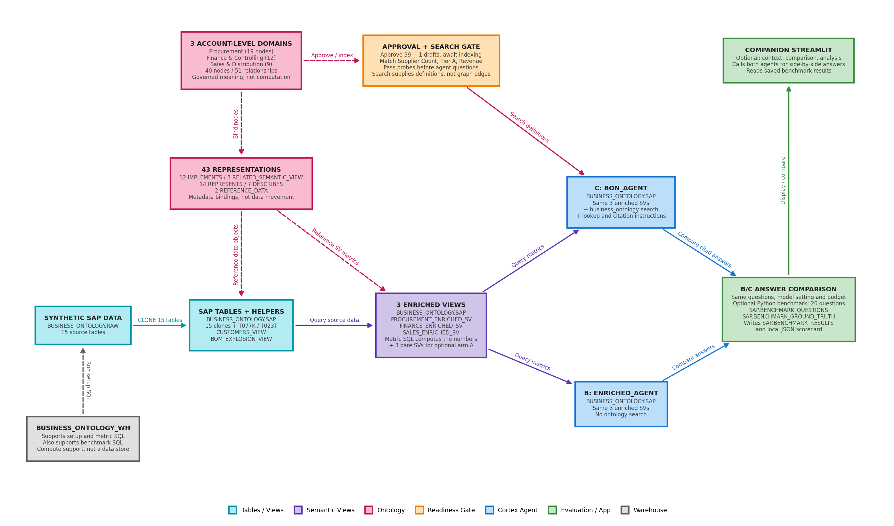
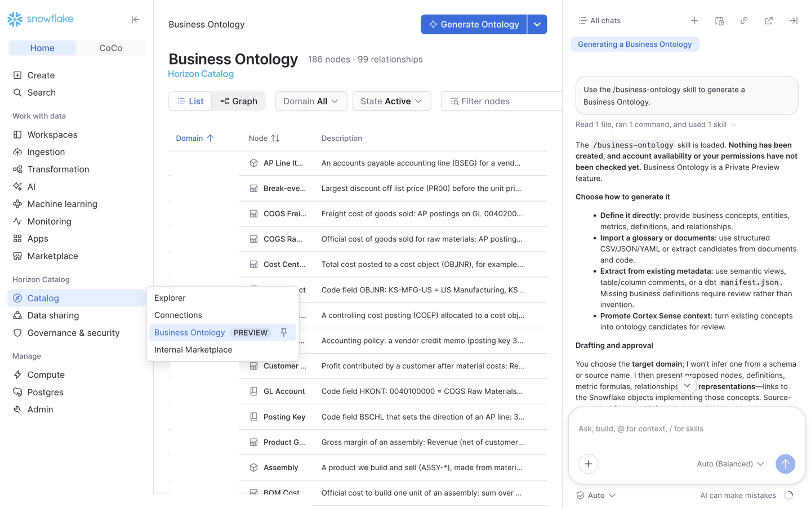
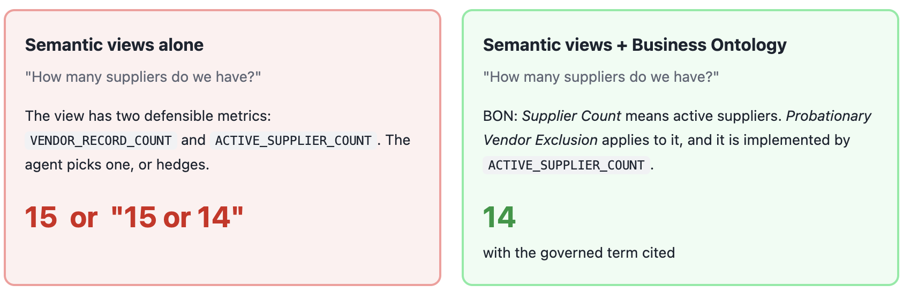
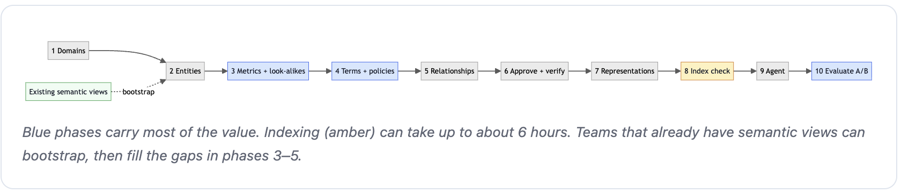
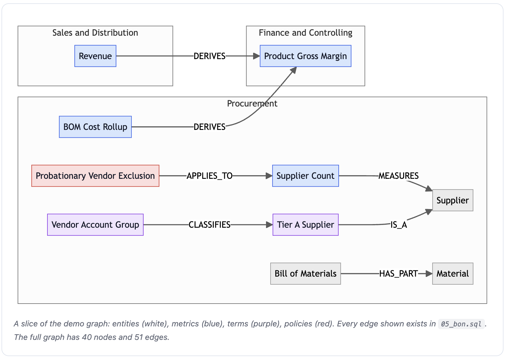
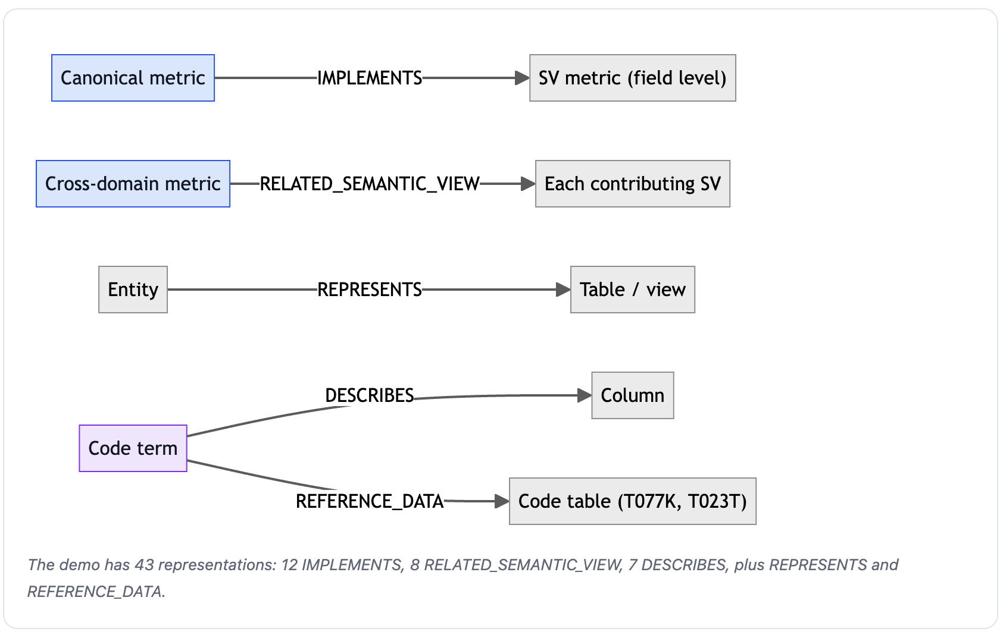
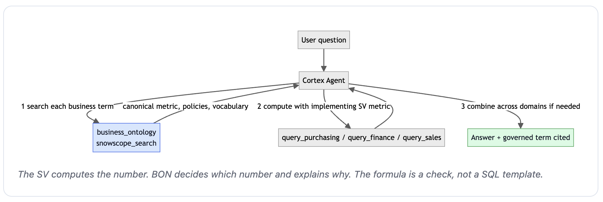
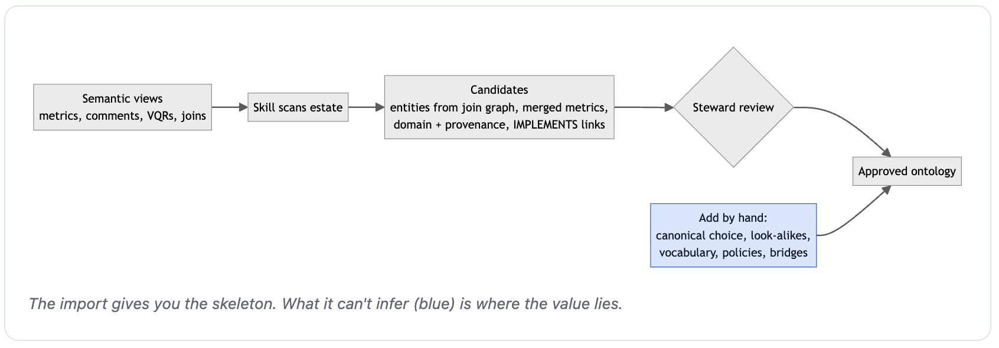

author: Tianxia Jia, Chanin Nantasenamat
id: getting-started-with-business-ontology
categories: snowflake-site:taxonomy/solution-center/certification/quickstart, snowflake-site:taxonomy/product/ai, snowflake-site:taxonomy/product/platform
language: en
summary: Build a governed Business Ontology on top of well-built semantic views, connect it to a Cortex Agent, and measure what it adds with a fair A/B test.
environments: web
status: Published
feedback link: https://github.com/Snowflake-Labs/sfquickstarts/issues
fork repo link: https://github.com/sfc-gh-cnantasenamat/business-ontology

# Getting Started with Business Ontology

## Overview

Ask a simple question like "How many suppliers do we have?" and you might expect a simple answer. In most companies, though, there are several correct-looking numbers. The vendor master holds 15 vendor records, but one of them is a probationary vendor that procurement policy says doesn't count, so the official answer is 14. Both numbers are computed correctly. They just answer slightly different questions.

People resolve this kind of ambiguity from experience: they know which number Finance reports, what "Tier A supplier" means at your company, and that you never cut a material that goes into something you sell. An AI agent doesn't have that experience. Given two plausible metrics, it may pick the wrong one, hedge with "15 or 14", or give different answers to different teams. Good semantic views help a lot, but each view describes one team's data. None of them is the place to decide which of two competing definitions is the official one.

Business Ontology, currently in Private Preview, is a governed layer of business meaning that sits above your semantic views. It doesn't replace them: the semantic views still compute every number. The ontology records what each business word means, which metric is canonical and which is only a look-alike, which policies apply, and how concepts connect across domains. A domain owner approves each definition, and the agent looks it up before it queries data.

With the ontology in place, the agent searches for "supplier count" first, finds the approved definition that says probationary vendors are excluded, queries the semantic view metric that implements it, and answers 14. It also names the definition it used, so anyone can check the answer. A steward can update shared meaning in the ontology without rewriting each agent's prompt. If the change affects how a number is computed, the implementing semantic view must also match the new rule; changing ontology text alone does not change metric SQL.

In this guide, you build exactly that on a synthetic SAP supply-chain dataset: three domain semantic views plus an ontology covering Procurement, Finance & Controlling, and Sales & Distribution. You build it in 10 steps. Each step identifies what to run or review, shows a `$business-ontology` Cortex Code (CoCo) alternative, and ends with a check so you know the step worked. At the end, you compare two agents using the same semantic views, one with ontology search and ontology-oriented instructions and one without, to see how their answers differ.

A quick word on those prompts. Cortex Code (CoCo) is Snowflake's AI coding assistant. You can use it in a side panel in Snowsight, as a desktop app, or as a command-line tool. It can load *skills*, which are packaged instructions that teach it how to do a specific job well. `business-ontology` is the skill for building and managing Business Ontology, and it comes bundled with Cortex Code, so there's nothing to install. Starting a message with `$business-ontology` tells Cortex Code to use that skill for the request. You then describe what you want in plain language, for example "Create three domains...", and the skill turns it into the right Business Ontology SQL calls. It shows you each draft for review before anything is written. Where a step includes a **The SQL Behind It** subsection, it shows the SQL that the skill runs for you.

### What You'll Learn

- What belongs in a semantic view and what belongs in Business Ontology
- How to model canonical metrics, their look-alikes, company vocabulary and policies
- How to connect ontology nodes to the semantic view metrics that implement them
- How to configure a Cortex Agent to search the ontology before it queries data
- How to measure what the ontology adds with a fair A/B test

Those are the skills. Here's the concrete result they produce.

### What You'll Build

The architecture below follows the data from source tables to agent answers. The upper path supplies governed definitions; the lower path computes the numbers.



1. **Prepare the data.** Load synthetic SAP tables into the raw schema, then clone them into the working schema with reference tables and helper views.
2. **Define the computations.** Three enriched semantic views expose Procurement, Finance and Sales metrics. Both comparison agents query these same views.
3. **Govern the meaning.** Three account-level ontology domains contain the approved concepts and relationships. Representations link those concepts to their implementing data objects and metrics; they do not copy data.
4. **Make definitions searchable.** Approve the drafts and verify search indexing before testing answers. The BON agent looks up definitions to select metrics and apply business rules; the baseline agent has no ontology search.
5. **Compare the answers.** Check both agents' numbers and explanations. The optional benchmark repeats the comparison. An optional companion Streamlit app displays side-by-side answers and saved results; its files are separate from the folder setup in this guide. The warehouse supplies compute for the SQL operations.

By the end of this guide, your account holds the objects below: three domains of governed nodes, the relationships and representations that connect them to each other and to your data, and the semantic views and agents that put them to work. The counts are the same ones the **Check** lines confirm along the way.

| Object | Count | Notes |
|---|---|---|
| Domains | 3 | Procurement · Finance & Controlling · Sales & Distribution |
| Entities | 13 | Supplier, Material, Assembly, Bill of Materials, Purchase Order, Shipment, Carrier, Inspection Lot, AP Line Item, Cost Posting, Sales Order, Customer, Pricing Condition |
| Metrics | 16 | Canonical metrics, their look-alikes (e.g. *Vendor Record Count*, *Carrier Reported On-Time Rate*, *Gross Bookings*), and cross-domain metrics (*Product Gross Margin*, *Customer Profit*, *Revenue at Risk*) |
| Terms | 8 | Code fields and company vocabulary: Vendor Account Group, Material Group, Posting Key, GL Account, Cost Object, Condition Type, Sales Organization, **Tier A Supplier** |
| Policies | 3 | Probationary Vendor Exclusion, Credit Memo Sign Rule, BOM Input Protection |
| Relationships | 51 | MEASURES 13 · DERIVES 13 · CLASSIFIES 8 · RELATED_TO 6 · APPLIES_TO 4 · HAS_PART 3 · HAS_VARIANT 3 · IS_A 1 |
| Representations | 43 | IMPLEMENTS 12 · REPRESENTS 14 · RELATED_SEMANTIC_VIEW 8 · DESCRIBES 7 · REFERENCE_DATA 2 |
| Semantic views | 6 | Three enriched views used here: `PROCUREMENT_ENRICHED_SV`, `FINANCE_ENRICHED_SV`, `SALES_ENRICHED_SV`; three bare views for the additional baseline agent |
| Agents | 7 | The A/B pair is `ENRICHED_AGENT` (SVs only) and `BON_AGENT` (same SVs + ontology search and instructions). The script also creates `BARE_AGENT` and two Finance/Sales team pairs. The current Python harness runs B/C and the team pairs, not arm A. |

The semantic views and agents live in `BUSINESS_ONTOLOGY.SAP`. Ontology domains are account-level containers; their representations point to objects in that schema.

> **Policies:** the generated script drafts policies with `itemKind: POLICY_CONCEPT`; the captured node read-backs identify them as `POLICY`. Keep the script's input spelling when reproducing this demo. Preview APIs can evolve, so check the current Business Ontology documentation before adapting node kinds for another project.

With the end result in mind, check that you have everything needed to build it.

### What You'll Need

Here's what you need before you start. Everything in the table is required except Python, which you only need for the optional full benchmark in Step 10.

| Requirement | Details |
|---|---|
| Account | Business Ontology enabled (Private Preview); search indexing enabled in your region |
| Snowsight | **Catalog > Business Ontology**, and a SQL worksheet to run the scripts |
| Role | One role for the whole guide, used as your primary role. It needs `CREATE ONTOLOGY DOMAIN` on the account to create the three domains (`ACCOUNTADMIN` has it by default), plus the usual privileges to create a database, warehouse, semantic views and agents. The role that creates a domain owns it, so it can then draft, approve and link nodes, and search them. The demo used ACCOUNTADMIN. |
| Local setup | A terminal with Bash and standard `mkdir` and `cat` commands. Step 0 writes all nine SQL scripts, including the synthetic SAP data, and the Python benchmark locally; no Git or repository download is required |
| CoCo | Cortex Code in Snowsight (opened by **Generate Ontology**, below) or Cortex Code Desktop, for the prompts, plus the Cortex Code CLI for the search check in Step 8. The `business-ontology` skill is bundled, so no install is needed. |
| Python (optional) | Python 3.10+ and `snowflake-connector-python`, only for the full benchmark in Step 10 |
| Time | About an hour of hands-on work, plus a variable search-indexing wait. In our trials, terms were first observed as searchable approximately 5 to 14 hours after the final ontology write. These are observation times, not guaranteed indexing durations (Step 8). |

If this is your first time with Business Ontology, start by finding it in Snowsight. In the left sidebar, hover over **Catalog** under **Horizon Catalog** and click **Business Ontology**, which carries a **PREVIEW** label. The page lists every node you can see, with its domain and description, and you can switch between a **List** and a **Graph** view or filter by domain and state. On a new account the list is empty; the screenshot below comes from an account that already has the demo ontology.

**Expected:** the catalog page opens. This is an illustrative screen-state checklist, not a new UI test or a claim that your account starts empty.

| Action | Visible state to look for |
|---|---|
| Open Business Ontology | A node list, or an empty state if no visible nodes exist |
| Switch List / Graph | The selected view shows the visible ontology nodes |
| Filter by domain or state | Results reflect the selected filter; clear it before later checks |

To build an ontology from this page, click **Generate Ontology** at the top right. A CoCo session opens in the right panel and loads the `business-ontology` skill for you, then explains the ways you can generate an ontology: define it directly, import a glossary or documents, extract it from existing metadata such as semantic views, or promote a Cortex Sense context. Nothing is created until you confirm. This panel is the easiest place to paste the **Use CoCo** prompts in this guide. In Snowsight, use `/business-ontology`. The prompts in this guide use `$business-ontology`, the form for Cortex Code Desktop and the CLI. Use the form for your surface rather than assuming the two prefixes are interchangeable.

**Expected:** the panel is ready for a request. The content below is illustrative, not an exact CoCo transcript.

```text
Business Ontology generation
Choose a source: direct definitions, glossary/documents, metadata, or context.
Next: describe what you want to build and review the proposal.
```



Before you build anything, it helps to be clear on what Business Ontology is and how it differs from the semantic views you may already have, so that's where we start.

## What Is Business Ontology

Business Ontology is the governed meaning layer in Horizon Catalog. It models shared business meaning as a connected graph of **terms, metrics and entities**, organised into **domains**, linked by **typed relationships**, and tied to the Snowflake objects that implement them through **representations**. Only approved items are visible to agents.

**Semantic Views tell Snowflake *how* to compute a metric. Business Ontology tells everyone *what* that metric means, *which* one is canonical, *who* approved it, and *whether* teams agree.**

The table below puts the two layers side by side, using the supplier count example from the introduction.

| Layer | Owns | Example from the demo |
|---|---|---|
| Semantic View | Tables, joins, dimensions, metric SQL; executes the number | `PROCUREMENT_ENRICHED_SV` has `VENDOR_RECORD_COUNT` (15); `FINANCE_ENRICHED_SV` has `ACTIVE_SUPPLIER_COUNT` (14) |
| Business Ontology | Which metric is canonical, business vocabulary, policies, cross-domain links | "Supplier Count" means active suppliers; *Probationary Vendor Exclusion* applies to it; it is implemented by `ACTIVE_SUPPLIER_COUNT` |

The picture below shows the same question asked twice. On the left, the agent has only the semantic views: it sees two defensible metrics, `VENDOR_RECORD_COUNT` and `ACTIVE_SUPPLIER_COUNT`, and either picks one or hedges. On the right, the ontology tells it which metric is official and which policy applies, so it answers 14 and cites the governed term.



The SV still computes the number. The ontology makes the agent pick the right one and say why.

That split between computing a number and deciding what it means is worth spelling out, because the rest of the guide builds on it.

### How Semantic Views and the Ontology Divide the Work

Most of the decisions in this guide follow from one division of labour:

- **The semantic view is the computation authority.** The SQL that produces a number lives in the view. A formula recorded in the ontology is documentation and a cross-check, not the calculation.
- **The ontology is the meaning authority.** When two correct metrics compete for the same business word, the ontology is where you say which one is official, and why.

That's also why a good ontology definition *decides* rather than just describes. "Number of suppliers" describes. "The official supplier count used in all reporting; probationary vendors are excluded; the vendor record count is an operational variant, not the official count" decides, and that sentence is what turns an agent's "it depends" into an answer.

With that rule in mind, here's how it plays out when you decide where a piece of business knowledge belongs.

### What Goes Where

As a rule of thumb, anything about *how* to compute a number belongs in the semantic view, and anything about *which* definition is official, or what a word means across teams, belongs in the ontology. The table gives concrete examples of each.

| Put it in the **Semantic View** | Put it in **Business Ontology** |
|---|---|
| Table joins, dimensions, facts | Which of several metrics is the canonical one |
| Metric SQL, including filters and sign logic (`ACTIVE_SUPPLIER_COUNT`, `COGS_RAW_MATERIALS` with credit memos subtracted) | Business vocabulary the data doesn't name ("Tier A supplier", "gross bookings is not revenue") |
| Synonyms that only help text-to-SQL | Policies that constrain how metrics are used (exclusions, sign rules, what must not be cut) |
| Verified queries | Cross-domain chains (Sales → BOM → Procurement cost) and who approved each definition |

**Don't** create one ontology metric for every SV metric. Create ontology nodes where meaning is contested, company-specific or cross-domain. The SV computes; the ontology decides and explains.

With that mental model in place, the next section explains how the 10 build steps are laid out, so you know what to expect from each one.

## How This Guide Works

The diagram below shows the 10 build steps in order. The blue steps (metrics, terms and policies, and the A/B test) are where most of the value comes from, and the amber step is the indexing wait. If you already have semantic views, the dashed bootstrap path can stand in for the early steps.



Each of the 10 steps has the same parts, and all but the first are subsections under the step's heading:

- **What to run:** each step opens by telling you the one thing to do, which is usually to run a named section of a script created in Step 0 in a Snowsight SQL worksheet. Running the scripts reproduces the demo exactly: the same 40 nodes, 51 relationships and 43 representations that the benchmark results depend on.
- **Use CoCo:** a subsection with an alternative to the script. A short sentence explains what the prompt in the box below it asks the `$business-ontology` skill to do, so you can paste the prompt into Cortex Code (CoCo) instead of running the script section. The prompts are shortened for reading. Use them to learn the workflow and to build an ontology on your own data. If you use them here, your ontology will differ from the demo and so may your results.
- **The SQL Behind It:** where it appears, a subsection showing the system function that both the script and the prompt call, with notes on how it behaves. It's for reference; you don't run it separately.
- **Check:** a subsection that says what to look at once the step has run, where to find it, and what to do if it doesn't match. Adjacent **Expected** blocks show sample outputs or expected states. Exact counts apply to the complete script path, not the shortened CoCo prompts.

> **Reading the examples:** observed SQL and agent results below come from an isolated verification run, with database, warehouse and domain names normalised to this guide's defaults. JSON excerpts show selected fields only. `<generated-domain-id>` and `<generated-term-id>` stand for IDs Snowflake returns for your objects; save your actual IDs rather than pasting these placeholders. CoCo review cards are illustrative content, not recorded UI transcripts. Optional paths without execution evidence are labelled as expected states or illustrative shapes.

Pick one way per step. Running both the script and the prompt drafts every node twice.

> **Keep one worksheet session.** Steps 1 to 6 approve drafts with the session-scoped form of `SYSTEM$APPROVE_ALL_GLOSSARY_TERMS`, which approves only what the current session drafted. Run them all in the same worksheet. If you switch sessions, approve by term ID instead (Step 6 shows both forms).

If you already have semantic views of your own, read **Bootstrap from Semantic Views** under **Going Further** after you finish: the import covers Step 2, and Steps 3 to 5 fill the gaps it can't infer.

Now that you know the shape of each step, you set up the demo data and the semantic views that the ontology will sit on top of.

## 0. Demo Setup

**Begin self-contained project setup.**

The block below creates the nine SQL scripts and the Python benchmark directly on your computer. All file contents are included, so you do not need Git, a repository download or a network connection for this folder setup. You run the SQL later, in the order explained below.

Choose a local working directory where you want the `business-ontology` folder. The block creates that parent folder if needed, or uses it if it is a real directory. It refuses an existing `business-ontology/getting-started` target, including a symlink, and never overwrites or removes an existing project. If setup stops partway through, files already written stay intact for inspection and manual recovery. Do not rerun the whole block to resume: it will refuse that target. Keep the partial files and use a different working directory for a fresh setup if needed.

The explicit `bash` command runs setup in a child shell. Its `set -euo pipefail` settings stop setup on errors without changing your terminal's shell settings. Quoted heredocs, the blocks between the named markers, write SQL and Python as literal text without expanding dollar signs or executing their contents.

**Run this step:** paste the entire block into your terminal, including the opening `bash` line and the final `BON_BOOTSTRAP` marker.

````bash
bash <<'BON_BOOTSTRAP'
set -euo pipefail
set -C

parent='business-ontology'
target='business-ontology/getting-started'
if [[ -L "$parent" || ( -e "$parent" && ! -d "$parent" ) ]]; then
  printf '%s\n' 'Refusing setup: business-ontology must be a real directory, not a file or symlink.' >&2
  exit 1
fi
if [[ ! -d "$parent" ]]; then
  mkdir -- "$parent"
fi
cd -- "$parent"
if ! mkdir -- getting-started; then
  printf '%s\n' 'Refusing setup: business-ontology/getting-started already exists (including a symlink), or cannot be created. Nothing was overwritten.' >&2
  exit 1
fi
trap 'status=$?; if [[ "$status" -ne 0 ]]; then printf "%s\n" "Setup stopped. Files already written in $target are left intact for inspection and manual recovery; nothing is removed. Re-running refuses this existing target." >&2; fi; exit "$status"' EXIT
cd -- getting-started
mkdir -- sql benchmark

cat > 'sql/01_setup.sql' <<'BON_FILE_01_SETUP_SQL'
-- Copyright 2026 Snowflake Inc.
-- SPDX-License-Identifier: Apache-2.0
--
-- Licensed under the Apache License, Version 2.0 (the "License");
-- you may not use this file except in compliance with the License.
-- You may obtain a copy of the License at
--
--     http://www.apache.org/licenses/LICENSE-2.0
--
-- Unless required by applicable law or agreed to in writing, software
-- distributed under the License is distributed on an "AS IS" BASIS,
-- WITHOUT WARRANTIES OR CONDITIONS OF ANY KIND, either express or implied.
-- See the License for the specific language governing permissions and
-- limitations under the License.

-- Setup: Create database, schema, and warehouse
CREATE DATABASE IF NOT EXISTS BUSINESS_ONTOLOGY;
CREATE SCHEMA IF NOT EXISTS BUSINESS_ONTOLOGY.RAW;
CREATE WAREHOUSE IF NOT EXISTS BUSINESS_ONTOLOGY_WH
  WAREHOUSE_SIZE = 'XSMALL'
  AUTO_SUSPEND = 60
  AUTO_RESUME = TRUE;

USE DATABASE BUSINESS_ONTOLOGY;
USE SCHEMA RAW;
USE WAREHOUSE BUSINESS_ONTOLOGY_WH;
BON_FILE_01_SETUP_SQL

cat > 'sql/02_raw_data.sql' <<'BON_FILE_02_RAW_DATA_SQL'
-- Copyright 2026 Snowflake Inc.
-- SPDX-License-Identifier: Apache-2.0
--
-- Licensed under the Apache License, Version 2.0 (the "License");
-- you may not use this file except in compliance with the License.
-- You may obtain a copy of the License at
--
--     http://www.apache.org/licenses/LICENSE-2.0
--
-- Unless required by applicable law or agreed to in writing, software
-- distributed under the License is distributed on an "AS IS" BASIS,
-- WITHOUT WARRANTIES OR CONDITIONS OF ANY KIND, either express or implied.
-- See the License for the specific language governing permissions and
-- limitations under the License.

-- =====================================================
-- RAW: Enterprise SAP-coded tables
-- Self-contained script: CREATE + INSERT for all tables
-- Realistic SAP column names (LIFNR, MAKTX, MATKL etc.)
-- This simulates what a real SAP extraction looks like.
-- =====================================================

USE DATABASE BUSINESS_ONTOLOGY;
USE SCHEMA RAW;
USE WAREHOUSE BUSINESS_ONTOLOGY_WH;

-- =============================================================================
-- MASTER DATA
-- =============================================================================

-- =====================================================
-- LFA1: Vendor Master
-- =====================================================
CREATE OR REPLACE TABLE LFA1 (
    LIFNR VARCHAR(10) NOT NULL PRIMARY KEY, -- Vendor number
    NAME1 VARCHAR(100),                     -- Vendor name
    ORT01 VARCHAR(50),                      -- City
    LAND1 VARCHAR(5),                       -- Country code
    STCD1 VARCHAR(30),                      -- Tax ID
    KRAUS VARCHAR(15),                      -- DUNS number (SAP uses KRAUS field)
    KTOKK VARCHAR(10),                      -- Account group (ZSTR=Strategic, ZSTD=Standard, ZPRB=Probationary)
    ZTERM VARCHAR(10)                       -- Payment terms
);

INSERT INTO LFA1 VALUES ('V10045', 'SHENZHEN ELECTRONICS CO. LTD', 'Shenzhen', 'CN', '91440300MA5FPQG72B', '54-138-7209', 'ZSTR', 'NET45');
INSERT INTO LFA1 VALUES ('V10078', 'PACIFIC METALS CORPORATION', 'Long Beach', 'US', '95-4821073', '07-823-6541', 'ZSTD', 'NET30');
INSERT INTO LFA1 VALUES ('V10089', 'ADVANCED SILICON SOLUTIONS INC.', 'Santa Clara', 'US', '77-3920184', '15-738-2904', 'ZSTR', 'NET45');
INSERT INTO LFA1 VALUES ('V10098', 'TOKYO SENSOR TECHNOLOGIES K.K.', 'Tokyo', 'JP', 'JP5010401098234', '71-385-6249', 'ZSTD', 'NET45');
INSERT INTO LFA1 VALUES ('V10102', 'RHINE CHEMICAL GMBH', 'Ludwigshafen', 'DE', 'DE283741956', '31-592-4780', 'ZSTR', 'NET30');
INSERT INTO LFA1 VALUES ('V10134', 'BAYERN KUNSTSTOFFE AG', 'Munich', 'DE', 'DE192847563', '44-591-7823', 'ZSTD', 'NET30');
INSERT INTO LFA1 VALUES ('V10156', 'OSAKA PRECISION INSTRUMENTS CO.', 'Osaka', 'JP', 'JP8120001098765', '69-247-1058', 'ZSTR', 'NET60');
INSERT INTO LFA1 VALUES ('V10167', 'GUANGZHOU RARE EARTH MATERIALS LTD', 'Guangzhou', 'CN', '91440101MA9URXG44N', '63-904-2175', 'ZSTD', 'NET60');
INSERT INTO LFA1 VALUES ('V10190', 'SCHWARZWALD PRECISION TOOLS GMBH', 'Freiburg', 'DE', 'DE314725890', '37-462-8105', 'ZSTD', 'NET30');
INSERT INTO LFA1 VALUES ('V10201', 'MONTERREY PACKAGING S.A. DE C.V.', 'Monterrey', 'MX', 'MPS040512QR7', '82-461-3097', 'ZSTD', 'NET30');
INSERT INTO LFA1 VALUES ('V10223', 'LONE STAR INDUSTRIAL SUPPLY CO.', 'Houston', 'US', '76-1948302', '28-617-4930', 'ZSTD', 'NET30');
INSERT INTO LFA1 VALUES ('V10245', 'PUEBLA CORRUGATED PRODUCTS SA', 'Puebla', 'MX', 'PCP090318HV5', NULL, 'ZPRB', 'NET30');
INSERT INTO LFA1 VALUES ('V10278', 'JIANGSU COPPER ALLOYS CO. LTD', 'Nanjing', 'CN', '91320100MA1MPKG28R', '56-813-4027', 'ZSTD', 'NET45');
INSERT INTO LFA1 VALUES ('V10312', 'ACME LOGISTICS INC', 'Chicago', 'US', '36-4829107', '09-284-5716', 'ZSTD', 'NET30');
INSERT INTO LFA1 VALUES ('V10334', 'NAGOYA STEEL WORKS LTD', 'Nagoya', 'JP', 'JP3180001054321', '48-729-3061', 'ZSTD', 'NET60');

-- =====================================================
-- LFA2: Carriers (Forwarding Agents)
-- =====================================================
CREATE OR REPLACE TABLE LFA2 (
    TDLNR VARCHAR(10) NOT NULL PRIMARY KEY, -- Forwarding agent number
    NAME1 VARCHAR(100),                     -- Carrier name
    VSART VARCHAR(5),                       -- Transport type (01=Ocean, 02=FTL, 03=Air, 04=Intermodal, 05=LTL)
    LZEIT NUMBER(38,0),                     -- Transit time (days)
    OTRAT NUMBER(4,2)                       -- On-time rate (carrier self-reported)
);

INSERT INTO LFA2 VALUES ('CAR-001', 'TransGlobal Freight Inc.', '01', 28, 0.87);
INSERT INTO LFA2 VALUES ('CAR-002', 'EuroHaul Logistics GmbH', '02', 4, 0.94);
INSERT INTO LFA2 VALUES ('CAR-003', 'SkyBridge Air Cargo', '03', 3, 0.96);
INSERT INTO LFA2 VALUES ('CAR-004', 'Pacific Intermodal Corp.', '04', 18, 0.91);
INSERT INTO LFA2 VALUES ('CAR-005', 'MexLine Transportes S.A.', '05', 6, 0.83);
INSERT INTO LFA2 VALUES ('CAR-006', 'Shenzhen Coastal Shipping Ltd.', '01', 22, 0.89);

-- =====================================================
-- MARA: Material Master
-- =====================================================
CREATE OR REPLACE TABLE MARA (
    MATNR VARCHAR(10) NOT NULL PRIMARY KEY, -- Material number
    MAKTX VARCHAR(100),                     -- Material description
    MATKL VARCHAR(5),                       -- Material group code
    STPRS NUMBER(10,2)                      -- Standard price
);

INSERT INTO MARA VALUES ('ASSY-001', 'Sensor Module Assembly', '048', 45.00);
INSERT INTO MARA VALUES ('ASSY-002', 'Power Distribution Board', '048', 32.00);
INSERT INTO MARA VALUES ('ASSY-003', 'Ruggedized Enclosure', '048', 380.00);
INSERT INTO MARA VALUES ('ASSY-004', 'Integrated System Module', '048', 520.00);
INSERT INTO MARA VALUES ('MAT-001', 'Multilayer Ceramic Capacitor 100nF', '043', 0.12);
INSERT INTO MARA VALUES ('MAT-002', 'Epoxy Resin ER-4500', '044', 18.50);
INSERT INTO MARA VALUES ('MAT-003', 'Aluminum Sheet 6061-T6 2mm', '045', 42.00);
INSERT INTO MARA VALUES ('MAT-004', 'MEMS Accelerometer IC', '043', 3.75);
INSERT INTO MARA VALUES ('MAT-005', 'Corrugated Box 400x300x200mm', '046', 1.85);
INSERT INTO MARA VALUES ('MAT-006', 'Isopropyl Alcohol 99.7%', '044', 5.20);
INSERT INTO MARA VALUES ('MAT-007', 'Copper Alloy Strip C17200', '045', 28.90);
INSERT INTO MARA VALUES ('MAT-008', 'ARM Cortex-M4 Microcontroller', '043', 6.40);
INSERT INTO MARA VALUES ('MAT-009', 'Anti-Static Foam Insert', '046', 0.95);
INSERT INTO MARA VALUES ('MAT-010', 'Stainless Steel Rod 304L 10mm', '045', 12.30);
INSERT INTO MARA VALUES ('MAT-011', 'Neodymium Rare Earth Magnet N52', '047', 2.10);
INSERT INTO MARA VALUES ('MAT-012', 'Silicone Thermal Paste TG-7', '044', 85.00);
INSERT INTO MARA VALUES ('MAT-013', 'Power MOSFET IRF540N', '043', 0.85);
INSERT INTO MARA VALUES ('MAT-014', 'Polyethylene Stretch Wrap 500mm', '046', 14.50);
INSERT INTO MARA VALUES ('MAT-015', 'Titanium Alloy Ti-6Al-4V Plate', '045', 120.00);
INSERT INTO MARA VALUES ('MAT-016', 'Fiber Optic Transceiver SFP+ 10G', '043', 22.00);
INSERT INTO MARA VALUES ('MAT-017', 'Hydrochloric Acid 37% ACS Grade', '044', 8.75);
INSERT INTO MARA VALUES ('MAT-018', 'Precision Ball Bearing 6205-2RS', '047', 4.50);
INSERT INTO MARA VALUES ('MAT-019', 'Carbon Fiber Sheet 3K Twill 2mm', '047', 65.00);
INSERT INTO MARA VALUES ('MAT-020', 'ESD Protective Bag 200x300mm', '046', 0.35);

-- =====================================================
-- T001W: Plants
-- =====================================================
CREATE OR REPLACE TABLE T001W (
    WERKS VARCHAR(10) NOT NULL PRIMARY KEY, -- Plant code
    NAME1 VARCHAR(100),                     -- Plant name
    REGIO VARCHAR(20)                       -- Region
);

INSERT INTO T001W VALUES ('PLT-001', 'Austin Manufacturing Center', 'AMERICAS');
INSERT INTO T001W VALUES ('PLT-002', 'Stuttgart Assembly Plant', 'EMEA');
INSERT INTO T001W VALUES ('PLT-003', 'Shanghai Production Facility', 'APAC');
INSERT INTO T001W VALUES ('PLT-004', 'Monterrey Operations Plant', 'AMERICAS');
INSERT INTO T001W VALUES ('PLT-005', 'Nagoya Precision Works', 'APAC');

-- =====================================================
-- T320: Storage Locations (Warehouses)
-- =====================================================
CREATE OR REPLACE TABLE T320 (
    LGORT VARCHAR(10) NOT NULL PRIMARY KEY, -- Storage location
    LGOBE VARCHAR(100),                     -- Storage location description
    WERKS VARCHAR(10),                      -- Plant
    LKAPA NUMBER(5,1)                       -- Capacity utilization %
);

INSERT INTO T320 VALUES ('WH-001', 'Austin Raw Materials Hub', 'PLT-001', 72.5);
INSERT INTO T320 VALUES ('WH-002', 'Austin Finished Goods Depot', 'PLT-001', 61.0);
INSERT INTO T320 VALUES ('WH-003', 'Stuttgart Inbound Logistics Center', 'PLT-002', 88.3);
INSERT INTO T320 VALUES ('WH-004', 'Shanghai Bonded Warehouse', 'PLT-003', 55.2);
INSERT INTO T320 VALUES ('WH-005', 'Shanghai Distribution Center', 'PLT-003', 79.8);
INSERT INTO T320 VALUES ('WH-006', 'Monterrey Cross-Dock Facility', 'PLT-004', 42.1);
INSERT INTO T320 VALUES ('WH-007', 'Nagoya JIT Storage', 'PLT-005', 91.7);
INSERT INTO T320 VALUES ('WH-008', 'Houston Regional Distribution Hub', 'PLT-001', 67.4);

-- =============================================================================
-- TRANSACTIONS
-- =============================================================================

-- =====================================================
-- EKPO: Purchase Order Items
-- =====================================================
CREATE OR REPLACE TABLE EKPO (
    EBELN VARCHAR(20) NOT NULL,             -- PO number
    EBELP VARCHAR(5) NOT NULL,              -- PO item number
    LIFNR VARCHAR(10),                      -- Vendor number
    MATNR VARCHAR(10),                      -- Material number
    WERKS VARCHAR(10),                      -- Plant
    BEDAT DATE,                             -- Order date
    MENGE NUMBER(38,0),                     -- Quantity
    NETWR NUMBER(12,2),                     -- Net value (USD)
    STATU VARCHAR(5),                       -- Status (O=Open, C=Closed, R=Received)
    PRIMARY KEY (EBELN, EBELP)
);

INSERT INTO EKPO VALUES ('PO-2024-001', '10', 'V10045', 'MAT-001', 'PLT-003', '2024-09-15', 100000, 11000.00, 'R');
INSERT INTO EKPO VALUES ('PO-2024-002', '10', 'V10078', 'MAT-002', 'PLT-002', '2024-09-20', 5000, 89000.00, 'R');
INSERT INTO EKPO VALUES ('PO-2024-003', '10', 'V10089', 'MAT-003', 'PLT-001', '2024-10-01', 1200, 48600.00, 'R');
INSERT INTO EKPO VALUES ('PO-2024-004', '10', 'V10098', 'MAT-004', 'PLT-005', '2024-10-10', 20000, 72000.00, 'R');
INSERT INTO EKPO VALUES ('PO-2024-005', '10', 'V10102', 'MAT-005', 'PLT-004', '2024-10-15', 15000, 26250.00, 'R');
INSERT INTO EKPO VALUES ('PO-2024-006', '10', 'V10134', 'MAT-008', 'PLT-001', '2024-11-01', 10000, 62000.00, 'R');
INSERT INTO EKPO VALUES ('PO-2024-007', '10', 'V10156', 'MAT-002', 'PLT-002', '2024-11-10', 3000, 57300.00, 'R');
INSERT INTO EKPO VALUES ('PO-2024-008', '10', 'V10167', 'MAT-011', 'PLT-003', '2024-11-15', 50000, 97500.00, 'R');
INSERT INTO EKPO VALUES ('PO-2024-009', '10', 'V10278', 'MAT-007', 'PLT-003', '2024-12-01', 2000, 55000.00, 'R');
INSERT INTO EKPO VALUES ('PO-2024-010', '10', 'V10334', 'MAT-010', 'PLT-005', '2024-12-05', 5000, 59000.00, 'R');
INSERT INTO EKPO VALUES ('PO-2024-011', '10', 'V10102', 'MAT-014', 'PLT-004', '2024-11-20', 800, 11040.00, 'R');
INSERT INTO EKPO VALUES ('PO-2024-012', '10', 'V10201', 'MAT-004', 'PLT-001', '2024-12-10', 8000, 30400.00, 'O');
INSERT INTO EKPO VALUES ('PO-2025-001', '10', 'V10045', 'MAT-013', 'PLT-003', '2025-01-10', 50000, 41000.00, 'R');
INSERT INTO EKPO VALUES ('PO-2025-002', '10', 'V10201', 'MAT-016', 'PLT-005', '2025-01-20', 4000, 84000.00, 'R');
INSERT INTO EKPO VALUES ('PO-2025-003', '10', 'V10190', 'MAT-006', 'PLT-001', '2025-02-01', 10000, 49000.00, 'R');
INSERT INTO EKPO VALUES ('PO-2025-004', '10', 'V10312', 'MAT-018', 'PLT-002', '2025-02-15', 8000, 34400.00, 'R');
INSERT INTO EKPO VALUES ('PO-2025-005', '10', 'V10089', 'MAT-015', 'PLT-001', '2025-03-01', 300, 34500.00, 'R');
INSERT INTO EKPO VALUES ('PO-2025-006', '10', 'V10134', 'MAT-008', 'PLT-001', '2025-03-15', 15000, 93000.00, 'O');
INSERT INTO EKPO VALUES ('PO-2025-007', '10', 'V10078', 'MAT-017', 'PLT-002', '2025-04-01', 8000, 67200.00, 'O');
INSERT INTO EKPO VALUES ('PO-2025-008', '10', 'V10223', 'MAT-005', 'PLT-004', '2025-04-05', 20000, 33000.00, 'O');
INSERT INTO EKPO VALUES ('PO-2025-009', '10', 'V10098', 'MAT-004', 'PLT-005', '2025-04-10', 25000, 90000.00, 'O');
INSERT INTO EKPO VALUES ('PO-2025-010', '10', 'V10167', 'MAT-011', 'PLT-003', '2025-04-12', 40000, 80000.00, 'O');
INSERT INTO EKPO VALUES ('PO-2025-011', '10', 'V10045', 'MAT-001', 'PLT-001', '2025-04-15', 200000, 22000.00, 'O');
INSERT INTO EKPO VALUES ('PO-2025-012', '10', 'V10278', 'MAT-007', 'PLT-003', '2025-04-16', 3000, 84000.00, 'O');
INSERT INTO EKPO VALUES ('PO-2025-013', '10', 'V10245', 'MAT-009', 'PLT-001', '2025-03-01', 25000, 22500.00, 'R');

-- =====================================================
-- LIKP: Shipments
-- =====================================================
CREATE OR REPLACE TABLE LIKP (
    TKNUM VARCHAR(10) NOT NULL PRIMARY KEY, -- Shipment number
    TDLNR VARCHAR(10),                      -- Forwarding agent (carrier)
    LGORT_SRC VARCHAR(10),                  -- Source storage location (origin warehouse)
    WERKS_DST VARCHAR(10),                  -- Destination plant
    MATNR VARCHAR(10),                      -- Material
    MENGE NUMBER(38,0),                     -- Quantity
    LFDAT DATE,                             -- Expected arrival
    WADAT DATE,                             -- Actual arrival
    FRTCO NUMBER(10,2),                     -- Freight cost
    STATU VARCHAR(5)                        -- Status (D=Delivered, T=In Transit, X=Delayed)
);

INSERT INTO LIKP VALUES ('SHP-001', 'CAR-006', 'WH-004', 'PLT-001', 'MAT-001', 100000, '2024-10-10', '2024-10-08', 2800.00, 'D');
INSERT INTO LIKP VALUES ('SHP-002', 'CAR-002', 'WH-003', 'PLT-002', 'MAT-002', 5000, '2024-09-26', '2024-09-25', 1200.00, 'D');
INSERT INTO LIKP VALUES ('SHP-003', 'CAR-003', 'WH-008', NULL, 'MAT-003', 1200, '2024-10-06', '2024-10-06', 3500.00, 'D');
INSERT INTO LIKP VALUES ('SHP-004', 'CAR-004', 'WH-007', 'PLT-005', 'MAT-004', 20000, '2024-11-02', '2024-11-05', 4200.00, 'D');
INSERT INTO LIKP VALUES ('SHP-005', 'CAR-005', 'WH-006', 'PLT-004', 'MAT-005', 15000, '2024-10-23', '2024-10-22', 850.00, 'D');
INSERT INTO LIKP VALUES ('SHP-006', 'CAR-003', 'WH-001', NULL, 'MAT-008', 10000, '2024-11-11', '2024-11-11', 5100.00, 'D');
INSERT INTO LIKP VALUES ('SHP-007', 'CAR-001', 'WH-004', NULL, 'MAT-011', 50000, '2024-12-18', '2024-12-22', 3100.00, 'D');
INSERT INTO LIKP VALUES ('SHP-008', 'CAR-006', 'WH-005', NULL, 'MAT-007', 2000, '2024-12-27', '2024-12-26', 1900.00, 'D');
INSERT INTO LIKP VALUES ('SHP-009', 'CAR-002', 'WH-003', 'PLT-002', 'MAT-018', 8000, '2025-02-22', '2025-02-21', 980.00, 'D');
INSERT INTO LIKP VALUES ('SHP-010', 'CAR-004', 'WH-007', NULL, 'MAT-016', 4000, '2025-02-12', '2025-02-14', 3800.00, 'D');
INSERT INTO LIKP VALUES ('SHP-011', 'CAR-001', 'WH-008', NULL, 'MAT-006', 10000, '2025-03-05', '2025-03-08', 2400.00, 'D');
INSERT INTO LIKP VALUES ('SHP-012', 'CAR-003', 'WH-001', 'PLT-001', 'MAT-015', 300, '2025-03-23', '2025-03-23', 1800.00, 'D');
INSERT INTO LIKP VALUES ('SHP-013', 'CAR-006', 'WH-004', 'PLT-003', 'MAT-013', 50000, '2025-02-06', '2025-02-04', 2200.00, 'D');
INSERT INTO LIKP VALUES ('SHP-014', 'CAR-005', 'WH-006', 'PLT-004', 'MAT-014', 800, '2024-11-28', '2024-11-30', 450.00, 'D');
INSERT INTO LIKP VALUES ('SHP-015', 'CAR-002', 'WH-003', 'PLT-002', 'MAT-002', 3000, '2025-03-29', '2025-03-28', 1100.00, 'D');
INSERT INTO LIKP VALUES ('SHP-016', 'CAR-001', 'WH-005', NULL, 'MAT-011', 40000, '2025-05-12', NULL, 3050.00, 'T');
INSERT INTO LIKP VALUES ('SHP-017', 'CAR-004', 'WH-007', 'PLT-005', 'MAT-004', 25000, '2025-05-03', NULL, 4500.00, 'T');
INSERT INTO LIKP VALUES ('SHP-018', 'CAR-003', 'WH-001', NULL, 'MAT-008', 8000, '2025-04-13', NULL, 4800.00, 'X');
INSERT INTO LIKP VALUES ('SHP-019', 'CAR-006', 'WH-004', NULL, 'MAT-007', 3000, '2025-05-10', NULL, 2600.00, 'T');
INSERT INTO LIKP VALUES ('SHP-020', 'CAR-005', 'WH-006', 'PLT-004', 'MAT-005', 20000, '2025-04-14', NULL, 920.00, 'X');

-- =====================================================
-- LFB1: Vendor Contracts
-- =====================================================
CREATE OR REPLACE TABLE LFB1 (
    LIFNR VARCHAR(10) NOT NULL,             -- Vendor
    VKONT VARCHAR(10) NOT NULL,             -- Contract number
    VTART VARCHAR(5),                       -- Contract type (M=Master, F=Framework, S=Spot)
    DTEND DATE,                             -- Expiration date
    JWERT NUMBER(12,2),                     -- Annual value
    PRIMARY KEY (LIFNR, VKONT)
);

INSERT INTO LFB1 VALUES ('V10045', 'CTR-001', 'M', '2026-12-31', 4500000.00);
INSERT INTO LFB1 VALUES ('V10078', 'CTR-002', 'M', '2026-06-30', 3200000.00);
INSERT INTO LFB1 VALUES ('V10089', 'CTR-003', 'F', '2026-03-31', 2800000.00);
INSERT INTO LFB1 VALUES ('V10098', 'CTR-004', 'M', '2027-12-31', 5200000.00);
INSERT INTO LFB1 VALUES ('V10102', 'CTR-005', 'F', '2025-05-31', 450000.00);
INSERT INTO LFB1 VALUES ('V10134', 'CTR-006', 'M', '2027-02-28', 7000000.00);
INSERT INTO LFB1 VALUES ('V10156', 'CTR-007', 'F', '2025-12-31', 1200000.00);
INSERT INTO LFB1 VALUES ('V10167', 'CTR-008', 'S', '2025-09-30', 980000.00);
INSERT INTO LFB1 VALUES ('V10190', 'CTR-015', 'F', '2025-07-31', 600000.00);
INSERT INTO LFB1 VALUES ('V10201', 'CTR-009', 'M', '2026-03-31', 3800000.00);
INSERT INTO LFB1 VALUES ('V10223', 'CTR-014', 'S', '2025-07-15', 250000.00);
INSERT INTO LFB1 VALUES ('V10245', 'CTR-010', 'F', '2025-12-31', 2000000.00);
INSERT INTO LFB1 VALUES ('V10278', 'CTR-011', 'M', '2026-05-31', 1500000.00);
INSERT INTO LFB1 VALUES ('V10312', 'CTR-012', 'F', '2025-12-31', 800000.00);
INSERT INTO LFB1 VALUES ('V10334', 'CTR-013', 'M', '2026-09-30', 3500000.00);

-- =====================================================
-- QALS: Inspection Lots
-- =====================================================
CREATE OR REPLACE TABLE QALS (
    PRUEFLOS VARCHAR(10) NOT NULL PRIMARY KEY, -- Inspection lot
    MATNR VARCHAR(10),                         -- Material
    QAESSION NUMBER(6,3),                      -- Defect rate
    VCODE VARCHAR(5)                           -- Disposition (A=Accepted, R=Rejected, C=Conditional)
);

INSERT INTO QALS VALUES ('INS-001', 'MAT-001', 0.006, 'A');
INSERT INTO QALS VALUES ('INS-002', 'MAT-002', 0.060, 'C');
INSERT INTO QALS VALUES ('INS-003', 'MAT-003', 0.001, 'A');
INSERT INTO QALS VALUES ('INS-004', 'MAT-004', 0.150, 'A');
INSERT INTO QALS VALUES ('INS-005', 'MAT-005', 0.011, 'A');
INSERT INTO QALS VALUES ('INS-006', 'MAT-006', 0.005, 'A');
INSERT INTO QALS VALUES ('INS-007', 'MAT-007', 0.050, 'C');
INSERT INTO QALS VALUES ('INS-008', 'MAT-008', 0.000, 'A');
INSERT INTO QALS VALUES ('INS-009', 'MAT-001', 0.010, 'A');
INSERT INTO QALS VALUES ('INS-010', 'MAT-003', 0.002, 'A');

-- =============================================================================
-- STRUCTURE
-- =============================================================================

-- =====================================================
-- STPO: BOM Items
-- =====================================================
CREATE OR REPLACE TABLE STPO (
    STLNR VARCHAR(10) NOT NULL,             -- BOM number
    IDNRK VARCHAR(10) NOT NULL,             -- Component material
    MENGE NUMBER(10,3),                     -- Quantity per unit
    STUFE NUMBER(38,0),                     -- BOM level
    PRIMARY KEY (STLNR, IDNRK)
);

INSERT INTO STPO VALUES ('ASSY-001', 'MAT-001', 10.000, 1);
INSERT INTO STPO VALUES ('ASSY-001', 'MAT-004', 2.000, 1);
INSERT INTO STPO VALUES ('ASSY-001', 'MAT-008', 1.000, 1);
INSERT INTO STPO VALUES ('ASSY-001', 'MAT-012', 0.050, 1);
INSERT INTO STPO VALUES ('ASSY-002', 'MAT-001', 20.000, 1);
INSERT INTO STPO VALUES ('ASSY-002', 'MAT-007', 0.500, 1);
INSERT INTO STPO VALUES ('ASSY-002', 'MAT-013', 4.000, 1);
INSERT INTO STPO VALUES ('ASSY-003', 'ASSY-001', 1.000, 1);
INSERT INTO STPO VALUES ('ASSY-003', 'ASSY-002', 1.000, 1);
INSERT INTO STPO VALUES ('ASSY-003', 'MAT-003', 2.000, 1);
INSERT INTO STPO VALUES ('ASSY-003', 'MAT-015', 0.300, 1);
INSERT INTO STPO VALUES ('ASSY-003', 'MAT-019', 1.000, 1);
INSERT INTO STPO VALUES ('ASSY-004', 'ASSY-003', 1.000, 1);
INSERT INTO STPO VALUES ('ASSY-004', 'MAT-016', 2.000, 1);
INSERT INTO STPO VALUES ('ASSY-004', 'MAT-018', 4.000, 1);

-- =====================================================
-- QUAL_MATRIX: Alternate Supplier Qualifications
-- (Quality engineering data)
-- =====================================================
CREATE OR REPLACE TABLE QUAL_MATRIX (
    MATNR VARCHAR(10) NOT NULL,             -- Material number
    LIFNR VARCHAR(10) NOT NULL,             -- Vendor number
    QUAL_STATUS VARCHAR(10),                -- APPROVED, PENDING, EXPIRED, REJECTED
    QUAL_DATE DATE,                         -- Qualification date
    PRIMARY KEY (MATNR, LIFNR)
);

INSERT INTO QUAL_MATRIX VALUES ('MAT-001', 'V10045', 'APPROVED', '2023-06-15');
INSERT INTO QUAL_MATRIX VALUES ('MAT-001', 'V10048', 'APPROVED', '2024-01-20');
INSERT INTO QUAL_MATRIX VALUES ('MAT-001', 'V10052', 'PENDING', '2025-03-01');
INSERT INTO QUAL_MATRIX VALUES ('MAT-002', 'V10054', 'APPROVED', '2023-07-01');
INSERT INTO QUAL_MATRIX VALUES ('MAT-002', 'V10056', 'APPROVED', '2024-03-10');
INSERT INTO QUAL_MATRIX VALUES ('MAT-003', 'V10053', 'APPROVED', '2023-04-01');
INSERT INTO QUAL_MATRIX VALUES ('MAT-003', 'V10060', 'APPROVED', '2024-11-01');
INSERT INTO QUAL_MATRIX VALUES ('MAT-004', 'V10055', 'APPROVED', '2023-09-01');
INSERT INTO QUAL_MATRIX VALUES ('MAT-004', 'V10057', 'APPROVED', '2024-07-15');
INSERT INTO QUAL_MATRIX VALUES ('MAT-005', 'V10057', 'APPROVED', '2024-08-20');
INSERT INTO QUAL_MATRIX VALUES ('MAT-005', 'V10059', 'APPROVED', '2023-11-01');
INSERT INTO QUAL_MATRIX VALUES ('MAT-006', 'V10049', 'APPROVED', '2023-06-01');
INSERT INTO QUAL_MATRIX VALUES ('MAT-007', 'V10051', 'APPROVED', '2023-05-20');
INSERT INTO QUAL_MATRIX VALUES ('MAT-008', 'V10045', 'EXPIRED', '2022-12-01');
INSERT INTO QUAL_MATRIX VALUES ('MAT-008', 'V10055', 'APPROVED', '2024-05-10');
INSERT INTO QUAL_MATRIX VALUES ('MAT-009', 'V10057', 'APPROVED', '2024-02-15');
INSERT INTO QUAL_MATRIX VALUES ('MAT-010', 'V10055', 'APPROVED', '2023-12-01');
INSERT INTO QUAL_MATRIX VALUES ('MAT-011', 'V10050', 'APPROVED', '2023-08-01');
INSERT INTO QUAL_MATRIX VALUES ('MAT-012', 'V10049', 'APPROVED', '2023-05-01');
INSERT INTO QUAL_MATRIX VALUES ('MAT-012', 'V10054', 'APPROVED', '2024-04-15');
INSERT INTO QUAL_MATRIX VALUES ('MAT-013', 'V10045', 'APPROVED', '2023-06-15');
INSERT INTO QUAL_MATRIX VALUES ('MAT-014', 'V10057', 'APPROVED', '2023-08-20');
INSERT INTO QUAL_MATRIX VALUES ('MAT-015', 'V10053', 'APPROVED', '2023-10-15');
INSERT INTO QUAL_MATRIX VALUES ('MAT-015', 'V10058', 'PENDING', '2025-06-01');
INSERT INTO QUAL_MATRIX VALUES ('MAT-016', 'V10057', 'APPROVED', '2024-01-10');
INSERT INTO QUAL_MATRIX VALUES ('MAT-017', 'V10049', 'APPROVED', '2023-09-01');
INSERT INTO QUAL_MATRIX VALUES ('MAT-018', 'V10055', 'APPROVED', '2023-07-15');
INSERT INTO QUAL_MATRIX VALUES ('MAT-019', 'V10049', 'APPROVED', '2023-06-01');

-- =============================================================================
-- FINANCE
-- =============================================================================

-- =====================================================
-- BSEG: Accounting Document Segment
-- =====================================================
CREATE OR REPLACE TABLE BSEG (
    BELNR VARCHAR(10) NOT NULL,             -- Accounting document number
    BUZEI VARCHAR(3) NOT NULL,              -- Line item number
    EBELN VARCHAR(20),                      -- Purchase order number
    LIFNR VARCHAR(10),                      -- Vendor number
    HKONT VARCHAR(15),                      -- G/L account number
    DMBTR NUMBER(12,2),                     -- Amount in local currency
    BUDAT DATE,                             -- Posting date
    BSCHL VARCHAR(3),                       -- Posting key (31=vendor invoice, 34=debit memo)
    GJAHR NUMBER(4,0),                      -- Fiscal year
    MONAT NUMBER(2,0),                      -- Fiscal period
    PRIMARY KEY (BELNR, BUZEI)
);

INSERT INTO BSEG VALUES ('5100000001', '001', 'PO-2024-001', 'V10045', '0040100000', 11000.00, '2024-10-15', '31', 2024, 10);
INSERT INTO BSEG VALUES ('5100000002', '001', 'PO-2024-002', 'V10078', '0040100000', 89000.00, '2024-10-20', '31', 2024, 10);
INSERT INTO BSEG VALUES ('5100000003', '001', 'PO-2024-003', 'V10089', '0040100000', 48600.00, '2024-11-01', '31', 2024, 11);
INSERT INTO BSEG VALUES ('5100000004', '001', 'PO-2024-004', 'V10098', '0040100000', 72000.00, '2024-11-10', '31', 2024, 11);
INSERT INTO BSEG VALUES ('5100000005', '001', 'PO-2024-005', 'V10102', '0040100000', 26250.00, '2024-11-15', '31', 2024, 11);
INSERT INTO BSEG VALUES ('5100000006', '001', 'PO-2024-006', 'V10134', '0040100000', 62000.00, '2024-12-01', '31', 2024, 12);
INSERT INTO BSEG VALUES ('5100000007', '001', 'PO-2024-007', 'V10156', '0040100000', 57300.00, '2024-12-10', '31', 2024, 12);
INSERT INTO BSEG VALUES ('5100000008', '001', 'PO-2024-008', 'V10167', '0040100000', 97500.00, '2024-12-15', '31', 2024, 12);
INSERT INTO BSEG VALUES ('5100000009', '001', 'PO-2024-009', 'V10278', '0040100000', 55000.00, '2025-01-01', '31', 2025, 1);
INSERT INTO BSEG VALUES ('5100000010', '001', 'PO-2024-010', 'V10334', '0040100000', 59000.00, '2025-01-05', '31', 2025, 1);
INSERT INTO BSEG VALUES ('5100000011', '001', 'PO-2024-011', 'V10102', '0040100000', 11040.00, '2024-12-20', '31', 2024, 12);
INSERT INTO BSEG VALUES ('5100000012', '001', 'PO-2024-012', 'V10201', '0040100000', 30400.00, '2025-01-10', '31', 2025, 1);
INSERT INTO BSEG VALUES ('5100000013', '001', 'PO-2025-001', 'V10045', '0040100000', 41000.00, '2025-02-10', '31', 2025, 2);
INSERT INTO BSEG VALUES ('5100000014', '001', 'PO-2025-002', 'V10201', '0040100000', 84000.00, '2025-02-20', '31', 2025, 2);
INSERT INTO BSEG VALUES ('5100000015', '001', 'PO-2025-003', 'V10190', '0040100000', 49000.00, '2025-03-01', '31', 2025, 3);
INSERT INTO BSEG VALUES ('5100000016', '001', 'PO-2025-004', 'V10312', '0040100000', 34400.00, '2025-03-15', '31', 2025, 3);
INSERT INTO BSEG VALUES ('5100000017', '001', 'PO-2025-005', 'V10089', '0040100000', 34500.00, '2025-04-01', '31', 2025, 4);
INSERT INTO BSEG VALUES ('5100000018', '001', 'PO-2025-006', 'V10134', '0040100000', 93000.00, '2025-04-15', '31', 2025, 4);
INSERT INTO BSEG VALUES ('5100000019', '001', 'PO-2025-007', 'V10078', '0040100000', 67200.00, '2025-05-01', '31', 2025, 5);
INSERT INTO BSEG VALUES ('5100000020', '001', 'PO-2025-008', 'V10223', '0040100000', 33000.00, '2025-05-05', '31', 2025, 5);
INSERT INTO BSEG VALUES ('5100000021', '001', 'PO-2025-009', 'V10098', '0040100000', 90000.00, '2025-05-10', '31', 2025, 5);
INSERT INTO BSEG VALUES ('5100000022', '001', 'PO-2025-010', 'V10167', '0040100000', 80000.00, '2025-05-12', '31', 2025, 5);
INSERT INTO BSEG VALUES ('5100000023', '001', 'PO-2025-011', 'V10045', '0040100000', 22000.00, '2025-05-15', '31', 2025, 5);
INSERT INTO BSEG VALUES ('5100000024', '001', 'PO-2025-012', 'V10278', '0040100000', 84000.00, '2025-05-16', '31', 2025, 5);
INSERT INTO BSEG VALUES ('5100000025', '001', 'PO-2025-013', 'V10245', '0040100000', 22500.00, '2025-04-01', '31', 2025, 4);
INSERT INTO BSEG VALUES ('5100000030', '001', 'PO-2024-003', 'V10089', '0040100000', 12150.00, '2024-12-01', '34', 2024, 12);
INSERT INTO BSEG VALUES ('5100000031', '001', 'PO-2024-008', 'V10167', '0040100000', 19500.00, '2025-01-15', '34', 2025, 1);
INSERT INTO BSEG VALUES ('5100000032', '001', 'PO-2025-003', 'V10190', '0040100000', 9800.00, '2025-04-01', '34', 2025, 4);
INSERT INTO BSEG VALUES ('5100000033', '001', 'PO-2025-007', 'V10078', '0040100000', 6720.00, '2025-06-01', '34', 2025, 6);
INSERT INTO BSEG VALUES ('5100000034', '001', 'PO-2024-006', 'V10134', '0040100000', 15500.00, '2025-02-01', '34', 2025, 2);
INSERT INTO BSEG VALUES ('5100000040', '001', 'PO-2024-001', 'V10045', '0040200000', 2200.00, '2024-10-20', '31', 2024, 10);
INSERT INTO BSEG VALUES ('5100000041', '001', 'PO-2024-004', 'V10098', '0040200000', 8500.00, '2024-11-15', '31', 2024, 11);
INSERT INTO BSEG VALUES ('5100000042', '001', 'PO-2025-002', 'V10201', '0040200000', 12600.00, '2025-03-01', '31', 2025, 3);
INSERT INTO BSEG VALUES ('5100000043', '001', 'PO-2025-009', 'V10098', '0040200000', 11000.00, '2025-05-15', '31', 2025, 5);
INSERT INTO BSEG VALUES ('5100000044', '001', 'PO-2025-006', 'V10134', '0040200000', 5500.00, '2025-04-20', '31', 2025, 4);
INSERT INTO BSEG VALUES ('5100000050', '001', 'PO-2024-001', 'V10045', '0021100000', 13200.00, '2024-10-15', '31', 2024, 10);
INSERT INTO BSEG VALUES ('5100000051', '001', 'PO-2025-009', 'V10098', '0021100000', 101000.00, '2025-05-10', '31', 2025, 5);
INSERT INTO BSEG VALUES ('5100000052', '001', 'PO-2025-006', 'V10134', '0021100000', 98500.00, '2025-04-15', '31', 2025, 4);

-- =====================================================
-- COEP: CO Line Items (Cost Element Postings)
-- =====================================================
CREATE OR REPLACE TABLE COEP (
    OBJNR VARCHAR(20),                      -- Cost center / object number
    KSTAR VARCHAR(15),                      -- Cost element
    WRTBTR NUMBER(12,2),                    -- Amount in controlling area currency
    GJAHR NUMBER(4,0),                      -- Fiscal year
    PERIO NUMBER(2,0),                      -- Posting period
    MATNR VARCHAR(10)                       -- Material number
);

INSERT INTO COEP VALUES ('KS-LOG', '0047000000', 39800.00, 2025, 1, NULL);
INSERT INTO COEP VALUES ('KS-LOG', '0047000000', 42100.00, 2025, 2, NULL);
INSERT INTO COEP VALUES ('KS-MFG-AP', '0040100000', 177500.00, 2025, 1, 'MAT-011');
INSERT INTO COEP VALUES ('KS-MFG-AP', '0040100000', 139000.00, 2025, 2, 'MAT-007');
INSERT INTO COEP VALUES ('KS-MFG-AP', '0040100000', 74000.00, 2025, 3, 'MAT-001');
INSERT INTO COEP VALUES ('KS-MFG-AP', '0047000000', 31200.00, 2025, 1, NULL);
INSERT INTO COEP VALUES ('KS-MFG-AP', '0048000000', 14800.00, 2025, 2, NULL);
INSERT INTO COEP VALUES ('KS-MFG-EU', '0040100000', 213500.00, 2025, 1, 'MAT-002');
INSERT INTO COEP VALUES ('KS-MFG-EU', '0040100000', 67200.00, 2025, 2, 'MAT-017');
INSERT INTO COEP VALUES ('KS-MFG-EU', '0040100000', 34400.00, 2025, 3, 'MAT-018');
INSERT INTO COEP VALUES ('KS-MFG-EU', '0047000000', 22300.00, 2025, 1, NULL);
INSERT INTO COEP VALUES ('KS-MFG-EU', '0048000000', 11500.00, 2025, 2, NULL);
INSERT INTO COEP VALUES ('KS-MFG-US', '0040100000', 172550.00, 2025, 1, 'MAT-003');
INSERT INTO COEP VALUES ('KS-MFG-US', '0040100000', 127500.00, 2025, 2, 'MAT-004');
INSERT INTO COEP VALUES ('KS-MFG-US', '0040100000', 93000.00, 2025, 3, 'MAT-008');
INSERT INTO COEP VALUES ('KS-MFG-US', '0047000000', 18500.00, 2025, 1, NULL);
INSERT INTO COEP VALUES ('KS-MFG-US', '0048000000', 8200.00, 2025, 1, NULL);
INSERT INTO COEP VALUES ('KS-QA', '0048000000', 22000.00, 2025, 1, NULL);
INSERT INTO COEP VALUES ('KS-QA', '0048000000', 18500.00, 2025, 2, NULL);

-- =============================================================================
-- SALES
-- =============================================================================

-- =====================================================
-- VBAP: Sales Order Items
-- =====================================================
CREATE OR REPLACE TABLE VBAP (
    VBELN VARCHAR(10) NOT NULL,             -- Sales document number
    POSNR VARCHAR(5) NOT NULL,              -- Sales document item
    MATNR VARCHAR(10),                      -- Material number
    KWMENG NUMBER(10,0),                    -- Order quantity
    NETWR NUMBER(12,2),                     -- Net value
    KUNNR VARCHAR(10),                      -- Customer number
    ERDAT DATE,                             -- Created on date
    VKORG VARCHAR(5),                       -- Sales organization
    PRIMARY KEY (VBELN, POSNR)
);

INSERT INTO VBAP VALUES ('SO-001', '010', 'ASSY-004', 50, 60000.00, 'C-1001', '2025-01-15', '1000');
INSERT INTO VBAP VALUES ('SO-001', '020', 'ASSY-003', 100, 85000.00, 'C-1001', '2025-01-15', '1000');
INSERT INTO VBAP VALUES ('SO-002', '010', 'ASSY-004', 80, 96000.00, 'C-1002', '2025-02-10', '2000');
INSERT INTO VBAP VALUES ('SO-002', '020', 'ASSY-003', 60, 51000.00, 'C-1002', '2025-02-10', '2000');
INSERT INTO VBAP VALUES ('SO-003', '010', 'ASSY-004', 30, 36000.00, 'C-1003', '2025-03-01', '3000');
INSERT INTO VBAP VALUES ('SO-004', '010', 'ASSY-004', 120, 144000.00, 'C-1001', '2025-04-01', '1000');
INSERT INTO VBAP VALUES ('SO-005', '010', 'ASSY-004', 45, 54000.00, 'C-1004', '2025-04-15', '2000');
INSERT INTO VBAP VALUES ('SO-006', '010', 'ASSY-003', 75, 63750.00, 'C-1005', '2025-03-20', '1000');
INSERT INTO VBAP VALUES ('SO-007', '010', 'ASSY-003', 40, 34000.00, 'C-1003', '2025-05-01', '3000');
INSERT INTO VBAP VALUES ('SO-008', '010', 'ASSY-001', 200, 24000.00, 'C-1001', '2025-02-01', '1000');
INSERT INTO VBAP VALUES ('SO-009', '010', 'ASSY-001', 500, 60000.00, 'C-1004', '2025-04-10', '2000');
INSERT INTO VBAP VALUES ('SO-010', '010', 'ASSY-002', 300, 25500.00, 'C-1002', '2025-03-05', '2000');
INSERT INTO VBAP VALUES ('SO-011', '010', 'ASSY-002', 150, 12750.00, 'C-1005', '2025-05-10', '1000');

-- =====================================================
-- KONV: Pricing Conditions
-- =====================================================
CREATE OR REPLACE TABLE KONV (
    KNUMV VARCHAR(10) NOT NULL,             -- Condition document number
    KPOSN VARCHAR(5) NOT NULL,              -- Item number
    KSCHL VARCHAR(5) NOT NULL,              -- Condition type (PR00=Price, K007=Customer discount, KF00=Freight surcharge)
    KBETR NUMBER(8,2),                      -- Condition rate / percentage
    KWERT NUMBER(12,2),                     -- Condition value
    MATNR VARCHAR(10),                      -- Material number
    KUNNR VARCHAR(10),                      -- Customer number
    PRIMARY KEY (KNUMV, KPOSN, KSCHL)
);

INSERT INTO KONV VALUES ('KN-001', '010', 'K007', 5.00, -3000.00, 'ASSY-004', 'C-1001');
INSERT INTO KONV VALUES ('KN-001', '010', 'PR00', 1200.00, 60000.00, 'ASSY-004', 'C-1001');
INSERT INTO KONV VALUES ('KN-001', '020', 'K007', 5.00, -4250.00, 'ASSY-003', 'C-1001');
INSERT INTO KONV VALUES ('KN-001', '020', 'PR00', 850.00, 85000.00, 'ASSY-003', 'C-1001');
INSERT INTO KONV VALUES ('KN-002', '010', 'K007', 8.00, -7680.00, 'ASSY-004', 'C-1002');
INSERT INTO KONV VALUES ('KN-002', '010', 'PR00', 1200.00, 96000.00, 'ASSY-004', 'C-1002');
INSERT INTO KONV VALUES ('KN-002', '020', 'PR00', 850.00, 51000.00, 'ASSY-003', 'C-1002');
INSERT INTO KONV VALUES ('KN-003', '010', 'KF00', 2.00, 720.00, 'ASSY-004', 'C-1003');
INSERT INTO KONV VALUES ('KN-003', '010', 'PR00', 1200.00, 36000.00, 'ASSY-004', 'C-1003');
INSERT INTO KONV VALUES ('KN-004', '010', 'K007', 5.00, -7200.00, 'ASSY-004', 'C-1001');
INSERT INTO KONV VALUES ('KN-004', '010', 'PR00', 1200.00, 144000.00, 'ASSY-004', 'C-1001');
INSERT INTO KONV VALUES ('KN-005', '010', 'K007', 3.00, -1620.00, 'ASSY-004', 'C-1004');
INSERT INTO KONV VALUES ('KN-005', '010', 'PR00', 1200.00, 54000.00, 'ASSY-004', 'C-1004');
INSERT INTO KONV VALUES ('KN-006', '010', 'K007', 4.00, -2550.00, 'ASSY-003', 'C-1005');
INSERT INTO KONV VALUES ('KN-006', '010', 'PR00', 850.00, 63750.00, 'ASSY-003', 'C-1005');
INSERT INTO KONV VALUES ('KN-007', '010', 'KF00', 3.00, 1020.00, 'ASSY-003', 'C-1003');
INSERT INTO KONV VALUES ('KN-007', '010', 'PR00', 850.00, 34000.00, 'ASSY-003', 'C-1003');
INSERT INTO KONV VALUES ('KN-008', '010', 'KF00', 2.00, 480.00, 'ASSY-001', 'C-1001');
INSERT INTO KONV VALUES ('KN-008', '010', 'PR00', 120.00, 24000.00, 'ASSY-001', 'C-1001');
INSERT INTO KONV VALUES ('KN-009', '010', 'K007', 10.00, -6000.00, 'ASSY-001', 'C-1004');
INSERT INTO KONV VALUES ('KN-009', '010', 'PR00', 120.00, 60000.00, 'ASSY-001', 'C-1004');
INSERT INTO KONV VALUES ('KN-010', '010', 'K007', 7.00, -1785.00, 'ASSY-002', 'C-1002');
INSERT INTO KONV VALUES ('KN-010', '010', 'PR00', 85.00, 25500.00, 'ASSY-002', 'C-1002');
INSERT INTO KONV VALUES ('KN-011', '010', 'KF00', 3.00, 382.50, 'ASSY-002', 'C-1005');
INSERT INTO KONV VALUES ('KN-011', '010', 'PR00', 85.00, 12750.00, 'ASSY-002', 'C-1005');

-- =====================================================
-- Verify row counts
-- =====================================================
SELECT 'LFA1' AS TBL, COUNT(*) AS ROW_COUNT FROM LFA1
UNION ALL SELECT 'LFA2', COUNT(*) FROM LFA2
UNION ALL SELECT 'MARA', COUNT(*) FROM MARA
UNION ALL SELECT 'T001W', COUNT(*) FROM T001W
UNION ALL SELECT 'T320', COUNT(*) FROM T320
UNION ALL SELECT 'EKPO', COUNT(*) FROM EKPO
UNION ALL SELECT 'LIKP', COUNT(*) FROM LIKP
UNION ALL SELECT 'LFB1', COUNT(*) FROM LFB1
UNION ALL SELECT 'QALS', COUNT(*) FROM QALS
UNION ALL SELECT 'STPO', COUNT(*) FROM STPO
UNION ALL SELECT 'QUAL_MATRIX', COUNT(*) FROM QUAL_MATRIX
UNION ALL SELECT 'BSEG', COUNT(*) FROM BSEG
UNION ALL SELECT 'COEP', COUNT(*) FROM COEP
UNION ALL SELECT 'VBAP', COUNT(*) FROM VBAP
UNION ALL SELECT 'KONV', COUNT(*) FROM KONV
ORDER BY TBL;
BON_FILE_02_RAW_DATA_SQL

cat > 'sql/03_sap_schema.sql' <<'BON_FILE_03_SAP_SCHEMA_SQL'
-- Copyright 2026 Snowflake Inc.
-- SPDX-License-Identifier: Apache-2.0
--
-- Licensed under the Apache License, Version 2.0 (the "License");
-- you may not use this file except in compliance with the License.
-- You may obtain a copy of the License at
--
--     http://www.apache.org/licenses/LICENSE-2.0
--
-- Unless required by applicable law or agreed to in writing, software
-- distributed under the License is distributed on an "AS IS" BASIS,
-- WITHOUT WARRANTIES OR CONDITIONS OF ANY KIND, either express or implied.
-- See the License for the specific language governing permissions and
-- limitations under the License.

-- =====================================================================
-- Business Ontology demo, 03: SAP schema, cloned data, reference (code) tables
-- Built objects live in SAP; the source tables stay untouched in RAW.
-- =====================================================================
USE DATABASE BUSINESS_ONTOLOGY;

CREATE SCHEMA IF NOT EXISTS BUSINESS_ONTOLOGY.SAP
  COMMENT = 'Business Ontology demo: domain SVs (bare/enriched), governed BON, fair 3-agent benchmark';
USE SCHEMA BUSINESS_ONTOLOGY.SAP;

-- Zero-copy clone of the SAP source tables from RAW.
-- PREREQUISITE: run 01_setup.sql and 02_raw_data.sql first;
-- they create RAW and load the synthetic SAP data this script clones.
EXECUTE IMMEDIATE $$
DECLARE
  missing_source EXCEPTION (-20001, 'RAW.LFA1 not found. Run sql/01_setup.sql and sql/02_raw_data.sql first.');
BEGIN
  IF (NOT EXISTS (SELECT 1 FROM BUSINESS_ONTOLOGY.INFORMATION_SCHEMA.TABLES
                  WHERE TABLE_SCHEMA = 'RAW' AND TABLE_NAME = 'LFA1')) THEN
    RAISE missing_source;
  END IF;
  RETURN 'RAW source tables found';
END;
$$;

EXECUTE IMMEDIATE $$
DECLARE
  t ARRAY DEFAULT ARRAY_CONSTRUCT('LFA1','LFA2','LFB1','MARA','EKPO','LIKP','T001W','T320',
                                  'STPO','QALS','BSEG','COEP','VBAP','KONV','QUAL_MATRIX');
  i INTEGER DEFAULT 0;
  n VARCHAR;
BEGIN
  FOR i IN 0 TO ARRAY_SIZE(t)-1 DO
    n := t[i];
    EXECUTE IMMEDIATE 'CREATE OR REPLACE TABLE BUSINESS_ONTOLOGY.SAP.' || n ||
                      ' CLONE BUSINESS_ONTOLOGY.RAW.' || n;
  END FOR;
  RETURN 'cloned ' || ARRAY_SIZE(t);
END;
$$;

-- Reference (code) tables: BON holds one term per code field that points here.
-- New codes arrive via normal ETL into these tables; BON only changes when a rule changes.
CREATE OR REPLACE TABLE T077K (
  KTOKK VARCHAR(10) PRIMARY KEY COMMENT 'Vendor account group code',
  TXT30 VARCHAR(60) COMMENT 'Account group description',
  EXCLUDE_FROM_ACTIVE_COUNT BOOLEAN COMMENT 'TRUE if vendors in this group are excluded from the active supplier count'
) COMMENT = 'Vendor account group reference (code table)' AS
SELECT * FROM VALUES ('ZSTR','Strategic partner',FALSE),('ZSTD','Standard vendor',FALSE),('ZPRB','Probationary vendor',TRUE);

CREATE OR REPLACE TABLE T023T (
  MATKL VARCHAR(5) PRIMARY KEY COMMENT 'Material group code',
  WGBEZ VARCHAR(60) COMMENT 'Material group description'
) COMMENT = 'Material group texts (code table)' AS
SELECT * FROM VALUES ('043','Electronics'),('044','Chemicals'),('045','Metals'),('046','Packaging'),('047','Raw Materials'),('048','Assembly');
BON_FILE_03_SAP_SCHEMA_SQL

cat > 'sql/04_ground_truth.sql' <<'BON_FILE_04_GROUND_TRUTH_SQL'
-- Copyright 2026 Snowflake Inc.
-- SPDX-License-Identifier: Apache-2.0
--
-- Licensed under the Apache License, Version 2.0 (the "License");
-- you may not use this file except in compliance with the License.
-- You may obtain a copy of the License at
--
--     http://www.apache.org/licenses/LICENSE-2.0
--
-- Unless required by applicable law or agreed to in writing, software
-- distributed under the License is distributed on an "AS IS" BASIS,
-- WITHOUT WARRANTIES OR CONDITIONS OF ANY KIND, either express or implied.
-- See the License for the specific language governing permissions and
-- limitations under the License.

-- =====================================================================
-- Business Ontology demo, 04: Benchmark questions + SQL-verified ground truth
-- Canonical Revenue = order value net of K007 customer discounts.
-- Gross margin, revenue at risk, and customer profit all build on it.
-- =====================================================================
USE SCHEMA BUSINESS_ONTOLOGY.SAP;

CREATE OR REPLACE TABLE BENCHMARK_QUESTIONS (
  QID VARCHAR, TIER NUMBER, TIER_NAME VARCHAR, VALUE_PILLAR VARCHAR, QUESTION VARCHAR
) AS SELECT * FROM VALUES
('Q01',1,'Business rules (single SV)','baseline-fairness','What is our cost of goods sold for raw materials?'),
('Q02',1,'Business rules (single SV)','baseline-fairness','What is the total cost allocated to US manufacturing?'),
('Q03',1,'Business rules (single SV)','baseline-fairness','How much revenue are we losing to customer discounts?'),
('Q04',1,'Business rules (single SV)','baseline-fairness','How much have we spent on electronics materials?'),
('Q05',1,'Business rules (single SV)','baseline-fairness','What is our net freight cost of goods sold?'),
('Q06',2,'Conflicting definitions & business vocabulary','canonical-choice','How many suppliers do we have?'),
('Q07',2,'Conflicting definitions & business vocabulary','canonical-choice','What is our revenue?'),
('Q08',2,'Conflicting definitions & business vocabulary','canonical-choice','What is our on-time delivery rate?'),
('Q09',2,'Conflicting definitions & business vocabulary','canonical-choice','What does it cost us to make one Integrated System Module (ASSY-004)?'),
('Q19',2,'Conflicting definitions & business vocabulary','canonical-choice','How much have we spent with our Tier A suppliers?'),
('Q10',3,'Cross-SV reasoning','cross-domain','What is the gross margin on the Integrated System Module (ASSY-004)?'),
('Q11',3,'Cross-SV reasoning','cross-domain','If supplier V10089 (Advanced Silicon Solutions) has a force majeure, how much revenue is at risk?'),
('Q12',3,'Cross-SV reasoning','cross-domain','What is our total revenue divided by our number of suppliers?'),
('Q13',3,'Cross-SV reasoning','cross-domain','We need to cut procurement spend by 15%. Which materials should we cut without disrupting production of anything we sell?'),
('Q14',3,'Cross-SV reasoning','cross-domain','Which customer contributes the most profit after material costs?'),
('Q15',4,'Governed meaning','governed-meaning','What counts as an active supplier, and why are some vendors excluded?'),
('Q16',4,'Governed meaning','governed-meaning','Should we report gross bookings or net revenue as our revenue, and why?'),
('Q17',4,'Governed meaning','governed-meaning','Why are credit memos subtracted when calculating COGS?'),
('Q18',4,'Governed meaning','governed-meaning','What is the difference between gross bookings and revenue?'),
('Q20',4,'Governed meaning','governed-meaning','What is our Supplier Resilience Score?');

-- Expected values were computed with the verification queries below.
CREATE OR REPLACE TABLE BENCHMARK_GROUND_TRUTH (
  QID VARCHAR, EXPECTED_VALUE FLOAT, TOLERANCE_PCT FLOAT, CANONICAL_METRIC VARCHAR, PLAUSIBLE_WRONG VARCHAR, GRADING_RULE VARCHAR
) AS SELECT * FROM VALUES
('Q01',1290020,0.5,'COGS Raw Materials','1,417,360 (credit memos added instead of subtracted)','numeric'),
('Q02',419750,0.5,'Cost Center Total','other cost objects included','numeric'),
('Q03',34085,0.5,'Customer Discounts','36,687.50 (freight surcharges KF00 included)','numeric'),
('Q04',505400,0.5,'Procurement Spend','wrong material group code','numeric'),
('Q05',39800,0.5,'COGS Freight','sign not applied to credit memos','numeric'),
('Q06',14,0,'Supplier Count','15 (all vendor master records incl. probationary ZPRB)','numeric'),
('Q07',711915,0.5,'Revenue','746,000 (gross bookings before K007 discounts)','numeric'),
('Q08',66.7,1,'On-Time Delivery Rate','90% (carrier self-reported OTRAT)','numeric'),
('Q09',286.60,0.5,'BOM Cost Rollup','520 (standard price STPRS of the assembly)','numeric'),
('Q10',277355,0.5,'Product Gross Margin','296,855 (gross bookings) or 221,000 (standard price)','numeric'),
('Q11',597450,0.5,'Revenue at Risk','226,950 (ASSY-003 only: direct BOM, missed ASSY-004 at level 2) or 623,750 (gross bookings)','numeric'),
('Q12',50851,0.5,'Revenue / Supplier Count','49,733 (746,000/15) or 47,461 (711,915/15) or 53,286 (746,000/14)','numeric'),
('Q13',203054,0,'Procurement Spend','cuts any BOM input (MAT-001/003/004/007/008/013/015/016/018)','set: all cut materials non-BOM AND total >= 203,054 (15% of 1,353,690)'),
('Q14',223498,0.5,'Customer Profit','C-1001 at 237,948 (gross) or 177,600 (standard price)','numeric: customer C-1001 with ~223,498'),
('Q15',NULL,NULL,'Supplier Count','vague answer without the ZPRB probationary rule','definition: active = KTOKK ZSTR or ZSTD; ZPRB probationary excluded by policy'),
('Q16',NULL,NULL,'Revenue','recommends gross bookings, or says either is fine','definition: report net revenue (order value net of K007 customer discounts, 711,915); gross bookings (746,000) is a Sales pipeline/quota measure, not official revenue'),
('Q17',NULL,NULL,'Credit Memo Sign Rule','no reason given','definition: BSCHL 34 credit memos reverse vendor invoices (BSCHL 31), so they reduce cost'),
('Q18',NULL,NULL,'Revenue','treats them as the same','definition: gross bookings = order value before discounts (Sales view); revenue = net of K007 discounts (canonical)'),
('Q19',251690,0.5,'Tier A Supplier','1,331,190 (strategic + standard, i.e. all active suppliers) or 1,353,690 (all suppliers)','numeric'),
('Q20',NULL,NULL,'(none: not defined)','invents a formula, or presents a different metric (e.g. a risk or quality score) as the Supplier Resilience Score','abstain: states that no governed or official definition of Supplier Resilience Score exists; may suggest related governed metrics or ask for a definition, but must not present an invented or substituted number as the score');

-- ---------------------------------------------------------------------
-- Verification queries (re-run to confirm ground truth)
-- ---------------------------------------------------------------------
-- Q01  SELECT SUM(CASE WHEN BSCHL='31' THEN DMBTR WHEN BSCHL='34' THEN -DMBTR END) FROM BSEG WHERE HKONT='0040100000';  -- 1,290,020
-- Q05  same with HKONT='0040200000';                                                                                  -- 39,800
-- Q06  SELECT COUNT(DISTINCT LIFNR) FROM LFA1 WHERE KTOKK IN ('ZSTR','ZSTD');                                         -- 14
-- Q07  SUM(VBAP.NETWR) - SUM(ABS(KONV.KWERT)) WHERE KSCHL='K007';                                                    -- 746,000 - 34,085 = 711,915
-- Q08  SELECT 100*COUNT_IF(WADAT<=LFDAT)/COUNT(*) FROM LIKP WHERE STATU='D';                                          -- 66.7
-- Q09-Q14 use the recursive BOM rollup below.
WITH RECURSIVE x AS (
  SELECT STLNR AS root, IDNRK AS comp, MENGE::FLOAT AS qty FROM STPO
  UNION ALL SELECT x.root, s.IDNRK, x.qty * s.MENGE FROM x JOIN STPO s ON s.STLNR = x.comp
), leaf AS (
  SELECT root, SUM(x.qty * m.STPRS) bom_cost FROM x JOIN MARA m ON m.MATNR = x.comp
  WHERE x.comp NOT IN (SELECT STLNR FROM STPO) GROUP BY root
), disc AS (
  SELECT MATNR, KUNNR, SUM(ABS(KWERT)) d FROM KONV WHERE KSCHL='K007' GROUP BY 1,2
), v AS (
  SELECT MATNR, KUNNR, SUM(NETWR) gross, SUM(KWMENG) qty FROM VBAP GROUP BY 1,2
)
SELECT v.MATNR, v.KUNNR, v.gross, COALESCE(d.d,0) AS discount, v.gross-COALESCE(d.d,0) AS net_revenue,
       l.bom_cost, v.gross-COALESCE(d.d,0) - l.bom_cost*v.qty AS profit
FROM v JOIN leaf l ON l.root=v.MATNR LEFT JOIN disc d ON d.MATNR=v.MATNR AND d.KUNNR=v.KUNNR
ORDER BY 1,2;
-- ASSY-004 bom_cost 286.60 | margin 370,500 - 93,145 = 277,355 | break-even discount 1 - 286.60/1200 = 76.1%
-- Q11 V10089 supplies MAT-003, MAT-015 (Metals) -> ASSY-003 directly, ASSY-004 only at BOM level 2 (via ASSY-003):
--     net 226,950 + 370,500 = 597,450 | gross 623,750 | direct-BOM-only 226,950
-- Q12 Revenue / Supplier Count = 711,915 / 14 = 50,851
-- Q19 Tier A = ZSTR. SELECT SUM(e.NETWR) FROM EKPO e JOIN LFA1 l USING (LIFNR) WHERE l.KTOKK='ZSTR';    -- 251,690
-- Q20 intentionally undefined everywhere (no SV metric, no BON term).
-- Top customer C-1001: 223,498
BON_FILE_04_GROUND_TRUTH_SQL

cat > 'sql/05_bare_svs.sql' <<'BON_FILE_05_BARE_SVS_SQL'
-- Copyright 2026 Snowflake Inc.
-- SPDX-License-Identifier: Apache-2.0
--
-- Licensed under the Apache License, Version 2.0 (the "License");
-- you may not use this file except in compliance with the License.
-- You may obtain a copy of the License at
--
--     http://www.apache.org/licenses/LICENSE-2.0
--
-- Unless required by applicable law or agreed to in writing, software
-- distributed under the License is distributed on an "AS IS" BASIS,
-- WITHOUT WARRANTIES OR CONDITIONS OF ANY KIND, either express or implied.
-- See the License for the specific language governing permissions and
-- limitations under the License.

-- =====================================================================
-- Business Ontology demo, 05: Helper views + BARE domain semantic views
-- BARE = what many teams start with: tables, keys, joins, label comments.
-- No metrics, synonyms, code values, instructions, or verified queries.
-- =====================================================================
USE SCHEMA BUSINESS_ONTOLOGY.SAP;

-- Customer dimension (derived from sales/pricing documents)
CREATE OR REPLACE VIEW CUSTOMERS_VIEW COMMENT = 'Customer master (derived from sales and pricing documents)' AS
SELECT DISTINCT KUNNR FROM (SELECT KUNNR FROM VBAP UNION SELECT KUNNR FROM KONV);

-- Flattened multi-level BOM (used by the ENRICHED Procurement view; BARE uses raw STPO)
CREATE OR REPLACE VIEW BOM_EXPLOSION_VIEW
  COMMENT = 'Multi-level BOM flattened: every component reachable from each assembly with total extended quantity per assembly unit'
AS
WITH RECURSIVE x AS (
  SELECT STLNR AS ASSEMBLY, IDNRK AS COMPONENT, MENGE::NUMBER(18,4) AS QTY, 1 AS LVL FROM STPO
  UNION ALL
  SELECT x.ASSEMBLY, s.IDNRK, (x.QTY * s.MENGE)::NUMBER(18,4), x.LVL + 1 FROM x JOIN STPO s ON s.STLNR = x.COMPONENT
)
SELECT ASSEMBLY, COMPONENT, SUM(QTY)::NUMBER(18,4) AS EXTENDED_QTY, MAX(LVL) AS MAX_BOM_LEVEL,
       COMPONENT NOT IN (SELECT STLNR FROM STPO) AS IS_LEAF
FROM x GROUP BY ASSEMBLY, COMPONENT;

-- ---------------------------------------------------------------------
CREATE OR REPLACE SEMANTIC VIEW PROCUREMENT_BARE_SV
TABLES (
  LFA1 AS BUSINESS_ONTOLOGY.SAP.LFA1 PRIMARY KEY (LIFNR) COMMENT = 'Vendor master data',
  T077K AS BUSINESS_ONTOLOGY.SAP.T077K PRIMARY KEY (KTOKK) COMMENT = 'Vendor account groups',
  LFB1 AS BUSINESS_ONTOLOGY.SAP.LFB1 PRIMARY KEY (LIFNR, VKONT) COMMENT = 'Vendor contract data',
  MARA AS BUSINESS_ONTOLOGY.SAP.MARA PRIMARY KEY (MATNR) COMMENT = 'Material master data',
  T023T AS BUSINESS_ONTOLOGY.SAP.T023T PRIMARY KEY (MATKL) COMMENT = 'Material group texts',
  EKPO AS BUSINESS_ONTOLOGY.SAP.EKPO PRIMARY KEY (EBELN, EBELP) COMMENT = 'Purchasing document items',
  T001W AS BUSINESS_ONTOLOGY.SAP.T001W PRIMARY KEY (WERKS) COMMENT = 'Plant data',
  LIKP AS BUSINESS_ONTOLOGY.SAP.LIKP PRIMARY KEY (TKNUM) COMMENT = 'Shipment data',
  LFA2 AS BUSINESS_ONTOLOGY.SAP.LFA2 PRIMARY KEY (TDLNR) COMMENT = 'Forwarding agent data',
  QALS AS BUSINESS_ONTOLOGY.SAP.QALS PRIMARY KEY (PRUEFLOS) COMMENT = 'Inspection lot data',
  STPO AS BUSINESS_ONTOLOGY.SAP.STPO PRIMARY KEY (STLNR, IDNRK) COMMENT = 'BOM items'
)
RELATIONSHIPS (
  LFA1 (KTOKK) REFERENCES T077K,
  MARA (MATKL) REFERENCES T023T,
  LFB1 (LIFNR) REFERENCES LFA1,
  EKPO (LIFNR) REFERENCES LFA1,
  EKPO (MATNR) REFERENCES MARA,
  EKPO (WERKS) REFERENCES T001W,
  LIKP (TDLNR) REFERENCES LFA2,
  LIKP (WERKS_DST) REFERENCES T001W,
  QALS (MATNR) REFERENCES MARA,
  STPO (IDNRK) REFERENCES MARA
)
FACTS (
  MARA.STPRS AS STPRS COMMENT = 'Standard price',
  EKPO.NETWR AS NETWR COMMENT = 'Net order value',
  EKPO.MENGE AS MENGE COMMENT = 'Purchase order quantity',
  LIKP.MENGE AS MENGE COMMENT = 'Delivery quantity',
  LIKP.FRTCO AS FRTCO COMMENT = 'Freight cost',
  LFA2.OTRAT AS OTRAT COMMENT = 'Carrier on-time ratio',
  LFA2.LZEIT AS LZEIT COMMENT = 'Transit time',
  QALS.QAESSION AS QAESSION COMMENT = 'Defect rate',
  LFB1.JWERT AS JWERT COMMENT = 'Annual contract value',
  STPO.MENGE AS MENGE COMMENT = 'Component quantity',
  STPO.STUFE AS STUFE COMMENT = 'BOM level'
)
DIMENSIONS (
  LFA1.LIFNR AS LIFNR COMMENT = 'Vendor number', LFA1.NAME1 AS NAME1 COMMENT = 'Vendor name', LFA1.ORT01 AS ORT01 COMMENT = 'City', LFA1.LAND1 AS LAND1 COMMENT = 'Country code', LFA1.KTOKK AS KTOKK COMMENT = 'Account group', LFA1.ZTERM AS ZTERM COMMENT = 'Payment terms key',
  T077K.KTOKK AS KTOKK COMMENT = 'Account group', T077K.TXT30 AS TXT30 COMMENT = 'Description', T077K.EXCLUDE_FROM_ACTIVE_COUNT AS EXCLUDE_FROM_ACTIVE_COUNT COMMENT = 'Exclude flag',
  LFB1.VKONT AS VKONT COMMENT = 'Contract account', LFB1.VTART AS VTART COMMENT = 'Contract type', LFB1.DTEND AS DTEND COMMENT = 'Validity end date',
  MARA.MATNR AS MATNR COMMENT = 'Material number', MARA.MAKTX AS MAKTX COMMENT = 'Material description', MARA.MATKL AS MATKL COMMENT = 'Material group',
  T023T.WGBEZ AS WGBEZ COMMENT = 'Material group description',
  EKPO.EBELN AS EBELN COMMENT = 'Purchasing document number', EKPO.EBELP AS EBELP COMMENT = 'Item number', EKPO.LIFNR AS LIFNR COMMENT = 'Vendor number', EKPO.MATNR AS MATNR COMMENT = 'Material number', EKPO.WERKS AS WERKS COMMENT = 'Plant', EKPO.STATU AS STATU COMMENT = 'Status', EKPO.BEDAT AS BEDAT COMMENT = 'Purchasing document date',
  T001W.WERKS AS WERKS COMMENT = 'Plant', T001W.NAME1 AS NAME1 COMMENT = 'Name', T001W.REGIO AS REGIO COMMENT = 'Region',
  LIKP.TKNUM AS TKNUM COMMENT = 'Shipment number', LIKP.TDLNR AS TDLNR COMMENT = 'Forwarding agent', LIKP.MATNR AS MATNR COMMENT = 'Material number', LIKP.STATU AS STATU COMMENT = 'Delivery status', LIKP.LFDAT AS LFDAT COMMENT = 'Delivery date', LIKP.WADAT AS WADAT COMMENT = 'Goods issue date', LIKP.WERKS_DST AS WERKS_DST COMMENT = 'Destination plant',
  LFA2.TDLNR AS TDLNR COMMENT = 'Forwarding agent', LFA2.NAME1 AS NAME1 COMMENT = 'Name', LFA2.VSART AS VSART COMMENT = 'Shipping type',
  QALS.PRUEFLOS AS PRUEFLOS COMMENT = 'Inspection lot', QALS.MATNR AS MATNR COMMENT = 'Material number', QALS.VCODE AS VCODE COMMENT = 'Usage decision code',
  STPO.STLNR AS STLNR COMMENT = 'Bill of material', STPO.IDNRK AS IDNRK COMMENT = 'BOM component'
)
COMMENT = 'SAP procurement data: vendors, materials, purchase orders, shipments, carriers, inspections, BOM';

-- ---------------------------------------------------------------------
CREATE OR REPLACE SEMANTIC VIEW FINANCE_BARE_SV
TABLES (
  BSEG AS BUSINESS_ONTOLOGY.SAP.BSEG PRIMARY KEY (BELNR, BUZEI) COMMENT = 'Accounting document line items',
  COEP AS BUSINESS_ONTOLOGY.SAP.COEP COMMENT = 'Cost element line items',
  LFA1 AS BUSINESS_ONTOLOGY.SAP.LFA1 PRIMARY KEY (LIFNR) COMMENT = 'Vendor master data',
  T077K AS BUSINESS_ONTOLOGY.SAP.T077K PRIMARY KEY (KTOKK) COMMENT = 'Vendor account groups'
)
RELATIONSHIPS (
  BSEG (LIFNR) REFERENCES LFA1,
  LFA1 (KTOKK) REFERENCES T077K
)
FACTS (
  BSEG.DMBTR AS DMBTR COMMENT = 'Amount in local currency',
  COEP.WRTBTR AS WRTBTR COMMENT = 'Value in reporting currency'
)
DIMENSIONS (
  BSEG.BELNR AS BELNR COMMENT = 'Document number', BSEG.BUZEI AS BUZEI COMMENT = 'Line item', BSEG.EBELN AS EBELN COMMENT = 'Purchasing document number', BSEG.LIFNR AS LIFNR COMMENT = 'Vendor number', BSEG.HKONT AS HKONT COMMENT = 'GL account', BSEG.BSCHL AS BSCHL COMMENT = 'Posting key', BSEG.GJAHR AS GJAHR COMMENT = 'Fiscal year', BSEG.MONAT AS MONAT COMMENT = 'Fiscal period', BSEG.BUDAT AS BUDAT COMMENT = 'Posting date',
  COEP.OBJNR AS OBJNR COMMENT = 'Cost object number', COEP.KSTAR AS KSTAR COMMENT = 'Cost element', COEP.GJAHR AS GJAHR COMMENT = 'Fiscal year', COEP.PERIO AS PERIO COMMENT = 'Period', COEP.MATNR AS MATNR COMMENT = 'Material number',
  LFA1.NAME1 AS NAME1 COMMENT = 'Vendor name', LFA1.KTOKK AS KTOKK COMMENT = 'Account group',
  T077K.TXT30 AS TXT30 COMMENT = 'Description', T077K.EXCLUDE_FROM_ACTIVE_COUNT AS EXCLUDE_FROM_ACTIVE_COUNT COMMENT = 'Exclude flag'
)
COMMENT = 'SAP finance data: accounting line items, cost postings, vendors';

-- ---------------------------------------------------------------------
CREATE OR REPLACE SEMANTIC VIEW SALES_BARE_SV
TABLES (
  VBAP AS BUSINESS_ONTOLOGY.SAP.VBAP PRIMARY KEY (VBELN, POSNR) COMMENT = 'Sales document items',
  KONV AS BUSINESS_ONTOLOGY.SAP.KONV PRIMARY KEY (KNUMV, KPOSN, KSCHL) COMMENT = 'Pricing condition records',
  MARA AS BUSINESS_ONTOLOGY.SAP.MARA PRIMARY KEY (MATNR) COMMENT = 'Material master data',
  KNA1 AS BUSINESS_ONTOLOGY.SAP.CUSTOMERS_VIEW PRIMARY KEY (KUNNR) COMMENT = 'Customers'
)
RELATIONSHIPS (
  VBAP (MATNR) REFERENCES MARA,
  VBAP (KUNNR) REFERENCES KNA1,
  KONV (MATNR) REFERENCES MARA,
  KONV (KUNNR) REFERENCES KNA1
)
FACTS (
  VBAP.NETWR AS NETWR COMMENT = 'Net value',
  VBAP.KWMENG AS KWMENG COMMENT = 'Order quantity',
  KONV.KBETR AS KBETR COMMENT = 'Rate',
  KONV.KWERT AS KWERT COMMENT = 'Condition value',
  MARA.STPRS AS STPRS COMMENT = 'Standard price'
)
DIMENSIONS (
  VBAP.VBELN AS VBELN COMMENT = 'Sales document', VBAP.POSNR AS POSNR COMMENT = 'Item number', VBAP.MATNR AS MATNR COMMENT = 'Material number', VBAP.KUNNR AS KUNNR COMMENT = 'Customer number', VBAP.VKORG AS VKORG COMMENT = 'Sales organization', VBAP.ERDAT AS ERDAT COMMENT = 'Created on date',
  KONV.KNUMV AS KNUMV COMMENT = 'Condition number', KONV.KPOSN AS KPOSN COMMENT = 'Condition item', KONV.KSCHL AS KSCHL COMMENT = 'Condition type', KONV.MATNR AS MATNR COMMENT = 'Material number', KONV.KUNNR AS KUNNR COMMENT = 'Customer number',
  MARA.MATNR AS MATNR COMMENT = 'Material number', MARA.MAKTX AS MAKTX COMMENT = 'Material description', MARA.MATKL AS MATKL COMMENT = 'Material group',
  KNA1.KUNNR AS KUNNR COMMENT = 'Customer number'
)
COMMENT = 'SAP sales data: sales document items, pricing conditions, materials, customers';
BON_FILE_05_BARE_SVS_SQL

cat > 'sql/06_enriched_svs.sql' <<'BON_FILE_06_ENRICHED_SVS_SQL'
-- Copyright 2026 Snowflake Inc.
-- SPDX-License-Identifier: Apache-2.0
--
-- Licensed under the Apache License, Version 2.0 (the "License");
-- you may not use this file except in compliance with the License.
-- You may obtain a copy of the License at
--
--     http://www.apache.org/licenses/LICENSE-2.0
--
-- Unless required by applicable law or agreed to in writing, software
-- distributed under the License is distributed on an "AS IS" BASIS,
-- WITHOUT WARRANTIES OR CONDITIONS OF ANY KIND, either express or implied.
-- See the License for the specific language governing permissions and
-- limitations under the License.

-- =====================================================================
-- Business Ontology demo, 06: ENRICHED domain semantic views
-- ENRICHED = what a strong customer builds for each team: metrics, code
-- values in comments, synonyms, custom instructions, verified queries.
--
-- Deliberate, realistic conflicts across teams (each defensible locally):
--   Supplier count : Procurement vendor_record_count = 15  vs  Finance active_supplier_count = 14
--   On-time rate   : Procurement carrier_otd_rate = 90%    vs  operational_otd_rate = 66.7%
--   Revenue        : Sales gross_bookings = 746,000       vs  net_revenue = 711,915
--   Unit cost      : Procurement avg_standard_price (STPRS) vs bom_material_cost
-- Enriched SVs document each team's rules but NOT the cross-team canonical
-- decision. That decision is what Business Ontology governs.
-- =====================================================================
USE SCHEMA BUSINESS_ONTOLOGY.SAP;

CREATE OR REPLACE SEMANTIC VIEW PROCUREMENT_ENRICHED_SV
TABLES (
  vendors AS BUSINESS_ONTOLOGY.SAP.LFA1 PRIMARY KEY (LIFNR) WITH SYNONYMS ('suppliers','vendor master') COMMENT = 'Vendor master (LFA1). One row per vendor record, including probationary vendors.',
  account_groups AS BUSINESS_ONTOLOGY.SAP.T077K PRIMARY KEY (KTOKK) COMMENT = 'Vendor account group code table (T077K).',
  contracts AS BUSINESS_ONTOLOGY.SAP.LFB1 PRIMARY KEY (LIFNR, VKONT) COMMENT = 'Vendor contracts (LFB1).',
  materials AS BUSINESS_ONTOLOGY.SAP.MARA PRIMARY KEY (MATNR) WITH SYNONYMS ('products','parts') COMMENT = 'Material master (MARA): raw materials and assemblies.',
  material_groups AS BUSINESS_ONTOLOGY.SAP.T023T PRIMARY KEY (MATKL) COMMENT = 'Material group code table (T023T).',
  purchase_orders AS BUSINESS_ONTOLOGY.SAP.EKPO PRIMARY KEY (EBELN, EBELP) WITH SYNONYMS ('PO lines','procurement') COMMENT = 'Purchase order line items (EKPO).',
  plants AS BUSINESS_ONTOLOGY.SAP.T001W PRIMARY KEY (WERKS) COMMENT = 'Plants (T001W).',
  shipments AS BUSINESS_ONTOLOGY.SAP.LIKP PRIMARY KEY (TKNUM) WITH SYNONYMS ('deliveries') COMMENT = 'Inbound shipments (LIKP).',
  carriers AS BUSINESS_ONTOLOGY.SAP.LFA2 PRIMARY KEY (TDLNR) WITH SYNONYMS ('forwarding agents','logistics providers') COMMENT = 'Carriers / forwarding agents (LFA2).',
  inspections AS BUSINESS_ONTOLOGY.SAP.QALS PRIMARY KEY (PRUEFLOS) COMMENT = 'Quality inspection lots (QALS).',
  bom AS BUSINESS_ONTOLOGY.SAP.BOM_EXPLOSION_VIEW PRIMARY KEY (ASSEMBLY, COMPONENT) WITH SYNONYMS ('bill of materials') COMMENT = 'Flattened multi-level bill of materials: every component of each assembly with extended quantity per one assembly unit.'
)
RELATIONSHIPS (
  vendors_to_groups AS vendors (KTOKK) REFERENCES account_groups,
  materials_to_groups AS materials (MATKL) REFERENCES material_groups,
  contracts_to_vendors AS contracts (LIFNR) REFERENCES vendors,
  po_to_vendors AS purchase_orders (LIFNR) REFERENCES vendors,
  po_to_materials AS purchase_orders (MATNR) REFERENCES materials,
  po_to_plants AS purchase_orders (WERKS) REFERENCES plants,
  shipments_to_carriers AS shipments (TDLNR) REFERENCES carriers,
  shipments_to_plants AS shipments (WERKS_DST) REFERENCES plants,
  inspections_to_materials AS inspections (MATNR) REFERENCES materials,
  bom_to_components AS bom (COMPONENT) REFERENCES materials
)
FACTS (
  materials.standard_price AS STPRS COMMENT = 'Standard price per unit (STPRS). For assemblies this is a planning price, not the material cost to build.',
  purchase_orders.order_value AS NETWR COMMENT = 'Net PO line value',
  purchase_orders.order_qty AS MENGE COMMENT = 'PO quantity',
  shipments.freight_cost AS FRTCO COMMENT = 'Freight cost per shipment',
  shipments.is_on_time AS IFF(WADAT <= LFDAT, 1, 0) COMMENT = '1 if goods issue date on or before planned delivery date',
  shipments.is_delivered AS IFF(STATU = 'D', 1, 0) COMMENT = '1 if shipment status is D (delivered)',
  carriers.carrier_on_time_ratio AS OTRAT COMMENT = 'Carrier self-reported on-time ratio (0-1)',
  inspections.defect_rate AS QAESSION COMMENT = 'Defect rate of the inspection lot',
  contracts.annual_contract_value AS JWERT COMMENT = 'Annual contract value',
  bom.extended_qty AS EXTENDED_QTY COMMENT = 'Component quantity needed for one unit of the assembly',
  bom.leaf_material_cost AS IFF(IS_LEAF, EXTENDED_QTY * materials.standard_price, 0) COMMENT = 'Material cost contributed by a leaf (purchased) component per assembly unit'
)
DIMENSIONS (
  vendors.vendor_id AS LIFNR WITH SYNONYMS ('supplier id','LIFNR') COMMENT = 'Vendor number',
  vendors.vendor_name AS NAME1 COMMENT = 'Vendor name',
  vendors.vendor_city AS ORT01 COMMENT = 'City',
  vendors.vendor_country AS LAND1 COMMENT = 'Country code',
  vendors.account_group AS KTOKK WITH SYNONYMS ('KTOKK','vendor type') COMMENT = 'Vendor account group: ZSTR = Strategic partner, ZSTD = Standard vendor, ZPRB = Probationary vendor',
  account_groups.account_group_name AS TXT30 COMMENT = 'Account group description',
  account_groups.excluded_from_active_count AS EXCLUDE_FROM_ACTIVE_COUNT COMMENT = 'TRUE for groups excluded from active supplier counts (ZPRB)',
  materials.material_id AS MATNR WITH SYNONYMS ('MATNR','part number') COMMENT = 'Material number. ASSY-* are assemblies we sell; MAT-* are purchased components.',
  materials.material_name AS MAKTX COMMENT = 'Material description',
  materials.material_group AS MATKL WITH SYNONYMS ('MATKL') COMMENT = 'Material group code: 043 Electronics, 044 Chemicals, 045 Metals, 046 Packaging, 047 Raw Materials, 048 Assembly',
  material_groups.material_group_name AS WGBEZ WITH SYNONYMS ('category') COMMENT = 'Material group description',
  purchase_orders.po_number AS EBELN COMMENT = 'Purchase order number',
  purchase_orders.po_status AS STATU COMMENT = 'PO status',
  purchase_orders.po_date AS BEDAT COMMENT = 'PO date',
  plants.plant_id AS WERKS COMMENT = 'Plant',
  plants.plant_name AS NAME1 COMMENT = 'Plant name',
  plants.region AS REGIO COMMENT = 'Region',
  shipments.shipment_id AS TKNUM COMMENT = 'Shipment number',
  shipments.shipment_status AS STATU COMMENT = 'Shipment status: D = Delivered, T = In transit, X = Cancelled',
  shipments.planned_delivery_date AS LFDAT COMMENT = 'Planned delivery date',
  shipments.goods_issue_date AS WADAT COMMENT = 'Actual goods issue date',
  carriers.carrier_id AS TDLNR COMMENT = 'Carrier id',
  carriers.carrier_name AS NAME1 COMMENT = 'Carrier name',
  carriers.shipping_type AS VSART COMMENT = 'Shipping type',
  inspections.usage_decision AS VCODE COMMENT = 'Inspection usage decision code',
  contracts.contract_type AS VTART COMMENT = 'Contract type',
  bom.assembly_id AS ASSEMBLY WITH SYNONYMS ('finished good','assembly') COMMENT = 'Assembly material number (ASSY-*)',
  bom.component_id AS COMPONENT COMMENT = 'Component material number',
  bom.is_leaf_component AS IS_LEAF COMMENT = 'TRUE if the component is purchased (not a sub-assembly)'
)
METRICS (
  vendors.vendor_record_count AS COUNT(DISTINCT vendors.LIFNR) WITH SYNONYMS ('supplier count','number of suppliers','vendor count') COMMENT = 'Count of vendor master records. Procurement operational view: includes every vendor on file, including probationary (ZPRB).',
  purchase_orders.procurement_spend AS SUM(purchase_orders.order_value) WITH SYNONYMS ('spend','purchase spend') COMMENT = 'Total net PO value',
  carriers.carrier_otd_rate AS AVG(carriers.carrier_on_time_ratio) * 100 WITH SYNONYMS ('on-time delivery rate','OTD','carrier on-time rate') COMMENT = 'Average carrier self-reported on-time rate, in percent',
  shipments.operational_otd_rate AS 100 * SUM(shipments.is_on_time * shipments.is_delivered) / NULLIF(SUM(shipments.is_delivered), 0) WITH SYNONYMS ('actual on-time delivery','measured OTD') COMMENT = 'Percent of delivered shipments with goods issue on or before planned date, in percent',
  shipments.total_freight_cost AS SUM(shipments.freight_cost) COMMENT = 'Total freight cost on shipments',
  bom.bom_material_cost AS SUM(bom.leaf_material_cost) WITH SYNONYMS ('BOM cost','material cost per unit','cost to build') COMMENT = 'Material cost to build one unit of an assembly: sum of extended quantity x standard price over purchased (leaf) components. Group by assembly_id.',
  materials.avg_standard_price AS AVG(materials.standard_price) WITH SYNONYMS ('unit cost','standard cost') COMMENT = 'Average standard price (STPRS)',
  inspections.avg_defect_rate AS AVG(inspections.defect_rate) COMMENT = 'Average defect rate'
)
COMMENT = 'Procurement domain (owned by the Purchasing team): vendors, materials, purchase orders, shipments, carriers, inspections, bill of materials.'
AI_SQL_GENERATION 'Material codes: MATKL 043 = Electronics, 047 = Raw Materials, 048 = Assembly. Join material_groups for group names. Assemblies (ASSY-*) are built from components listed in bom; bom already includes all levels, so never recurse. Shipment status D = delivered.'
AI_VERIFIED_QUERIES (
  spend_by_group AS (QUESTION 'Procurement spend by material group' SQL 'SELECT * FROM SEMANTIC_VIEW(BUSINESS_ONTOLOGY.SAP.PROCUREMENT_ENRICHED_SV METRICS purchase_orders.procurement_spend DIMENSIONS material_groups.material_group_name)'),
  bom_cost_by_assembly AS (QUESTION 'Material cost to build each assembly' SQL 'SELECT * FROM SEMANTIC_VIEW(BUSINESS_ONTOLOGY.SAP.PROCUREMENT_ENRICHED_SV METRICS bom.bom_material_cost DIMENSIONS bom.assembly_id)')
);

-- ---------------------------------------------------------------------
CREATE OR REPLACE SEMANTIC VIEW FINANCE_ENRICHED_SV
TABLES (
  ap_lines AS BUSINESS_ONTOLOGY.SAP.BSEG PRIMARY KEY (BELNR, BUZEI) WITH SYNONYMS ('accounts payable','AP postings','invoices') COMMENT = 'Accounting document line items (BSEG) for vendor invoices and credit memos.',
  cost_postings AS BUSINESS_ONTOLOGY.SAP.COEP WITH SYNONYMS ('cost allocations','controlling postings') COMMENT = 'Controlling cost postings by cost object (COEP).',
  vendors AS BUSINESS_ONTOLOGY.SAP.LFA1 PRIMARY KEY (LIFNR) WITH SYNONYMS ('suppliers') COMMENT = 'Vendor master (LFA1) as used by Finance.',
  account_groups AS BUSINESS_ONTOLOGY.SAP.T077K PRIMARY KEY (KTOKK) COMMENT = 'Vendor account group code table (T077K).'
)
RELATIONSHIPS (
  ap_to_vendors AS ap_lines (LIFNR) REFERENCES vendors,
  vendors_to_groups AS vendors (KTOKK) REFERENCES account_groups
)
FACTS (
  ap_lines.amount AS DMBTR COMMENT = 'Posting amount in local currency (always positive; direction comes from posting_key)',
  ap_lines.signed_amount AS CASE WHEN BSCHL = '31' THEN DMBTR WHEN BSCHL = '34' THEN -DMBTR ELSE 0 END COMMENT = 'Amount with sign: invoice (31) positive, credit memo (34) negative',
  cost_postings.posted_cost AS WRTBTR COMMENT = 'Cost value in reporting currency'
)
DIMENSIONS (
  ap_lines.document_number AS BELNR COMMENT = 'Accounting document number',
  ap_lines.po_number AS EBELN COMMENT = 'Purchase order number',
  ap_lines.vendor_id AS LIFNR COMMENT = 'Vendor number',
  ap_lines.gl_account AS HKONT WITH SYNONYMS ('HKONT','GL account') COMMENT = 'GL account: 0040100000 = COGS Raw Materials, 0040200000 = COGS Freight, 0021100000 = Accounts Payable',
  ap_lines.posting_key AS BSCHL WITH SYNONYMS ('BSCHL') COMMENT = 'Posting key: 31 = vendor invoice (adds cost), 34 = vendor credit memo (reduces cost)',
  ap_lines.fiscal_year AS GJAHR COMMENT = 'Fiscal year',
  ap_lines.fiscal_period AS MONAT COMMENT = 'Fiscal period',
  ap_lines.posting_date AS BUDAT COMMENT = 'Posting date',
  cost_postings.cost_object AS OBJNR WITH SYNONYMS ('OBJNR','cost center') COMMENT = 'Cost object: KS-MFG-US = US Manufacturing, KS-MFG-EU = EU Manufacturing, KS-MFG-AP = APAC Manufacturing, KS-LOG = Logistics, KS-QA = Quality Assurance',
  cost_postings.cost_element AS KSTAR COMMENT = 'Cost element',
  cost_postings.material_id AS MATNR COMMENT = 'Material number',
  vendors.vendor_name AS NAME1 COMMENT = 'Vendor name',
  vendors.account_group AS KTOKK WITH SYNONYMS ('KTOKK') COMMENT = 'Vendor account group: ZSTR = Strategic, ZSTD = Standard, ZPRB = Probationary',
  account_groups.excluded_from_active_count AS EXCLUDE_FROM_ACTIVE_COUNT COMMENT = 'TRUE for probationary groups'
)
METRICS (
  ap_lines.cogs_raw_materials AS SUM(IFF(ap_lines.HKONT = '0040100000', ap_lines.signed_amount, 0)) WITH SYNONYMS ('COGS','cost of goods sold','raw material COGS') COMMENT = 'COGS for raw materials: GL 0040100000, invoices minus credit memos',
  ap_lines.cogs_freight AS SUM(IFF(ap_lines.HKONT = '0040200000', ap_lines.signed_amount, 0)) WITH SYNONYMS ('freight COGS') COMMENT = 'Freight COGS: GL 0040200000, invoices minus credit memos',
  ap_lines.net_ap_amount AS SUM(ap_lines.signed_amount) COMMENT = 'Net payable amount across all GL accounts, credit memos subtracted',
  cost_postings.total_posted_cost AS SUM(cost_postings.posted_cost) WITH SYNONYMS ('allocated cost','cost center total') COMMENT = 'Total cost posted; filter or group by cost_object',
  vendors.active_supplier_count AS COUNT(DISTINCT IFF(vendors.KTOKK IN ('ZSTR','ZSTD'), vendors.LIFNR, NULL)) WITH SYNONYMS ('supplier count','number of suppliers','active vendors') COMMENT = 'Active suppliers for Finance reporting: strategic (ZSTR) and standard (ZSTD) vendors; probationary (ZPRB) excluded'
)
COMMENT = 'Finance & Controlling domain (owned by the Finance team): AP postings, COGS, cost allocations.'
AI_SQL_GENERATION 'Always apply the posting-key sign: BSCHL 31 adds, BSCHL 34 subtracts. Use signed_amount, never raw amount, for any cost or COGS total. Cost object codes are in cost_object.'
AI_VERIFIED_QUERIES (
  cogs_raw AS (QUESTION 'What is COGS for raw materials?' SQL 'SELECT * FROM SEMANTIC_VIEW(BUSINESS_ONTOLOGY.SAP.FINANCE_ENRICHED_SV METRICS ap_lines.cogs_raw_materials)'),
  cost_by_object AS (QUESTION 'Total cost by cost object' SQL 'SELECT * FROM SEMANTIC_VIEW(BUSINESS_ONTOLOGY.SAP.FINANCE_ENRICHED_SV METRICS cost_postings.total_posted_cost DIMENSIONS cost_postings.cost_object)')
);

-- ---------------------------------------------------------------------
CREATE OR REPLACE SEMANTIC VIEW SALES_ENRICHED_SV
TABLES (
  sales_items AS BUSINESS_ONTOLOGY.SAP.VBAP PRIMARY KEY (VBELN, POSNR) WITH SYNONYMS ('sales orders','orders','bookings') COMMENT = 'Sales order line items (VBAP). NETWR is the order value before customer discounts.',
  pricing AS BUSINESS_ONTOLOGY.SAP.KONV PRIMARY KEY (KNUMV, KPOSN, KSCHL) WITH SYNONYMS ('pricing conditions','conditions') COMMENT = 'Pricing condition records (KONV): list price, discounts, surcharges.',
  products AS BUSINESS_ONTOLOGY.SAP.MARA PRIMARY KEY (MATNR) WITH SYNONYMS ('materials','assemblies') COMMENT = 'Material master (MARA): the assemblies we sell.',
  customers AS BUSINESS_ONTOLOGY.SAP.CUSTOMERS_VIEW PRIMARY KEY (KUNNR) WITH SYNONYMS ('accounts','clients') COMMENT = 'Customers.'
)
RELATIONSHIPS (
  sales_to_products AS sales_items (MATNR) REFERENCES products,
  sales_to_customers AS sales_items (KUNNR) REFERENCES customers,
  pricing_to_products AS pricing (MATNR) REFERENCES products,
  pricing_to_customers AS pricing (KUNNR) REFERENCES customers
)
FACTS (
  sales_items.order_value AS NETWR COMMENT = 'Order line value before customer discounts',
  sales_items.order_qty AS KWMENG COMMENT = 'Units ordered',
  pricing.condition_value AS KWERT COMMENT = 'Condition value (discounts are negative)',
  pricing.condition_rate AS KBETR COMMENT = 'Condition rate; for PR00 this is the list price per unit',
  pricing.discount_amount AS IFF(KSCHL = 'K007', ABS(KWERT), 0) COMMENT = 'Customer discount amount (K007), positive',
  pricing.surcharge_amount AS IFF(KSCHL = 'KF00', ABS(KWERT), 0) COMMENT = 'Freight surcharge amount (KF00)'
)
DIMENSIONS (
  sales_items.sales_document AS VBELN COMMENT = 'Sales document number',
  sales_items.sales_org AS VKORG WITH SYNONYMS ('VKORG','sales organization','region') COMMENT = 'Sales organization: 1000 = Americas, 2000 = EMEA, 3000 = APAC',
  sales_items.order_date AS ERDAT COMMENT = 'Order created date',
  pricing.condition_type AS KSCHL WITH SYNONYMS ('KSCHL') COMMENT = 'Condition type: PR00 = list price, K007 = customer discount, KF00 = freight surcharge',
  products.product_id AS MATNR WITH SYNONYMS ('MATNR','assembly id') COMMENT = 'Material number (ASSY-* assemblies)',
  products.product_name AS MAKTX COMMENT = 'Product description',
  customers.customer_id AS KUNNR WITH SYNONYMS ('KUNNR','customer number') COMMENT = 'Customer number'
)
METRICS (
  sales_items.gross_bookings AS SUM(sales_items.order_value) WITH SYNONYMS ('revenue','sales','total sales','bookings') COMMENT = 'Gross bookings: total order value before customer discounts. Sales team pipeline and quota metric.',
  sales_items.units_sold AS SUM(sales_items.order_qty) WITH SYNONYMS ('quantity sold','volume') COMMENT = 'Units ordered',
  pricing.customer_discounts AS SUM(pricing.discount_amount) WITH SYNONYMS ('discounts','discount leakage','revenue lost to discounts') COMMENT = 'Customer discounts granted (K007 only; excludes freight surcharges)',
  pricing.freight_surcharges AS SUM(pricing.surcharge_amount) COMMENT = 'Freight surcharges billed (KF00)',
  pricing.list_price AS AVG(IFF(pricing.KSCHL = 'PR00', pricing.condition_rate, NULL)) WITH SYNONYMS ('price','unit price') COMMENT = 'List price per unit (PR00 condition rate)',
  net_revenue AS sales_items.gross_bookings - pricing.customer_discounts WITH SYNONYMS ('net sales','revenue after discounts') COMMENT = 'Order value net of K007 customer discounts'
)
COMMENT = 'Sales & Distribution domain (owned by the Sales team): orders, pricing conditions, customers.'
AI_SQL_GENERATION 'Discounts are condition type K007; freight surcharges KF00 are not discounts. List price is the PR00 condition rate.'
AI_VERIFIED_QUERIES (
  bookings_by_product AS (QUESTION 'Gross bookings by product' SQL 'SELECT * FROM SEMANTIC_VIEW(BUSINESS_ONTOLOGY.SAP.SALES_ENRICHED_SV METRICS sales_items.gross_bookings DIMENSIONS products.product_id)'),
  discounts_total AS (QUESTION 'How much do we give away in customer discounts?' SQL 'SELECT * FROM SEMANTIC_VIEW(BUSINESS_ONTOLOGY.SAP.SALES_ENRICHED_SV METRICS pricing.customer_discounts)')
);

-- Verification (all match BENCHMARK_GROUND_TRUTH):
-- SELECT * FROM SEMANTIC_VIEW(PROCUREMENT_ENRICHED_SV METRICS bom.bom_material_cost DIMENSIONS bom.assembly_id);   -- ASSY-004 = 286.60
-- SELECT * FROM SEMANTIC_VIEW(PROCUREMENT_ENRICHED_SV METRICS shipments.operational_otd_rate, carriers.carrier_otd_rate); -- 66.7 / 90
-- SELECT * FROM SEMANTIC_VIEW(FINANCE_ENRICHED_SV METRICS ap_lines.cogs_raw_materials, ap_lines.cogs_freight, vendors.active_supplier_count); -- 1,290,020 / 39,800 / 14
-- SELECT * FROM SEMANTIC_VIEW(SALES_ENRICHED_SV METRICS sales_items.gross_bookings, pricing.customer_discounts, net_revenue);  -- 746,000 / 34,085 / 711,915
BON_FILE_06_ENRICHED_SVS_SQL

cat > 'sql/07_ontology.sql' <<'BON_FILE_07_ONTOLOGY_SQL'
-- Copyright 2026 Snowflake Inc.
-- SPDX-License-Identifier: Apache-2.0
--
-- Licensed under the Apache License, Version 2.0 (the "License");
-- you may not use this file except in compliance with the License.
-- You may obtain a copy of the License at
--
--     http://www.apache.org/licenses/LICENSE-2.0
--
-- Unless required by applicable law or agreed to in writing, software
-- distributed under the License is distributed on an "AS IS" BASIS,
-- WITHOUT WARRANTIES OR CONDITIONS OF ANY KIND, either express or implied.
-- See the License for the specific language governing permissions and
-- limitations under the License.

-- =====================================================================
-- Business Ontology demo, 07: Governed Business Ontology
-- 3 domains, 40 nodes (ENTITY / METRIC / TERM / POLICY_CONCEPT), 51 typed edges.
--
-- Design rules (per internal positioning: "Sense proposes, Ontology governs, SVs execute"):
--   * Every METRIC states the canonical definition in plain language, names the
--     SV metric that implements it, and names the non-canonical variants.
--   * Variants are separate METRIC nodes with a `scope` and a HAS_VARIANT edge.
--   * Code fields are one TERM each, pointing to a reference table; never one node per code value.
--   * Business rules are POLICY_CONCEPT nodes linked with APPLIES_TO.
--   * Cross-domain metrics (margin, profit, break-even, revenue at risk) carry the
--     reasoning chain; the SVs compute each piece.
--
-- Run after 06_enriched_svs.sql. Term references below use Domain.Term paths;
-- if a name collides with a term in another domain, use the termId returned by DRAFT.
-- =====================================================================

-- ---------------------------------------------------------------- Domains
SELECT SYSTEM$CREATE_GLOSSARY_DOMAIN('Procurement', 'Governed procurement concepts: suppliers, materials, purchasing, logistics, bill of materials. Steward: Procurement data steward.');
SELECT SYSTEM$CREATE_GLOSSARY_DOMAIN('Finance & Controlling', 'Governed finance concepts: revenue, COGS, margin, cost allocation, posting rules. Steward: Finance data steward.');
SELECT SYSTEM$CREATE_GLOSSARY_DOMAIN('Sales & Distribution', 'Governed sales concepts: orders, bookings, pricing conditions, discounts, customers. Steward: Sales data steward.');

-- ---------------------------------------------------------------- Procurement nodes
SELECT SYSTEM$DRAFT_GLOSSARY_TERM('{"name":"Supplier","domainName":"Procurement","itemKind":"ENTITY","synonyms":["Vendor","Supply partner"],"description":"A company we buy materials from, recorded in the vendor master (LFA1). Each supplier has an account group (KTOKK) that determines whether it counts as an active supplier."}');
SELECT SYSTEM$DRAFT_GLOSSARY_TERM('{"name":"Material","domainName":"Procurement","itemKind":"ENTITY","synonyms":["Part","Component","Raw material"],"description":"A purchased item in the material master (MARA), identified by MATNR (MAT-*). Materials are grouped by material group (MATKL)."}');
SELECT SYSTEM$DRAFT_GLOSSARY_TERM('{"name":"Assembly","domainName":"Procurement","itemKind":"ENTITY","synonyms":["Finished good","Product","Sellable product"],"description":"A product we build and sell (ASSY-*), made from materials and sub-assemblies defined in the bill of materials. Assemblies are the items on sales orders."}');
SELECT SYSTEM$DRAFT_GLOSSARY_TERM('{"name":"Bill of Materials","domainName":"Procurement","itemKind":"ENTITY","synonyms":["BOM","Product structure"],"description":"The multi-level structure of components and quantities needed to build one unit of an assembly (STPO). Sub-assemblies have their own BOMs, so costs and dependencies must be traced through every level."}');
SELECT SYSTEM$DRAFT_GLOSSARY_TERM('{"name":"Purchase Order","domainName":"Procurement","itemKind":"ENTITY","synonyms":["PO","PO line"],"description":"An order line placed with a supplier for a material (EKPO). Its net value (NETWR) is procurement spend."}');
SELECT SYSTEM$DRAFT_GLOSSARY_TERM('{"name":"Shipment","domainName":"Procurement","itemKind":"ENTITY","synonyms":["Delivery","Inbound shipment"],"description":"An inbound delivery (LIKP) with a planned delivery date (LFDAT), actual goods issue date (WADAT), and status (D delivered, T in transit, X cancelled)."}');
SELECT SYSTEM$DRAFT_GLOSSARY_TERM('{"name":"Carrier","domainName":"Procurement","itemKind":"ENTITY","synonyms":["Forwarding agent","Logistics provider"],"description":"A logistics provider that moves shipments (LFA2). Carriers self-report an on-time ratio (OTRAT), which is not the official on-time measure."}');
SELECT SYSTEM$DRAFT_GLOSSARY_TERM('{"name":"Inspection Lot","domainName":"Procurement","itemKind":"ENTITY","synonyms":["Quality inspection"],"description":"A quality inspection of a material batch (QALS) with a measured defect rate."}');
SELECT SYSTEM$DRAFT_GLOSSARY_TERM('{"name":"Supplier Count","domainName":"Procurement","itemKind":"METRIC","synonyms":["Number of suppliers","Active suppliers","Active supplier count"],"description":"Official supplier count used in all reporting: the number of active suppliers, meaning vendors in account group ZSTR (strategic) or ZSTD (standard). Probationary vendors (ZPRB) are excluded by procurement policy. Canonical implementation: FINANCE_ENRICHED_SV metric vendors.active_supplier_count. The Procurement view metric vendor_record_count counts all vendor master records and is an operational variant, not the official count.","formula":"COUNT(DISTINCT LIFNR) WHERE KTOKK IN (ZSTR, ZSTD)","exclusions":["KTOKK = ZPRB (probationary)"],"formulaSource":"BUSINESS_ONTOLOGY.SAP.LFA1"}');
SELECT SYSTEM$DRAFT_GLOSSARY_TERM('{"name":"Vendor Record Count","domainName":"Procurement","itemKind":"METRIC","scope":"Procurement operations","synonyms":["Vendor master record count"],"description":"Operational variant of Supplier Count: every vendor record on file, including probationary vendors. Use only for vendor master data maintenance, never as the supplier count. Implemented by PROCUREMENT_ENRICHED_SV metric vendors.vendor_record_count.","formula":"COUNT(DISTINCT LIFNR)","formulaSource":"BUSINESS_ONTOLOGY.SAP.LFA1"}');
SELECT SYSTEM$DRAFT_GLOSSARY_TERM('{"name":"On-Time Delivery Rate","domainName":"Procurement","itemKind":"METRIC","synonyms":["OTD","On-time delivery","Delivery performance"],"description":"Official on-time delivery rate: percent of delivered shipments (status D) whose actual goods issue date is on or before the planned delivery date. Canonical implementation: PROCUREMENT_ENRICHED_SV metric shipments.operational_otd_rate. The carrier self-reported ratio (carrier_otd_rate, OTRAT) is not the official measure.","formula":"100 * COUNT(WADAT <= LFDAT) / COUNT(*) WHERE STATU = D","formulaSource":"BUSINESS_ONTOLOGY.SAP.LIKP"}');
SELECT SYSTEM$DRAFT_GLOSSARY_TERM('{"name":"Carrier Reported On-Time Rate","domainName":"Procurement","itemKind":"METRIC","scope":"Carrier scorecard","synonyms":["OTRAT","Carrier OTD"],"description":"Variant of On-Time Delivery Rate: average on-time ratio self-reported by carriers. Useful for carrier negotiations only; not the official delivery performance. Implemented by PROCUREMENT_ENRICHED_SV metric carriers.carrier_otd_rate.","formula":"AVG(OTRAT) * 100","formulaSource":"BUSINESS_ONTOLOGY.SAP.LFA2"}');
SELECT SYSTEM$DRAFT_GLOSSARY_TERM('{"name":"BOM Cost Rollup","domainName":"Procurement","itemKind":"METRIC","synonyms":["Unit cost to build","Cost to make","Material cost per unit","Product cost"],"description":"Official cost to build one unit of an assembly: sum over every purchased component at every BOM level of extended quantity times component standard price. This is the unit cost for all margin, profit, and pricing decisions. The standard price STPRS stored on an assembly is a planning price, not its cost. Canonical implementation: PROCUREMENT_ENRICHED_SV metric bom.bom_material_cost grouped by bom.assembly_id.","formula":"SUM(extended_qty * component STPRS) over leaf BOM components, per assembly","formulaSource":"BUSINESS_ONTOLOGY.SAP.BOM_EXPLOSION_VIEW"}');
SELECT SYSTEM$DRAFT_GLOSSARY_TERM('{"name":"Procurement Spend","domainName":"Procurement","itemKind":"METRIC","synonyms":["Purchase spend","Spend"],"description":"Total net value of purchase order lines (EKPO NETWR). Canonical implementation: PROCUREMENT_ENRICHED_SV metric purchase_orders.procurement_spend.","formula":"SUM(NETWR)","formulaSource":"BUSINESS_ONTOLOGY.SAP.EKPO"}');
SELECT SYSTEM$DRAFT_GLOSSARY_TERM('{"name":"Vendor Account Group","domainName":"Procurement","itemKind":"TERM","synonyms":["KTOKK","Vendor type"],"description":"Code field KTOKK on the vendor master that classifies suppliers: ZSTR = strategic partner, ZSTD = standard vendor, ZPRB = probationary. The full code list and the EXCLUDE_FROM_ACTIVE_COUNT flag live in reference table T077K; new codes are added there, not here."}');
SELECT SYSTEM$DRAFT_GLOSSARY_TERM('{"name":"Material Group","domainName":"Procurement","itemKind":"TERM","synonyms":["MATKL","Material category"],"description":"Code field MATKL that classifies materials: 043 Electronics, 044 Chemicals, 045 Metals, 046 Packaging, 047 Raw Materials, 048 Assembly. The full code list lives in reference table T023T."}');
SELECT SYSTEM$DRAFT_GLOSSARY_TERM('{"name":"Probationary Vendor Exclusion","domainName":"Procurement","itemKind":"POLICY_CONCEPT","description":"Procurement policy: vendors in a probationary account group (ZPRB, flagged EXCLUDE_FROM_ACTIVE_COUNT in T077K) are not active suppliers. They are excluded from supplier counts and supplier KPIs until promoted."}');
SELECT SYSTEM$DRAFT_GLOSSARY_TERM('{"name":"BOM Input Protection","domainName":"Procurement","itemKind":"POLICY_CONCEPT","description":"Procurement policy: a material that is a component, at any BOM level, of an assembly we sell is a production input and must not be cut to reduce spend. Only materials that appear in no sold assembly BOM are discretionary spend."}');

-- ---------------------------------------------------------------- Finance & Controlling nodes
SELECT SYSTEM$DRAFT_GLOSSARY_TERM('{"name":"AP Line Item","domainName":"Finance & Controlling","itemKind":"ENTITY","synonyms":["Accounts payable posting","Vendor invoice line"],"description":"An accounts payable accounting line (BSEG) for a vendor invoice or credit memo, posted to a GL account with a posting key that sets its direction."}');
SELECT SYSTEM$DRAFT_GLOSSARY_TERM('{"name":"Cost Posting","domainName":"Finance & Controlling","itemKind":"ENTITY","synonyms":["Cost allocation","Controlling posting"],"description":"A controlling cost posting (COEP) allocated to a cost object such as a manufacturing cost center."}');
SELECT SYSTEM$DRAFT_GLOSSARY_TERM('{"name":"COGS Raw Materials","domainName":"Finance & Controlling","itemKind":"METRIC","synonyms":["Cost of goods sold","COGS","Raw material COGS"],"description":"Official cost of goods sold for raw materials: AP postings on GL 0040100000, with vendor invoices (posting key 31) added and credit memos (posting key 34) subtracted. Canonical implementation: FINANCE_ENRICHED_SV metric ap_lines.cogs_raw_materials.","formula":"SUM(DMBTR if BSCHL=31, -DMBTR if BSCHL=34) WHERE HKONT = 0040100000","formulaSource":"BUSINESS_ONTOLOGY.SAP.BSEG"}');
SELECT SYSTEM$DRAFT_GLOSSARY_TERM('{"name":"COGS Freight","domainName":"Finance & Controlling","itemKind":"METRIC","synonyms":["Freight cost of goods sold","Net freight COGS"],"description":"Freight cost of goods sold: AP postings on GL 0040200000, invoices minus credit memos. Canonical implementation: FINANCE_ENRICHED_SV metric ap_lines.cogs_freight.","formula":"SUM(signed DMBTR) WHERE HKONT = 0040200000","formulaSource":"BUSINESS_ONTOLOGY.SAP.BSEG"}');
SELECT SYSTEM$DRAFT_GLOSSARY_TERM('{"name":"Cost Center Total","domainName":"Finance & Controlling","itemKind":"METRIC","synonyms":["Allocated cost","Manufacturing cost"],"description":"Total cost posted to a cost object (OBJNR), for example KS-MFG-US for US Manufacturing. Canonical implementation: FINANCE_ENRICHED_SV metric cost_postings.total_posted_cost filtered by cost_object.","formula":"SUM(WRTBTR) WHERE OBJNR = cost object","formulaSource":"BUSINESS_ONTOLOGY.SAP.COEP"}');
SELECT SYSTEM$DRAFT_GLOSSARY_TERM('{"name":"Product Gross Margin","domainName":"Finance & Controlling","itemKind":"METRIC","synonyms":["Gross margin","Product margin"],"description":"Gross margin of an assembly: Revenue (net of customer discounts) minus BOM Cost Rollup times units sold. Revenue comes from the Sales view (net_revenue) and unit cost from the Procurement view (bom_material_cost); query both and combine. Never use the assembly standard price STPRS as cost, and never use gross bookings as revenue.","formula":"Revenue - (BOM Cost Rollup * units sold), per assembly"}');
SELECT SYSTEM$DRAFT_GLOSSARY_TERM('{"name":"Customer Profit","domainName":"Finance & Controlling","itemKind":"METRIC","synonyms":["Customer profitability","Profit contribution"],"description":"Profit contributed by a customer after material costs: Revenue (net of discounts) for that customer minus BOM Cost Rollup times units sold to that customer, summed over the assemblies they bought. Combines Sales (net_revenue and units_sold by customer and product) with Procurement (bom_material_cost by assembly).","formula":"SUM over products(Revenue - BOM Cost Rollup * units), per customer"}');
SELECT SYSTEM$DRAFT_GLOSSARY_TERM('{"name":"Break-even Discount","domainName":"Finance & Controlling","itemKind":"METRIC","synonyms":["Maximum discount","Discount floor"],"description":"Largest discount off list price (PR00) before the unit price falls below the cost to build: 1 minus BOM Cost Rollup divided by list price. List price comes from the Sales view (list_price); unit cost from the Procurement view (bom_material_cost).","formula":"1 - BOM Cost Rollup / list price"}');
SELECT SYSTEM$DRAFT_GLOSSARY_TERM('{"name":"Posting Key","domainName":"Finance & Controlling","itemKind":"TERM","synonyms":["BSCHL"],"description":"Code field BSCHL that sets the direction of an AP line: 31 = vendor invoice (adds cost), 34 = vendor credit memo (reduces cost)."}');
SELECT SYSTEM$DRAFT_GLOSSARY_TERM('{"name":"GL Account","domainName":"Finance & Controlling","itemKind":"TERM","synonyms":["HKONT","General ledger account"],"description":"Code field HKONT: 0040100000 = COGS Raw Materials, 0040200000 = COGS Freight, 0021100000 = Accounts Payable."}');
SELECT SYSTEM$DRAFT_GLOSSARY_TERM('{"name":"Cost Object","domainName":"Finance & Controlling","itemKind":"TERM","synonyms":["OBJNR","Cost center"],"description":"Code field OBJNR: KS-MFG-US = US Manufacturing, KS-MFG-EU = EU Manufacturing, KS-MFG-AP = APAC Manufacturing, KS-LOG = Logistics, KS-QA = Quality Assurance."}');
SELECT SYSTEM$DRAFT_GLOSSARY_TERM('{"name":"Credit Memo Sign Rule","domainName":"Finance & Controlling","itemKind":"POLICY_CONCEPT","description":"Accounting policy: a vendor credit memo (posting key 34) reverses part of a vendor invoice (posting key 31), so it must be subtracted from every cost and COGS total. Summing raw amounts overstates cost."}');

-- ---------------------------------------------------------------- Sales & Distribution nodes
SELECT SYSTEM$DRAFT_GLOSSARY_TERM('{"name":"Sales Order","domainName":"Sales & Distribution","itemKind":"ENTITY","synonyms":["Order","Sales order line"],"description":"A customer order line for an assembly (VBAP). Its value NETWR is the order value before customer discounts."}');
SELECT SYSTEM$DRAFT_GLOSSARY_TERM('{"name":"Customer","domainName":"Sales & Distribution","itemKind":"ENTITY","synonyms":["Account","Client"],"description":"A company that buys our assemblies, identified by KUNNR."}');
SELECT SYSTEM$DRAFT_GLOSSARY_TERM('{"name":"Pricing Condition","domainName":"Sales & Distribution","itemKind":"ENTITY","synonyms":["Price condition"],"description":"A pricing record on a sales order (KONV): list price, customer discount, or surcharge, distinguished by condition type."}');
SELECT SYSTEM$DRAFT_GLOSSARY_TERM('{"name":"Revenue","domainName":"Sales & Distribution","itemKind":"METRIC","synonyms":["Net revenue","Net sales","Sales revenue"],"description":"Official revenue for all reporting, margin, profit, and risk analysis: order value net of customer discounts (condition type K007). Canonical implementation: SALES_ENRICHED_SV derived metric net_revenue. Gross Bookings (order value before discounts, the Sales view metric gross_bookings) is a sales pipeline variant and is not revenue.","formula":"SUM(VBAP.NETWR) - SUM(ABS(KONV.KWERT)) WHERE KSCHL = K007","exclusions":["Freight surcharges (KF00) are not discounts"],"formulaSource":"BUSINESS_ONTOLOGY.SAP.VBAP"}');
SELECT SYSTEM$DRAFT_GLOSSARY_TERM('{"name":"Gross Bookings","domainName":"Sales & Distribution","itemKind":"METRIC","scope":"Sales pipeline","synonyms":["Bookings","Order value"],"description":"Variant of Revenue used by the Sales team for pipeline and quota: total order value before customer discounts. Not official revenue. Implemented by SALES_ENRICHED_SV metric sales_items.gross_bookings.","formula":"SUM(VBAP.NETWR)","formulaSource":"BUSINESS_ONTOLOGY.SAP.VBAP"}');
SELECT SYSTEM$DRAFT_GLOSSARY_TERM('{"name":"Customer Discounts","domainName":"Sales & Distribution","itemKind":"METRIC","synonyms":["Discount leakage","Revenue lost to discounts"],"description":"Value of customer discounts granted: pricing conditions of type K007 only. Freight surcharges (KF00) are not discounts. Canonical implementation: SALES_ENRICHED_SV metric pricing.customer_discounts.","formula":"SUM(ABS(KWERT)) WHERE KSCHL = K007","exclusions":["KSCHL = KF00 (freight surcharge)"],"formulaSource":"BUSINESS_ONTOLOGY.SAP.KONV"}');
SELECT SYSTEM$DRAFT_GLOSSARY_TERM('{"name":"Revenue at Risk","domainName":"Sales & Distribution","itemKind":"METRIC","synonyms":["Supplier disruption impact","Exposed revenue"],"description":"Revenue (net of discounts) exposed when a supplier cannot deliver: find the materials the supplier provides (Procurement purchase orders), find every sold assembly whose BOM contains any of those materials at any level (Procurement bom, which is already fully exploded), then sum Revenue for those assemblies (Sales net_revenue by product).","formula":"SUM(Revenue) for assemblies whose BOM contains a material supplied by the supplier"}');
SELECT SYSTEM$DRAFT_GLOSSARY_TERM('{"name":"Condition Type","domainName":"Sales & Distribution","itemKind":"TERM","synonyms":["KSCHL"],"description":"Code field KSCHL on pricing conditions: PR00 = list price, K007 = customer discount, KF00 = freight surcharge."}');
SELECT SYSTEM$DRAFT_GLOSSARY_TERM('{"name":"Sales Organization","domainName":"Sales & Distribution","itemKind":"TERM","synonyms":["VKORG","Sales org"],"description":"Code field VKORG: 1000 = Americas, 2000 = EMEA, 3000 = APAC."}');

-- Approve: pass the 39 termIds returned above (scoped form; never the no-arg form)
-- SELECT SYSTEM$APPROVE_ALL_GLOSSARY_TERMS('["<termId>", ...]');

-- ---------------------------------------------------------------- Relationships (49)
-- Entity structure
SELECT SYSTEM$CREATE_GLOSSARY_RELATIONSHIP('Procurement.Assembly','Procurement.Bill of Materials','HAS_PART');
SELECT SYSTEM$CREATE_GLOSSARY_RELATIONSHIP('Procurement.Bill of Materials','Procurement.Material','HAS_PART');
SELECT SYSTEM$CREATE_GLOSSARY_RELATIONSHIP('Procurement.Supplier','Procurement.Material','RELATED_TO');
SELECT SYSTEM$CREATE_GLOSSARY_RELATIONSHIP('Procurement.Purchase Order','Procurement.Supplier','RELATED_TO');
SELECT SYSTEM$CREATE_GLOSSARY_RELATIONSHIP('Procurement.Purchase Order','Procurement.Material','RELATED_TO');
SELECT SYSTEM$CREATE_GLOSSARY_RELATIONSHIP('Procurement.Carrier','Procurement.Shipment','RELATED_TO');
SELECT SYSTEM$CREATE_GLOSSARY_RELATIONSHIP('Procurement.Inspection Lot','Procurement.Material','MEASURES');
SELECT SYSTEM$CREATE_GLOSSARY_RELATIONSHIP('Sales & Distribution.Sales Order','Procurement.Assembly','RELATED_TO');          -- cross-domain
SELECT SYSTEM$CREATE_GLOSSARY_RELATIONSHIP('Sales & Distribution.Sales Order','Sales & Distribution.Customer','RELATED_TO');
SELECT SYSTEM$CREATE_GLOSSARY_RELATIONSHIP('Sales & Distribution.Sales Order','Sales & Distribution.Pricing Condition','HAS_PART');
SELECT SYSTEM$CREATE_GLOSSARY_RELATIONSHIP('Procurement.Purchase Order','Finance & Controlling.AP Line Item','DERIVES');      -- cross-domain
SELECT SYSTEM$CREATE_GLOSSARY_RELATIONSHIP('Finance & Controlling.AP Line Item','Finance & Controlling.Cost Posting','DERIVES');
-- Metrics: what they measure, canonical vs variant, derivation chains
SELECT SYSTEM$CREATE_GLOSSARY_RELATIONSHIP('Procurement.Supplier Count','Procurement.Supplier','MEASURES');
SELECT SYSTEM$CREATE_GLOSSARY_RELATIONSHIP('Procurement.Supplier Count','Procurement.Vendor Record Count','HAS_VARIANT');
SELECT SYSTEM$CREATE_GLOSSARY_RELATIONSHIP('Procurement.On-Time Delivery Rate','Procurement.Shipment','MEASURES');
SELECT SYSTEM$CREATE_GLOSSARY_RELATIONSHIP('Procurement.On-Time Delivery Rate','Procurement.Carrier Reported On-Time Rate','HAS_VARIANT');
SELECT SYSTEM$CREATE_GLOSSARY_RELATIONSHIP('Sales & Distribution.Revenue','Sales & Distribution.Sales Order','MEASURES');
SELECT SYSTEM$CREATE_GLOSSARY_RELATIONSHIP('Sales & Distribution.Revenue','Sales & Distribution.Gross Bookings','HAS_VARIANT');
SELECT SYSTEM$CREATE_GLOSSARY_RELATIONSHIP('Sales & Distribution.Gross Bookings','Sales & Distribution.Revenue','DERIVES');
SELECT SYSTEM$CREATE_GLOSSARY_RELATIONSHIP('Sales & Distribution.Customer Discounts','Sales & Distribution.Revenue','DERIVES');
SELECT SYSTEM$CREATE_GLOSSARY_RELATIONSHIP('Procurement.BOM Cost Rollup','Procurement.Assembly','MEASURES');
SELECT SYSTEM$CREATE_GLOSSARY_RELATIONSHIP('Procurement.Bill of Materials','Procurement.BOM Cost Rollup','DERIVES');
SELECT SYSTEM$CREATE_GLOSSARY_RELATIONSHIP('Sales & Distribution.Revenue','Finance & Controlling.Product Gross Margin','DERIVES');   -- cross-domain
SELECT SYSTEM$CREATE_GLOSSARY_RELATIONSHIP('Procurement.BOM Cost Rollup','Finance & Controlling.Product Gross Margin','DERIVES');  -- cross-domain
SELECT SYSTEM$CREATE_GLOSSARY_RELATIONSHIP('Finance & Controlling.Product Gross Margin','Procurement.Assembly','MEASURES');
SELECT SYSTEM$CREATE_GLOSSARY_RELATIONSHIP('Sales & Distribution.Revenue','Finance & Controlling.Customer Profit','DERIVES');
SELECT SYSTEM$CREATE_GLOSSARY_RELATIONSHIP('Procurement.BOM Cost Rollup','Finance & Controlling.Customer Profit','DERIVES');
SELECT SYSTEM$CREATE_GLOSSARY_RELATIONSHIP('Finance & Controlling.Customer Profit','Sales & Distribution.Customer','MEASURES');
SELECT SYSTEM$CREATE_GLOSSARY_RELATIONSHIP('Procurement.BOM Cost Rollup','Finance & Controlling.Break-even Discount','DERIVES');
SELECT SYSTEM$CREATE_GLOSSARY_RELATIONSHIP('Sales & Distribution.Pricing Condition','Finance & Controlling.Break-even Discount','DERIVES');
SELECT SYSTEM$CREATE_GLOSSARY_RELATIONSHIP('Sales & Distribution.Revenue','Sales & Distribution.Revenue at Risk','DERIVES');
SELECT SYSTEM$CREATE_GLOSSARY_RELATIONSHIP('Procurement.Bill of Materials','Sales & Distribution.Revenue at Risk','DERIVES');
SELECT SYSTEM$CREATE_GLOSSARY_RELATIONSHIP('Sales & Distribution.Revenue at Risk','Procurement.Supplier','MEASURES');
SELECT SYSTEM$CREATE_GLOSSARY_RELATIONSHIP('Finance & Controlling.COGS Raw Materials','Finance & Controlling.AP Line Item','MEASURES');
SELECT SYSTEM$CREATE_GLOSSARY_RELATIONSHIP('Finance & Controlling.COGS Freight','Finance & Controlling.AP Line Item','MEASURES');
SELECT SYSTEM$CREATE_GLOSSARY_RELATIONSHIP('Finance & Controlling.Cost Center Total','Finance & Controlling.Cost Posting','MEASURES');
SELECT SYSTEM$CREATE_GLOSSARY_RELATIONSHIP('Procurement.Procurement Spend','Procurement.Purchase Order','MEASURES');
SELECT SYSTEM$CREATE_GLOSSARY_RELATIONSHIP('Sales & Distribution.Customer Discounts','Sales & Distribution.Pricing Condition','MEASURES');
-- Code terms classify entities; policies apply to metrics
SELECT SYSTEM$CREATE_GLOSSARY_RELATIONSHIP('Procurement.Vendor Account Group','Procurement.Supplier','CLASSIFIES');
SELECT SYSTEM$CREATE_GLOSSARY_RELATIONSHIP('Procurement.Material Group','Procurement.Material','CLASSIFIES');
SELECT SYSTEM$CREATE_GLOSSARY_RELATIONSHIP('Sales & Distribution.Condition Type','Sales & Distribution.Pricing Condition','CLASSIFIES');
SELECT SYSTEM$CREATE_GLOSSARY_RELATIONSHIP('Sales & Distribution.Sales Organization','Sales & Distribution.Sales Order','CLASSIFIES');
SELECT SYSTEM$CREATE_GLOSSARY_RELATIONSHIP('Finance & Controlling.Posting Key','Finance & Controlling.AP Line Item','CLASSIFIES');
SELECT SYSTEM$CREATE_GLOSSARY_RELATIONSHIP('Finance & Controlling.GL Account','Finance & Controlling.AP Line Item','CLASSIFIES');
SELECT SYSTEM$CREATE_GLOSSARY_RELATIONSHIP('Finance & Controlling.Cost Object','Finance & Controlling.Cost Posting','CLASSIFIES');
SELECT SYSTEM$CREATE_GLOSSARY_RELATIONSHIP('Procurement.Probationary Vendor Exclusion','Procurement.Supplier Count','APPLIES_TO');
SELECT SYSTEM$CREATE_GLOSSARY_RELATIONSHIP('Finance & Controlling.Credit Memo Sign Rule','Finance & Controlling.COGS Raw Materials','APPLIES_TO');
SELECT SYSTEM$CREATE_GLOSSARY_RELATIONSHIP('Finance & Controlling.Credit Memo Sign Rule','Finance & Controlling.COGS Freight','APPLIES_TO');
SELECT SYSTEM$CREATE_GLOSSARY_RELATIONSHIP('Procurement.BOM Input Protection','Procurement.Procurement Spend','APPLIES_TO');

-- ---------------------------------------------------------------- Added for benchmark Q19 (company vocabulary)
SELECT SYSTEM$DRAFT_GLOSSARY_TERM('{"name":"Tier A Supplier","domainName":"Procurement","itemKind":"TERM","synonyms":["Tier A suppliers","Tier A vendor","Tier-A supplier"],"description":"Company term for our top supplier tier: a supplier in vendor account group ZSTR (strategic partner). Tier A does not include standard (ZSTD) or probationary (ZPRB) vendors. Spend with Tier A suppliers = Procurement Spend (PROCUREMENT_ENRICHED_SV purchase_orders.procurement_spend) filtered to vendors.account_group = ZSTR."}');
-- SELECT SYSTEM$APPROVE_ALL_GLOSSARY_TERMS('["<termId>"]');
SELECT SYSTEM$CREATE_GLOSSARY_RELATIONSHIP('Procurement.Vendor Account Group','Procurement.Tier A Supplier','CLASSIFIES');
SELECT SYSTEM$CREATE_GLOSSARY_RELATIONSHIP('Procurement.Tier A Supplier','Procurement.Supplier','IS_A');
BON_FILE_07_ONTOLOGY_SQL

cat > 'sql/08_representations.sql' <<'BON_FILE_08_REPRESENTATIONS_SQL'
-- Copyright 2026 Snowflake Inc.
-- SPDX-License-Identifier: Apache-2.0
--
-- Licensed under the Apache License, Version 2.0 (the "License");
-- you may not use this file except in compliance with the License.
-- You may obtain a copy of the License at
--
--     http://www.apache.org/licenses/LICENSE-2.0
--
-- Unless required by applicable law or agreed to in writing, software
-- distributed under the License is distributed on an "AS IS" BASIS,
-- WITHOUT WARRANTIES OR CONDITIONS OF ANY KIND, either express or implied.
-- See the License for the specific language governing permissions and
-- limitations under the License.

-- =====================================================================
-- Business Ontology demo, 08: Representations (bind meaning to the assets that implement it)
-- 43 representations:
--   IMPLEMENTS            : metric -> the exact SV metric (field-level binding, verified working)
--   RELATED_SEMANTIC_VIEW : cross-SV metric -> every SV that supplies one of its inputs
--   REPRESENTS            : entity -> table/view
--   DESCRIBES             : code-mapping term -> column
--   REFERENCE_DATA        : code-mapping term -> code table (T077K, T023T)
-- Verified: owners/stewards cannot be set via API (patch schema rejects `owners`);
-- stewardship is recorded in domain descriptions.
-- =====================================================================
-- Helper: SV sub-component ref = {"refType":"SEMANTIC_VIEW","fqn":<sv>,"subObjectType":"METRIC","entityQualifier":<logical table>,"subObjectName":<metric>}

-- ------------------------------------------------ Canonical metrics -> implementing SV metric
SELECT SYSTEM$CREATE_GLOSSARY_ASSOCIATION('Procurement.Supplier Count', '{"refType":"SEMANTIC_VIEW","fqn":"BUSINESS_ONTOLOGY.SAP.FINANCE_ENRICHED_SV","subObjectType":"METRIC","entityQualifier":"VENDORS","subObjectName":"ACTIVE_SUPPLIER_COUNT"}', 'IMPLEMENTS');
SELECT SYSTEM$CREATE_GLOSSARY_ASSOCIATION('Procurement.Vendor Record Count', '{"refType":"SEMANTIC_VIEW","fqn":"BUSINESS_ONTOLOGY.SAP.PROCUREMENT_ENRICHED_SV","subObjectType":"METRIC","entityQualifier":"VENDORS","subObjectName":"VENDOR_RECORD_COUNT"}', 'IMPLEMENTS');
SELECT SYSTEM$CREATE_GLOSSARY_ASSOCIATION('Procurement.On-Time Delivery Rate', '{"refType":"SEMANTIC_VIEW","fqn":"BUSINESS_ONTOLOGY.SAP.PROCUREMENT_ENRICHED_SV","subObjectType":"METRIC","entityQualifier":"SHIPMENTS","subObjectName":"OPERATIONAL_OTD_RATE"}', 'IMPLEMENTS');
SELECT SYSTEM$CREATE_GLOSSARY_ASSOCIATION('Procurement.Carrier Reported On-Time Rate', '{"refType":"SEMANTIC_VIEW","fqn":"BUSINESS_ONTOLOGY.SAP.PROCUREMENT_ENRICHED_SV","subObjectType":"METRIC","entityQualifier":"CARRIERS","subObjectName":"CARRIER_OTD_RATE"}', 'IMPLEMENTS');
SELECT SYSTEM$CREATE_GLOSSARY_ASSOCIATION('Procurement.BOM Cost Rollup', '{"refType":"SEMANTIC_VIEW","fqn":"BUSINESS_ONTOLOGY.SAP.PROCUREMENT_ENRICHED_SV","subObjectType":"METRIC","entityQualifier":"BOM","subObjectName":"BOM_MATERIAL_COST"}', 'IMPLEMENTS');
SELECT SYSTEM$CREATE_GLOSSARY_ASSOCIATION('Procurement.Procurement Spend', '{"refType":"SEMANTIC_VIEW","fqn":"BUSINESS_ONTOLOGY.SAP.PROCUREMENT_ENRICHED_SV","subObjectType":"METRIC","entityQualifier":"PURCHASE_ORDERS","subObjectName":"PROCUREMENT_SPEND"}', 'IMPLEMENTS');
SELECT SYSTEM$CREATE_GLOSSARY_ASSOCIATION('Sales & Distribution.Revenue', '{"refType":"SEMANTIC_VIEW","fqn":"BUSINESS_ONTOLOGY.SAP.SALES_ENRICHED_SV","subObjectType":"DERIVED_METRIC","subObjectName":"NET_REVENUE"}', 'IMPLEMENTS');
SELECT SYSTEM$CREATE_GLOSSARY_ASSOCIATION('Sales & Distribution.Gross Bookings', '{"refType":"SEMANTIC_VIEW","fqn":"BUSINESS_ONTOLOGY.SAP.SALES_ENRICHED_SV","subObjectType":"METRIC","entityQualifier":"SALES_ITEMS","subObjectName":"GROSS_BOOKINGS"}', 'IMPLEMENTS');
SELECT SYSTEM$CREATE_GLOSSARY_ASSOCIATION('Sales & Distribution.Customer Discounts', '{"refType":"SEMANTIC_VIEW","fqn":"BUSINESS_ONTOLOGY.SAP.SALES_ENRICHED_SV","subObjectType":"METRIC","entityQualifier":"PRICING","subObjectName":"CUSTOMER_DISCOUNTS"}', 'IMPLEMENTS');
SELECT SYSTEM$CREATE_GLOSSARY_ASSOCIATION('Finance & Controlling.COGS Raw Materials', '{"refType":"SEMANTIC_VIEW","fqn":"BUSINESS_ONTOLOGY.SAP.FINANCE_ENRICHED_SV","subObjectType":"METRIC","entityQualifier":"AP_LINES","subObjectName":"COGS_RAW_MATERIALS"}', 'IMPLEMENTS');
SELECT SYSTEM$CREATE_GLOSSARY_ASSOCIATION('Finance & Controlling.COGS Freight', '{"refType":"SEMANTIC_VIEW","fqn":"BUSINESS_ONTOLOGY.SAP.FINANCE_ENRICHED_SV","subObjectType":"METRIC","entityQualifier":"AP_LINES","subObjectName":"COGS_FREIGHT"}', 'IMPLEMENTS');
SELECT SYSTEM$CREATE_GLOSSARY_ASSOCIATION('Finance & Controlling.Cost Center Total', '{"refType":"SEMANTIC_VIEW","fqn":"BUSINESS_ONTOLOGY.SAP.FINANCE_ENRICHED_SV","subObjectType":"METRIC","entityQualifier":"COST_POSTINGS","subObjectName":"TOTAL_POSTED_COST"}', 'IMPLEMENTS');

-- ------------------------------------------------ Cross-SV metrics -> each contributing SV
SELECT SYSTEM$CREATE_GLOSSARY_ASSOCIATION('Finance & Controlling.Product Gross Margin', '{"refType":"SEMANTIC_VIEW","fqn":"BUSINESS_ONTOLOGY.SAP.SALES_ENRICHED_SV","objectName":"SALES_ENRICHED_SV"}', 'RELATED_SEMANTIC_VIEW');
SELECT SYSTEM$CREATE_GLOSSARY_ASSOCIATION('Finance & Controlling.Product Gross Margin', '{"refType":"SEMANTIC_VIEW","fqn":"BUSINESS_ONTOLOGY.SAP.PROCUREMENT_ENRICHED_SV","objectName":"PROCUREMENT_ENRICHED_SV"}', 'RELATED_SEMANTIC_VIEW');
SELECT SYSTEM$CREATE_GLOSSARY_ASSOCIATION('Finance & Controlling.Customer Profit', '{"refType":"SEMANTIC_VIEW","fqn":"BUSINESS_ONTOLOGY.SAP.SALES_ENRICHED_SV","objectName":"SALES_ENRICHED_SV"}', 'RELATED_SEMANTIC_VIEW');
SELECT SYSTEM$CREATE_GLOSSARY_ASSOCIATION('Finance & Controlling.Customer Profit', '{"refType":"SEMANTIC_VIEW","fqn":"BUSINESS_ONTOLOGY.SAP.PROCUREMENT_ENRICHED_SV","objectName":"PROCUREMENT_ENRICHED_SV"}', 'RELATED_SEMANTIC_VIEW');
SELECT SYSTEM$CREATE_GLOSSARY_ASSOCIATION('Finance & Controlling.Break-even Discount', '{"refType":"SEMANTIC_VIEW","fqn":"BUSINESS_ONTOLOGY.SAP.SALES_ENRICHED_SV","objectName":"SALES_ENRICHED_SV"}', 'RELATED_SEMANTIC_VIEW');
SELECT SYSTEM$CREATE_GLOSSARY_ASSOCIATION('Finance & Controlling.Break-even Discount', '{"refType":"SEMANTIC_VIEW","fqn":"BUSINESS_ONTOLOGY.SAP.PROCUREMENT_ENRICHED_SV","objectName":"PROCUREMENT_ENRICHED_SV"}', 'RELATED_SEMANTIC_VIEW');
SELECT SYSTEM$CREATE_GLOSSARY_ASSOCIATION('Sales & Distribution.Revenue at Risk', '{"refType":"SEMANTIC_VIEW","fqn":"BUSINESS_ONTOLOGY.SAP.SALES_ENRICHED_SV","objectName":"SALES_ENRICHED_SV"}', 'RELATED_SEMANTIC_VIEW');
SELECT SYSTEM$CREATE_GLOSSARY_ASSOCIATION('Sales & Distribution.Revenue at Risk', '{"refType":"SEMANTIC_VIEW","fqn":"BUSINESS_ONTOLOGY.SAP.PROCUREMENT_ENRICHED_SV","objectName":"PROCUREMENT_ENRICHED_SV"}', 'RELATED_SEMANTIC_VIEW');

-- ------------------------------------------------ Entities -> tables / views
SELECT SYSTEM$CREATE_GLOSSARY_ASSOCIATION('Procurement.Supplier', '{"refType":"TABLE","fqn":"BUSINESS_ONTOLOGY.SAP.LFA1","objectName":"LFA1"}', 'REPRESENTS');
SELECT SYSTEM$CREATE_GLOSSARY_ASSOCIATION('Procurement.Material', '{"refType":"TABLE","fqn":"BUSINESS_ONTOLOGY.SAP.MARA","objectName":"MARA"}', 'REPRESENTS');
SELECT SYSTEM$CREATE_GLOSSARY_ASSOCIATION('Procurement.Assembly', '{"refType":"TABLE","fqn":"BUSINESS_ONTOLOGY.SAP.MARA","objectName":"MARA"}', 'REPRESENTS');
SELECT SYSTEM$CREATE_GLOSSARY_ASSOCIATION('Procurement.Bill of Materials', '{"refType":"TABLE","fqn":"BUSINESS_ONTOLOGY.SAP.STPO","objectName":"STPO"}', 'REPRESENTS');
SELECT SYSTEM$CREATE_GLOSSARY_ASSOCIATION('Procurement.Bill of Materials', '{"refType":"VIEW","fqn":"BUSINESS_ONTOLOGY.SAP.BOM_EXPLOSION_VIEW","objectName":"BOM_EXPLOSION_VIEW"}', 'REPRESENTS');
SELECT SYSTEM$CREATE_GLOSSARY_ASSOCIATION('Procurement.Purchase Order', '{"refType":"TABLE","fqn":"BUSINESS_ONTOLOGY.SAP.EKPO","objectName":"EKPO"}', 'REPRESENTS');
SELECT SYSTEM$CREATE_GLOSSARY_ASSOCIATION('Procurement.Shipment', '{"refType":"TABLE","fqn":"BUSINESS_ONTOLOGY.SAP.LIKP","objectName":"LIKP"}', 'REPRESENTS');
SELECT SYSTEM$CREATE_GLOSSARY_ASSOCIATION('Procurement.Carrier', '{"refType":"TABLE","fqn":"BUSINESS_ONTOLOGY.SAP.LFA2","objectName":"LFA2"}', 'REPRESENTS');
SELECT SYSTEM$CREATE_GLOSSARY_ASSOCIATION('Procurement.Inspection Lot', '{"refType":"TABLE","fqn":"BUSINESS_ONTOLOGY.SAP.QALS","objectName":"QALS"}', 'REPRESENTS');
SELECT SYSTEM$CREATE_GLOSSARY_ASSOCIATION('Sales & Distribution.Sales Order', '{"refType":"TABLE","fqn":"BUSINESS_ONTOLOGY.SAP.VBAP","objectName":"VBAP"}', 'REPRESENTS');
SELECT SYSTEM$CREATE_GLOSSARY_ASSOCIATION('Sales & Distribution.Customer', '{"refType":"VIEW","fqn":"BUSINESS_ONTOLOGY.SAP.CUSTOMERS_VIEW","objectName":"CUSTOMERS_VIEW"}', 'REPRESENTS');
SELECT SYSTEM$CREATE_GLOSSARY_ASSOCIATION('Sales & Distribution.Pricing Condition', '{"refType":"TABLE","fqn":"BUSINESS_ONTOLOGY.SAP.KONV","objectName":"KONV"}', 'REPRESENTS');
SELECT SYSTEM$CREATE_GLOSSARY_ASSOCIATION('Finance & Controlling.AP Line Item', '{"refType":"TABLE","fqn":"BUSINESS_ONTOLOGY.SAP.BSEG","objectName":"BSEG"}', 'REPRESENTS');
SELECT SYSTEM$CREATE_GLOSSARY_ASSOCIATION('Finance & Controlling.Cost Posting', '{"refType":"TABLE","fqn":"BUSINESS_ONTOLOGY.SAP.COEP","objectName":"COEP"}', 'REPRESENTS');

-- ------------------------------------------------ Code-mapping terms -> columns + code tables
SELECT SYSTEM$CREATE_GLOSSARY_ASSOCIATION('Procurement.Vendor Account Group', '{"refType":"COLUMN","fqn":"BUSINESS_ONTOLOGY.SAP.LFA1","dimensionName":"KTOKK"}', 'DESCRIBES');
SELECT SYSTEM$CREATE_GLOSSARY_ASSOCIATION('Procurement.Vendor Account Group', '{"refType":"TABLE","fqn":"BUSINESS_ONTOLOGY.SAP.T077K","objectName":"T077K"}', 'REFERENCE_DATA');
SELECT SYSTEM$CREATE_GLOSSARY_ASSOCIATION('Procurement.Material Group', '{"refType":"COLUMN","fqn":"BUSINESS_ONTOLOGY.SAP.MARA","dimensionName":"MATKL"}', 'DESCRIBES');
SELECT SYSTEM$CREATE_GLOSSARY_ASSOCIATION('Procurement.Material Group', '{"refType":"TABLE","fqn":"BUSINESS_ONTOLOGY.SAP.T023T","objectName":"T023T"}', 'REFERENCE_DATA');
SELECT SYSTEM$CREATE_GLOSSARY_ASSOCIATION('Sales & Distribution.Condition Type', '{"refType":"COLUMN","fqn":"BUSINESS_ONTOLOGY.SAP.KONV","dimensionName":"KSCHL"}', 'DESCRIBES');
SELECT SYSTEM$CREATE_GLOSSARY_ASSOCIATION('Sales & Distribution.Sales Organization', '{"refType":"COLUMN","fqn":"BUSINESS_ONTOLOGY.SAP.VBAP","dimensionName":"VKORG"}', 'DESCRIBES');
SELECT SYSTEM$CREATE_GLOSSARY_ASSOCIATION('Finance & Controlling.Posting Key', '{"refType":"COLUMN","fqn":"BUSINESS_ONTOLOGY.SAP.BSEG","dimensionName":"BSCHL"}', 'DESCRIBES');
SELECT SYSTEM$CREATE_GLOSSARY_ASSOCIATION('Finance & Controlling.GL Account', '{"refType":"COLUMN","fqn":"BUSINESS_ONTOLOGY.SAP.BSEG","dimensionName":"HKONT"}', 'DESCRIBES');
SELECT SYSTEM$CREATE_GLOSSARY_ASSOCIATION('Finance & Controlling.Cost Object', '{"refType":"COLUMN","fqn":"BUSINESS_ONTOLOGY.SAP.COEP","dimensionName":"OBJNR"}', 'DESCRIBES');
BON_FILE_08_REPRESENTATIONS_SQL

cat > 'sql/09_agents.sql' <<'BON_FILE_09_AGENTS_SQL'
-- Copyright 2026 Snowflake Inc.
-- SPDX-License-Identifier: Apache-2.0
--
-- Licensed under the Apache License, Version 2.0 (the "License");
-- you may not use this file except in compliance with the License.
-- You may obtain a copy of the License at
--
--     http://www.apache.org/licenses/LICENSE-2.0
--
-- Unless required by applicable law or agreed to in writing, software
-- distributed under the License is distributed on an "AS IS" BASIS,
-- WITHOUT WARRANTIES OR CONDITIONS OF ANY KIND, either express or implied.
-- See the License for the specific language governing permissions and
-- limitations under the License.

-- =====================================================================
-- Business Ontology demo, 09: Agent matrix
-- Every agent: same model (auto), same budget (150 s / 40k tokens), same
-- response text, same domain tool descriptions. The ONLY difference between
-- an arm and its "+ BON" twin is the business_ontology tool and its 2-step instruction.
--
--   Arm A  BARE_AGENT        3 BARE SVs
--   Arm B  ENRICHED_AGENT    3 ENRICHED SVs
--   Arm C  BON_AGENT         3 ENRICHED SVs + Business Ontology      (BON uplift = C - B)
--   Consistency pairs (do two teams get the same answer?)
--          FINANCE_ENRICHED_AGENT / FINANCE_BON_AGENT   Finance + Procurement ENRICHED SVs
--          SALES_ENRICHED_AGENT   / SALES_BON_AGENT     Sales + Procurement ENRICHED SVs
--   Finance sees active_supplier_count (14); Sales only sees vendor_record_count (15).
--   Without BON they disagree; with BON both should answer 14.
--
-- After creating, DESCRIBE AGENT and confirm agent_spec contains
--   "EnableSnowscopeBusinessOntologySearch":true, "type":"snowscope_search", "corpus":"businessOntology"
-- (CREATE AGENT does not validate these values.)
-- BON search index refresh can take up to 6 hours after ontology edits or grants.
-- =====================================================================

CREATE OR REPLACE AGENT BUSINESS_ONTOLOGY.SAP.BARE_AGENT
  COMMENT = 'benchmark arm A: 3 BARE domain semantic views, no Business Ontology'
  PROFILE = '{"display_name": "SAP Assistant (bare SVs)"}'
  FROM SPECIFICATION $$
models:
  orchestration: auto
orchestration:
  budget:
    seconds: 150
    tokens: 40000
instructions:
  response: |
    You are an enterprise analytics assistant for SAP supply chain data.
    Answer precisely. State the final answer as a clear number or list first,
    then briefly explain how it was computed and which data was used.
  orchestration: |
    Data lives in three domain tools. Each tool queries one domain only and
    cannot join to another domain, so for questions that span domains, query
    each relevant tool and combine the results yourself.
    - query_procurement: vendors, materials, purchase orders, shipments, carriers, inspections, bill of materials
    - query_finance: accounts payable postings, COGS, cost allocations by cost object
    - query_sales: sales orders, pricing conditions, discounts, customers
tools:
  - tool_spec:
      type: cortex_analyst_text_to_sql
      name: query_procurement
      description: Procurement domain data - vendors, materials, purchase orders, shipments, carriers, inspections, bill of materials.
  - tool_spec:
      type: cortex_analyst_text_to_sql
      name: query_finance
      description: Finance domain data - accounts payable postings, cost of goods sold, cost allocations by cost object.
  - tool_spec:
      type: cortex_analyst_text_to_sql
      name: query_sales
      description: Sales domain data - sales orders, pricing conditions, discounts, customers.
tool_resources:
  query_procurement:
    semantic_view: BUSINESS_ONTOLOGY.SAP.PROCUREMENT_BARE_SV
    execution_environment: {type: warehouse, warehouse: BUSINESS_ONTOLOGY_WH, query_timeout: 120}
  query_finance:
    semantic_view: BUSINESS_ONTOLOGY.SAP.FINANCE_BARE_SV
    execution_environment: {type: warehouse, warehouse: BUSINESS_ONTOLOGY_WH, query_timeout: 120}
  query_sales:
    semantic_view: BUSINESS_ONTOLOGY.SAP.SALES_BARE_SV
    execution_environment: {type: warehouse, warehouse: BUSINESS_ONTOLOGY_WH, query_timeout: 120}
$$;

CREATE OR REPLACE AGENT BUSINESS_ONTOLOGY.SAP.ENRICHED_AGENT
  COMMENT = 'benchmark arm B: 3 ENRICHED domain semantic views, no Business Ontology'
  PROFILE = '{"display_name": "SAP Assistant (enriched SVs)"}'
  FROM SPECIFICATION $$
models:
  orchestration: auto
orchestration:
  budget:
    seconds: 150
    tokens: 40000
instructions:
  response: |
    You are an enterprise analytics assistant for SAP supply chain data.
    Answer precisely. State the final answer as a clear number or list first,
    then briefly explain how it was computed and which data was used.
  orchestration: |
    Data lives in three domain tools. Each tool queries one domain only and
    cannot join to another domain, so for questions that span domains, query
    each relevant tool and combine the results yourself.
    - query_procurement: vendors, materials, purchase orders, shipments, carriers, inspections, bill of materials
    - query_finance: accounts payable postings, COGS, cost allocations by cost object
    - query_sales: sales orders, pricing conditions, discounts, customers
tools:
  - tool_spec:
      type: cortex_analyst_text_to_sql
      name: query_procurement
      description: Procurement domain data - vendors, materials, purchase orders, shipments, carriers, inspections, bill of materials.
  - tool_spec:
      type: cortex_analyst_text_to_sql
      name: query_finance
      description: Finance domain data - accounts payable postings, cost of goods sold, cost allocations by cost object.
  - tool_spec:
      type: cortex_analyst_text_to_sql
      name: query_sales
      description: Sales domain data - sales orders, pricing conditions, discounts, customers.
tool_resources:
  query_procurement:
    semantic_view: BUSINESS_ONTOLOGY.SAP.PROCUREMENT_ENRICHED_SV
    execution_environment: {type: warehouse, warehouse: BUSINESS_ONTOLOGY_WH, query_timeout: 120}
  query_finance:
    semantic_view: BUSINESS_ONTOLOGY.SAP.FINANCE_ENRICHED_SV
    execution_environment: {type: warehouse, warehouse: BUSINESS_ONTOLOGY_WH, query_timeout: 120}
  query_sales:
    semantic_view: BUSINESS_ONTOLOGY.SAP.SALES_ENRICHED_SV
    execution_environment: {type: warehouse, warehouse: BUSINESS_ONTOLOGY_WH, query_timeout: 120}
$$;

CREATE OR REPLACE AGENT BUSINESS_ONTOLOGY.SAP.BON_AGENT
  COMMENT = 'benchmark arm C: 3 ENRICHED domain semantic views + native Business Ontology search'
  PROFILE = '{"display_name": "SAP Assistant (enriched SVs + Business Ontology)"}'
  FROM SPECIFICATION $$
models:
  orchestration: auto
experimental:
  EnableSnowscopeBusinessOntologySearch: true
orchestration:
  budget:
    seconds: 150
    tokens: 40000
instructions:
  response: |
    You are an enterprise analytics assistant for SAP supply chain data.
    Answer precisely. State the final answer as a clear number or list first,
    then briefly explain how it was computed and which data was used.
    When you used a governed Business Ontology definition, name the term and
    the semantic view metric that implements it.
  orchestration: |
    Data lives in three domain tools. Each tool queries one domain only and
    cannot join to another domain, so for questions that span domains, query
    each relevant tool and combine the results yourself.
    - query_procurement: vendors, materials, purchase orders, shipments, carriers, inspections, bill of materials
    - query_finance: accounts payable postings, COGS, cost allocations by cost object
    - query_sales: sales orders, pricing conditions, discounts, customers

    Before querying data, call business_ontology to look up the governed
    definition of each business term in the question. Prefer terms from the
    Procurement, Finance & Controlling, and Sales & Distribution domains. When
    the ontology names a canonical metric and the semantic view metric that
    implements it, use that metric rather than a similarly named variant, and
    follow any policy that applies to it. If the question only asks what
    something means, answer from the ontology without querying data.
tools:
  - tool_spec:
      type: snowscope_search
      name: business_ontology
      description: Governed business definitions - canonical metrics and their implementing semantic view metrics, scoped variants, business policies, code meanings, and how concepts relate across Procurement, Finance and Sales.
  - tool_spec:
      type: cortex_analyst_text_to_sql
      name: query_procurement
      description: Procurement domain data - vendors, materials, purchase orders, shipments, carriers, inspections, bill of materials.
  - tool_spec:
      type: cortex_analyst_text_to_sql
      name: query_finance
      description: Finance domain data - accounts payable postings, cost of goods sold, cost allocations by cost object.
  - tool_spec:
      type: cortex_analyst_text_to_sql
      name: query_sales
      description: Sales domain data - sales orders, pricing conditions, discounts, customers.
tool_resources:
  business_ontology:
    corpus: businessOntology
  query_procurement:
    semantic_view: BUSINESS_ONTOLOGY.SAP.PROCUREMENT_ENRICHED_SV
    execution_environment: {type: warehouse, warehouse: BUSINESS_ONTOLOGY_WH, query_timeout: 120}
  query_finance:
    semantic_view: BUSINESS_ONTOLOGY.SAP.FINANCE_ENRICHED_SV
    execution_environment: {type: warehouse, warehouse: BUSINESS_ONTOLOGY_WH, query_timeout: 120}
  query_sales:
    semantic_view: BUSINESS_ONTOLOGY.SAP.SALES_ENRICHED_SV
    execution_environment: {type: warehouse, warehouse: BUSINESS_ONTOLOGY_WH, query_timeout: 120}
$$;

-- ------------------------------------------------ Consistency pairs
CREATE OR REPLACE AGENT BUSINESS_ONTOLOGY.SAP.FINANCE_ENRICHED_AGENT
  COMMENT = 'consistency pair: Finance team agent (Finance + Procurement enriched SVs), no BON'
  PROFILE = '{"display_name": "Finance Assistant"}'
  FROM SPECIFICATION $$
models:
  orchestration: auto
orchestration:
  budget:
    seconds: 150
    tokens: 40000
instructions:
  response: |
    You are an enterprise analytics assistant for SAP supply chain data.
    Answer precisely. State the final answer as a clear number or list first,
    then briefly explain how it was computed and which data was used.
  orchestration: |
    You support the Finance team. Data lives in the domain tools below. Each
    tool queries one domain only and cannot join to another domain, so for
    questions that span domains, query each relevant tool and combine the
    results yourself.
    - query_finance: Finance domain data - accounts payable postings, cost of goods sold, cost allocations by cost object.
    - query_procurement: Procurement domain data - vendors, materials, purchase orders, shipments, carriers, inspections, bill of materials.
tools:
  - tool_spec:
      type: cortex_analyst_text_to_sql
      name: query_finance
      description: Finance domain data - accounts payable postings, cost of goods sold, cost allocations by cost object.
  - tool_spec:
      type: cortex_analyst_text_to_sql
      name: query_procurement
      description: Procurement domain data - vendors, materials, purchase orders, shipments, carriers, inspections, bill of materials.
tool_resources:
  query_finance:
    semantic_view: BUSINESS_ONTOLOGY.SAP.FINANCE_ENRICHED_SV
    execution_environment: {type: warehouse, warehouse: BUSINESS_ONTOLOGY_WH, query_timeout: 120}
  query_procurement:
    semantic_view: BUSINESS_ONTOLOGY.SAP.PROCUREMENT_ENRICHED_SV
    execution_environment: {type: warehouse, warehouse: BUSINESS_ONTOLOGY_WH, query_timeout: 120}
$$;

CREATE OR REPLACE AGENT BUSINESS_ONTOLOGY.SAP.FINANCE_BON_AGENT
  COMMENT = 'consistency pair: Finance team agent (Finance + Procurement enriched SVs) + BON'
  PROFILE = '{"display_name": "Finance Assistant + BON"}'
  FROM SPECIFICATION $$
models:
  orchestration: auto
experimental:
  EnableSnowscopeBusinessOntologySearch: true
orchestration:
  budget:
    seconds: 150
    tokens: 40000
instructions:
  response: |
    You are an enterprise analytics assistant for SAP supply chain data.
    Answer precisely. State the final answer as a clear number or list first,
    then briefly explain how it was computed and which data was used.
    When you used a governed Business Ontology definition, name the term and
    the semantic view metric that implements it.
  orchestration: |
    You support the Finance team. Data lives in the domain tools below. Each
    tool queries one domain only and cannot join to another domain, so for
    questions that span domains, query each relevant tool and combine the
    results yourself.
    - query_finance: Finance domain data - accounts payable postings, cost of goods sold, cost allocations by cost object.
    - query_procurement: Procurement domain data - vendors, materials, purchase orders, shipments, carriers, inspections, bill of materials.
    Before querying data, call business_ontology to look up the governed
    definition of each business term in the question. Prefer terms from the
    Procurement, Finance & Controlling, and Sales & Distribution domains. When
    the ontology names a canonical metric and the semantic view metric that
    implements it, use that metric rather than a similarly named variant, and
    follow any policy that applies to it. If the ontology names a semantic view
    metric this agent does not have, compute the same definition with the
    tools available. If the question only asks what something means, answer
    from the ontology without querying data.
tools:
  - tool_spec:
      type: snowscope_search
      name: business_ontology
      description: Governed business definitions - canonical metrics and their implementing semantic view metrics, scoped variants, business policies, code meanings, and how concepts relate across Procurement, Finance and Sales.
  - tool_spec:
      type: cortex_analyst_text_to_sql
      name: query_finance
      description: Finance domain data - accounts payable postings, cost of goods sold, cost allocations by cost object.
  - tool_spec:
      type: cortex_analyst_text_to_sql
      name: query_procurement
      description: Procurement domain data - vendors, materials, purchase orders, shipments, carriers, inspections, bill of materials.
tool_resources:
  business_ontology:
    corpus: businessOntology
  query_finance:
    semantic_view: BUSINESS_ONTOLOGY.SAP.FINANCE_ENRICHED_SV
    execution_environment: {type: warehouse, warehouse: BUSINESS_ONTOLOGY_WH, query_timeout: 120}
  query_procurement:
    semantic_view: BUSINESS_ONTOLOGY.SAP.PROCUREMENT_ENRICHED_SV
    execution_environment: {type: warehouse, warehouse: BUSINESS_ONTOLOGY_WH, query_timeout: 120}
$$;

CREATE OR REPLACE AGENT BUSINESS_ONTOLOGY.SAP.SALES_ENRICHED_AGENT
  COMMENT = 'consistency pair: Sales team agent (Sales + Procurement enriched SVs), no BON'
  PROFILE = '{"display_name": "Sales Assistant"}'
  FROM SPECIFICATION $$
models:
  orchestration: auto
orchestration:
  budget:
    seconds: 150
    tokens: 40000
instructions:
  response: |
    You are an enterprise analytics assistant for SAP supply chain data.
    Answer precisely. State the final answer as a clear number or list first,
    then briefly explain how it was computed and which data was used.
  orchestration: |
    You support the Sales team. Data lives in the domain tools below. Each
    tool queries one domain only and cannot join to another domain, so for
    questions that span domains, query each relevant tool and combine the
    results yourself.
    - query_sales: Sales domain data - sales orders, pricing conditions, discounts, customers.
    - query_procurement: Procurement domain data - vendors, materials, purchase orders, shipments, carriers, inspections, bill of materials.
tools:
  - tool_spec:
      type: cortex_analyst_text_to_sql
      name: query_sales
      description: Sales domain data - sales orders, pricing conditions, discounts, customers.
  - tool_spec:
      type: cortex_analyst_text_to_sql
      name: query_procurement
      description: Procurement domain data - vendors, materials, purchase orders, shipments, carriers, inspections, bill of materials.
tool_resources:
  query_sales:
    semantic_view: BUSINESS_ONTOLOGY.SAP.SALES_ENRICHED_SV
    execution_environment: {type: warehouse, warehouse: BUSINESS_ONTOLOGY_WH, query_timeout: 120}
  query_procurement:
    semantic_view: BUSINESS_ONTOLOGY.SAP.PROCUREMENT_ENRICHED_SV
    execution_environment: {type: warehouse, warehouse: BUSINESS_ONTOLOGY_WH, query_timeout: 120}
$$;

CREATE OR REPLACE AGENT BUSINESS_ONTOLOGY.SAP.SALES_BON_AGENT
  COMMENT = 'consistency pair: Sales team agent (Sales + Procurement enriched SVs) + BON'
  PROFILE = '{"display_name": "Sales Assistant + BON"}'
  FROM SPECIFICATION $$
models:
  orchestration: auto
experimental:
  EnableSnowscopeBusinessOntologySearch: true
orchestration:
  budget:
    seconds: 150
    tokens: 40000
instructions:
  response: |
    You are an enterprise analytics assistant for SAP supply chain data.
    Answer precisely. State the final answer as a clear number or list first,
    then briefly explain how it was computed and which data was used.
    When you used a governed Business Ontology definition, name the term and
    the semantic view metric that implements it.
  orchestration: |
    You support the Sales team. Data lives in the domain tools below. Each
    tool queries one domain only and cannot join to another domain, so for
    questions that span domains, query each relevant tool and combine the
    results yourself.
    - query_sales: Sales domain data - sales orders, pricing conditions, discounts, customers.
    - query_procurement: Procurement domain data - vendors, materials, purchase orders, shipments, carriers, inspections, bill of materials.
    Before querying data, call business_ontology to look up the governed
    definition of each business term in the question. Prefer terms from the
    Procurement, Finance & Controlling, and Sales & Distribution domains. When
    the ontology names a canonical metric and the semantic view metric that
    implements it, use that metric rather than a similarly named variant, and
    follow any policy that applies to it. If the ontology names a semantic view
    metric this agent does not have, compute the same definition with the
    tools available. If the question only asks what something means, answer
    from the ontology without querying data.
tools:
  - tool_spec:
      type: snowscope_search
      name: business_ontology
      description: Governed business definitions - canonical metrics and their implementing semantic view metrics, scoped variants, business policies, code meanings, and how concepts relate across Procurement, Finance and Sales.
  - tool_spec:
      type: cortex_analyst_text_to_sql
      name: query_sales
      description: Sales domain data - sales orders, pricing conditions, discounts, customers.
  - tool_spec:
      type: cortex_analyst_text_to_sql
      name: query_procurement
      description: Procurement domain data - vendors, materials, purchase orders, shipments, carriers, inspections, bill of materials.
tool_resources:
  business_ontology:
    corpus: businessOntology
  query_sales:
    semantic_view: BUSINESS_ONTOLOGY.SAP.SALES_ENRICHED_SV
    execution_environment: {type: warehouse, warehouse: BUSINESS_ONTOLOGY_WH, query_timeout: 120}
  query_procurement:
    semantic_view: BUSINESS_ONTOLOGY.SAP.PROCUREMENT_ENRICHED_SV
    execution_environment: {type: warehouse, warehouse: BUSINESS_ONTOLOGY_WH, query_timeout: 120}
$$;
BON_FILE_09_AGENTS_SQL

cat > 'benchmark/run_benchmark.py' <<'BON_FILE_10_RUN_BENCHMARK_PY'
# Copyright 2026 Snowflake Inc.
# SPDX-License-Identifier: Apache-2.0
#
# Licensed under the Apache License, Version 2.0 (the "License");
# you may not use this file except in compliance with the License.
# You may obtain a copy of the License at
#
#     http://www.apache.org/licenses/LICENSE-2.0
#
# Unless required by applicable law or agreed to in writing, software
# distributed under the License is distributed on an "AS IS" BASIS,
# WITHOUT WARRANTIES OR CONDITIONS OF ANY KIND, either express or implied.
# See the License for the specific language governing permissions and
# limitations under the License.

"""Business Ontology demo benchmark harness.

Measures Business Ontology uplift as arm C (enriched SVs + BON) minus arm B
(enriched SVs alone). Same model, budget,
instructions, and SVs across B and C: the only difference is the BON tool.

Value scorecard (maps to Business Ontology positioning):
  canonical choice       Tier 2: pick the governed metric among conflicting SV metrics
  cross-domain           Tier 3: compose meaning across Sales/Finance/Procurement SVs
  governed meaning       Tier 4: explain the business definition, policy, implementation
  consistency            same question, two teams' agents, same answer?
  baseline fairness      Tier 1: enriched SVs already handle single-SV rules (BON adds ~0)
  accuracy stability     answers identical across repeated runs
  cost                   latency and tool calls per answer
  traceability           answer names the governed term and its implementing SV metric

Usage:
  SNOWFLAKE_CONNECTION_NAME=<conn> python run_benchmark.py            # full run
  SNOWFLAKE_CONNECTION_NAME=<conn> python run_benchmark.py --runs 1 --qids Q06,Q07
  SNOWFLAKE_CONNECTION_NAME=<conn> python run_benchmark.py --check-index
"""
import argparse
import json
import os
import re
import subprocess
import time
import uuid
from concurrent.futures import ThreadPoolExecutor, as_completed

import snowflake.connector

DATABASE = os.environ.get("SNOWFLAKE_DATABASE", "BUSINESS_ONTOLOGY")
SCHEMA_NAME = os.environ.get("SNOWFLAKE_SCHEMA", "SAP")
SCHEMA = f"{DATABASE}.{SCHEMA_NAME}"
ARMS = {"B": "ENRICHED_AGENT", "C": "BON_AGENT"}
PAIRS = {  # Same question asked through two teams' agents
    "no_bon": ("FINANCE_ENRICHED_AGENT", "SALES_ENRICHED_AGENT"),
    "bon": ("FINANCE_BON_AGENT", "SALES_BON_AGENT"),
}
PAIR_QIDS = ["Q06", "Q07", "Q09"]
JUDGE_MODEL = "claude-sonnet-4-5"
# Index check: a new node that must be searchable, and nodes from the retired SAP * domains that must not be.
INDEX_PROBES = [("supplier count active suppliers", "Procurement.Supplier Count"),
                ("revenue net of discounts", "Sales & Distribution.Revenue"),
                ("tier a suppliers", "Procurement.Tier A Supplier")]
RETIRED_DOMAINS = ("SAP Purchasing.", "SAP Finance.", "SAP Sales.")


def connect():
    # SNOWFLAKE_ROLE / SNOWFLAKE_WAREHOUSE override the connection's defaults, e.g. when its default role is read-only.
    overrides = {k: os.environ[e] for k, e in (("role", "SNOWFLAKE_ROLE"), ("warehouse", "SNOWFLAKE_WAREHOUSE")) if os.environ.get(e)}
    return snowflake.connector.connect(connection_name=os.environ.get("SNOWFLAKE_CONNECTION_NAME", "default"), **overrides)


def check_index():
    """Return (ready, report). Ready when new nodes are found and retired SAP * domain nodes are gone."""
    ready, lines = True, []
    # Search the same connection the benchmark runs on.
    conn_args = ["-c", os.environ["SNOWFLAKE_CONNECTION_NAME"]] if os.environ.get("SNOWFLAKE_CONNECTION_NAME") else []
    for query, expected in INDEX_PROBES:
        out = subprocess.run(["cortex", "search", "object", query, "--types=business-ontology", *conn_args],
                             capture_output=True, text=True, timeout=120).stdout
        hits = re.findall(r"\d+\. ([^\n(]+) \(", out)
        found = expected in [h.strip() for h in hits]
        stale = [h.strip() for h in hits if h.strip().startswith(RETIRED_DOMAINS)]
        ready &= found and not stale
        lines.append(f"  '{query}': expected={'found' if found else 'MISSING'}, retired-domain hits={stale or 'none'}")
    return ready, "\n".join(lines)


def run_agent(conn, agent, question):
    body = json.dumps({"messages": [{"role": "user", "content": [{"type": "text", "text": question}]}]})
    t0 = time.time()
    cur = conn.cursor()
    try:
        cur.execute("SELECT SNOWFLAKE.CORTEX.DATA_AGENT_RUN(%s, %s)", (f"{SCHEMA}.{agent}", body))
        resp = json.loads(cur.fetchone()[0])
        err = None
    except Exception as e:  # keep the run; a failure is a scored wrong answer
        resp, err = {"content": []}, str(e)[:500]
    finally:
        cur.close()
    latency = round(time.time() - t0, 1)
    content = resp.get("content", [])
    tools = [c["tool_use"]["name"] for c in content if c.get("type") == "tool_use"]
    texts = [c.get("text", "") for c in content if c.get("type") == "text"]
    answer = "\n".join(t for t in texts if t.strip())
    return {"answer": answer or (err or ""), "tools": tools, "latency_s": latency, "error": err}


JUDGE_PROMPT = """You grade an analytics agent's answer against ground truth.
Question: {q}
Expected: {expected}
Grading rule: {rule}
Plausible wrong answer to watch for: {wrong}
Agent answer:
<<<
{answer}
>>>
Return only JSON with keys:
  "headline_value": the single final number the agent gave as its answer (number, or null if none). If the agent mentions several numbers but clearly states which one is the official or recommended answer, use that one,
  "hedged": true only if the agent offers two or more competing answers AND never states which one is official or recommended, leaving the choice to the user. Mentioning an alternative after clearly committing to one answer is NOT hedging,
  "correct": true/false applying the grading rule (for numeric rules, compare the headline value, not side numbers). A hedged answer is NOT correct, even if one of its options matches,
  "fell_for_wrong": true if the agent's headline answer matches the plausible wrong answer,
  "names_governed_term": true if the answer names a governed business term AND the semantic view metric that implements it,
  "reason": one short sentence."""


def parse_judge(raw):
    """AI_COMPLETE may return the text JSON-encoded and wrapped in a ```json fence."""
    text = raw
    try:
        decoded = json.loads(raw)
        if isinstance(decoded, str):
            text = decoded
        elif isinstance(decoded, dict):
            return decoded
    except (TypeError, ValueError):
        pass
    m = re.search(r"\{.*\}", text or "", re.S)
    if m:
        try:
            return json.loads(m.group(0))
        except ValueError:
            pass
    return {"correct": False, "reason": "unparseable judge output: " + str(raw)[:200]}


def judge(conn, gt, answer):
    expected = gt["EXPECTED_VALUE"] if gt["EXPECTED_VALUE"] is not None else gt["GRADING_RULE"]
    prompt = JUDGE_PROMPT.format(q=gt["QUESTION"], expected=expected, rule=gt["GRADING_RULE"],
                                 wrong=gt["PLAUSIBLE_WRONG"], answer=answer[:6000])
    cur = conn.cursor()
    try:
        cur.execute("SELECT AI_COMPLETE(%s, %s)", (JUDGE_MODEL, prompt))
        raw = cur.fetchone()[0]
    finally:
        cur.close()
    v = parse_judge(raw)
    # Deterministic check for plain numeric questions: the judge only extracts the headline number.
    if gt["GRADING_RULE"] == "numeric" and gt["EXPECTED_VALUE"] is not None and v.get("headline_value") is not None:
        try:
            exp, got = float(gt["EXPECTED_VALUE"]), float(v["headline_value"])
            tol = float(gt["TOLERANCE_PCT"] or 0) / 100 * abs(exp)
            v["correct"] = abs(got - exp) <= max(tol, 0.051 if exp < 100 else 0.5) and not v.get("hedged")
        except (TypeError, ValueError):
            pass
    return v


def load_questions(conn, qids):
    cur = conn.cursor(snowflake.connector.DictCursor)
    cur.execute(f"""SELECT q.QID, q.TIER, q.TIER_NAME, q.VALUE_PILLAR, q.QUESTION, g.EXPECTED_VALUE,
                    g.TOLERANCE_PCT, g.CANONICAL_METRIC, g.PLAUSIBLE_WRONG, g.GRADING_RULE
                    FROM {SCHEMA}.BENCHMARK_QUESTIONS q JOIN {SCHEMA}.BENCHMARK_GROUND_TRUTH g USING (QID) ORDER BY QID""")
    rows = cur.fetchall()
    return [r for r in rows if not qids or r["QID"] in qids]


def ensure_results_table(conn):
    conn.cursor().execute(f"""CREATE TABLE IF NOT EXISTS {SCHEMA}.BENCHMARK_RESULTS (
        RUN_ID STRING, RUN_TS TIMESTAMP_LTZ DEFAULT CURRENT_TIMESTAMP(), EXPERIMENT STRING, ARM STRING,
        AGENT STRING, QID STRING, RUN_NO INT, CORRECT BOOLEAN, FELL_FOR_WRONG BOOLEAN,
        NAMES_GOVERNED_TERM BOOLEAN, HEADLINE_VALUE FLOAT, LATENCY_S FLOAT, TOOL_CALLS INT,
        USED_BON BOOLEAN, ANSWER STRING, JUDGE_REASON STRING, ERROR STRING)""")
    conn.cursor().execute(f"ALTER TABLE {SCHEMA}.BENCHMARK_RESULTS ADD COLUMN IF NOT EXISTS HEDGED BOOLEAN")


def save(conn, run_id, rows):
    cur = conn.cursor()
    cur.executemany(f"""INSERT INTO {SCHEMA}.BENCHMARK_RESULTS (RUN_ID, EXPERIMENT, ARM, AGENT, QID, RUN_NO, CORRECT,
        FELL_FOR_WRONG, NAMES_GOVERNED_TERM, HEADLINE_VALUE, LATENCY_S, TOOL_CALLS, USED_BON, ANSWER, JUDGE_REASON, ERROR, HEDGED)
        VALUES (%s,%s,%s,%s,%s,%s,%s,%s,%s,%s,%s,%s,%s,%s,%s,%s,%s)""",
        [(run_id, r["experiment"], r["arm"], r["agent"], r["qid"], r["run_no"], bool(r["correct"]),
          bool(r.get("fell_for_wrong")), bool(r.get("names_governed_term")), r.get("headline_value"),
          r["latency_s"], len(r["tools"]), "business_ontology" in r["tools"], r["answer"][:16000],
          r.get("reason"), r.get("error"), bool(r.get("hedged"))) for r in rows])
    cur.close()


def task(experiment, arm, agent, gt, run_no, attempts=3):
    # Retry the whole call: transient connection errors (e.g. 390422 IP blocks) otherwise abort the run.
    for i in range(attempts):
        conn = None
        try:
            conn = connect()
            res = run_agent(conn, agent, gt["QUESTION"])
            v = judge(conn, gt, res["answer"])
            break
        except snowflake.connector.errors.Error as e:
            if i == attempts - 1:
                raise
            print(f"  retry {i + 1} {experiment} {arm} {gt['QID']} run{run_no}: {str(e)[:80]}")
            time.sleep(30 * (i + 1))
        finally:
            if conn:
                conn.close()
    try:
        hv = float(v.get("headline_value")) if v.get("headline_value") is not None else None
    except (TypeError, ValueError):
        hv = None
    return {"experiment": experiment, "arm": arm, "agent": agent, "qid": gt["QID"], "run_no": run_no,
            **res, **v, "headline_value": hv}


def scorecard(conn, run_id):
    cur = conn.cursor(snowflake.connector.DictCursor)
    cur.execute(f"""
      WITH r AS (SELECT r.*, q.VALUE_PILLAR FROM {SCHEMA}.BENCHMARK_RESULTS r
                 JOIN {SCHEMA}.BENCHMARK_QUESTIONS q USING (QID) WHERE RUN_ID = %s AND EXPERIMENT = 'main')
      SELECT VALUE_PILLAR, ARM, ROUND(100*AVG(IFF(CORRECT,1,0)),0) PCT, COUNT(*) N
      FROM r GROUP BY 1,2 ORDER BY 1,2""", (run_id,))
    acc = cur.fetchall()
    cur.execute(f"""
      WITH per_q AS (SELECT ARM, QID, COUNT(DISTINCT IFF(HEADLINE_VALUE IS NULL, 'x:'||CORRECT::STRING,
                            ROUND(HEADLINE_VALUE,1)::STRING)) DISTINCT_ANSWERS, MIN(IFF(CORRECT,1,0)) ALL_CORRECT
                     FROM {SCHEMA}.BENCHMARK_RESULTS WHERE RUN_ID = %s AND EXPERIMENT = 'main' GROUP BY 1,2)
      SELECT ARM, ROUND(100*AVG(IFF(DISTINCT_ANSWERS = 1,1,0)),0) STABLE_PCT,
             ROUND(100*AVG(ALL_CORRECT),0) ALWAYS_RIGHT_PCT FROM per_q GROUP BY 1 ORDER BY 1""", (run_id,))
    stab = cur.fetchall()
    cur.execute(f"""SELECT ARM, ROUND(MEDIAN(LATENCY_S),1) P50_S, ROUND(AVG(TOOL_CALLS),1) AVG_TOOLS,
             ROUND(100*AVG(IFF(NAMES_GOVERNED_TERM,1,0)),0) TRACE_PCT, ROUND(100*AVG(IFF(FELL_FOR_WRONG,1,0)),0) TRAP_PCT,
             ROUND(100*AVG(IFF(HEDGED,1,0)),0) HEDGE_PCT
             FROM {SCHEMA}.BENCHMARK_RESULTS WHERE RUN_ID = %s AND EXPERIMENT = 'main' GROUP BY 1 ORDER BY 1""", (run_id,))
    cost = cur.fetchall()
    cur.execute(f"""
      WITH p AS (SELECT ARM, QID, RUN_NO, AGENT, HEADLINE_VALUE, CORRECT FROM {SCHEMA}.BENCHMARK_RESULTS
                 WHERE RUN_ID = %s AND EXPERIMENT = 'consistency')
      SELECT f.ARM, f.QID, ROUND(100*AVG(IFF(ROUND(f.HEADLINE_VALUE,1) = ROUND(s.HEADLINE_VALUE,1),1,0)),0) AGREE_PCT,
             ROUND(100*AVG(IFF(f.CORRECT AND s.CORRECT,1,0)),0) BOTH_RIGHT_PCT
      FROM p f JOIN p s ON f.ARM = s.ARM AND f.QID = s.QID AND f.RUN_NO = s.RUN_NO
       AND f.AGENT LIKE 'FINANCE%%' AND s.AGENT LIKE 'SALES%%' GROUP BY 1,2 ORDER BY 1,2""", (run_id,))
    cons = cur.fetchall()
    cur.close()
    return {"accuracy": acc, "stability": stab, "cost_trace": cost, "consistency": cons}


def print_scorecard(sc):
    pillars = {}
    for r in sc["accuracy"]:
        pillars.setdefault(r["VALUE_PILLAR"], {})[r["ARM"]] = int(r["PCT"])
    print("\nACCURACY BY VALUE PILLAR (% correct)       B enriched  C +BON  BON uplift (C-B)")
    for p, a in sorted(pillars.items()):
        print(f"  {p:<28} {a.get('B',0):>10}% {a.get('C',0):>6}%   {a.get('C',0)-a.get('B',0):+d} pts")
    print("\nSTABILITY              same answer every run   always right")
    for r in sc["stability"]:
        print(f"  arm {r['ARM']}  {int(r['STABLE_PCT']):>28}% {int(r['ALWAYS_RIGHT_PCT']):>14}%")
    print("\nCOST & TRACEABILITY   median s   avg tools   names term+SV metric   fell for trap   hedged")
    for r in sc["cost_trace"]:
        print(f"  arm {r['ARM']}  {r['P50_S']:>18} {r['AVG_TOOLS']:>11} {int(r['TRACE_PCT']):>21}% "
              f"{int(r['TRAP_PCT']):>14}% {int(r['HEDGE_PCT'] or 0):>7}%")
    print("\nCONSISTENCY ACROSS TEAMS  Finance agent vs Sales agent, same question")
    for r in sc["consistency"]:
        print(f"  {r['ARM']:<7} {r['QID']}  agree {int(r['AGREE_PCT'])}%  both right {int(r['BOTH_RIGHT_PCT'])}%")


def main():
    ap = argparse.ArgumentParser()
    ap.add_argument("--runs", type=int, default=3, help="runs per question for tiers 1 and 4")
    ap.add_argument("--runs-hard", type=int, default=5, help="runs per question for tiers 2 and 3, where BON uplift is expected")
    ap.add_argument("--qids", default="")
    ap.add_argument("--arms", default="B,C")
    ap.add_argument("--workers", type=int, default=6)
    ap.add_argument("--skip-consistency", action="store_true")
    ap.add_argument("--check-index", action="store_true", help="only report whether the BON search index is ready")
    ap.add_argument("--force", action="store_true", help="run even if the BON index is not ready")
    ap.add_argument("--resume", default="", help="existing RUN_ID: run only the calls not yet saved for it")
    a = ap.parse_args()

    ready, report = check_index()
    print("BON search index check:\n" + report + f"\n  ready={ready}")
    if a.check_index:
        return
    if not ready and not a.force:
        print("Index not ready (new nodes missing or retired-domain nodes still served). "
              "Re-run later or pass --force. Propagation can take up to 6 hours.")
        return

    conn = connect()
    ensure_results_table(conn)
    qs = load_questions(conn, set(filter(None, a.qids.split(","))))
    run_id = a.resume or (time.strftime("%Y%m%d_%H%M%S_") + uuid.uuid4().hex[:4])
    runs_for = lambda gt: a.runs_hard if int(gt["TIER"]) in (2, 3) else a.runs
    jobs = [("main", arm, ARMS[arm], gt, n) for gt in qs for arm in a.arms.split(",") for n in range(1, runs_for(gt) + 1)]
    if not a.skip_consistency:
        gts = {g["QID"]: g for g in load_questions(conn, set(PAIR_QIDS))}
        jobs += [("consistency", label, agent, gts[q], n) for label, agents in PAIRS.items()
                 for agent in agents for q in PAIR_QIDS for n in range(1, a.runs + 1)]
    if a.resume:
        cur = conn.cursor()
        cur.execute(f"SELECT EXPERIMENT, ARM, AGENT, QID, RUN_NO FROM {SCHEMA}.BENCHMARK_RESULTS WHERE RUN_ID = %s", (run_id,))
        saved = {tuple(r) for r in cur.fetchall()}
        cur.close()
        jobs = [j for j in jobs if (j[0], j[1], j[2], j[3]["QID"], j[4]) not in saved]
        print(f"resuming {run_id}: {len(saved)} calls already saved")
    print(f"run_id={run_id}: {len(jobs)} agent calls, {a.workers} parallel")

    rows, done = [], 0
    with ThreadPoolExecutor(max_workers=a.workers) as ex:
        futs = [ex.submit(task, *j) for j in jobs]
        for f in as_completed(futs):
            r = f.result()
            rows.append(r)
            done += 1
            print(f"  [{done}/{len(jobs)}] {r['experiment']:<11} {r['arm']:<6} {r['qid']} run{r['run_no']} "
                  f"{'OK ' if r['correct'] else 'BAD'} {r['latency_s']:>5}s tools={len(r['tools'])} "
                  f"val={r.get('headline_value')}")
            if len(rows) >= 12:
                save(conn, run_id, rows)
                rows = []
    if rows:
        save(conn, run_id, rows)

    sc = scorecard(conn, run_id)
    print_scorecard(sc)
    out = os.path.join(os.path.dirname(os.path.abspath(__file__)), f"scorecard_{run_id}.json")
    with open(out, "w") as fh:
        json.dump({"run_id": run_id, **sc}, fh, indent=2, default=str)
    print(f"\nSaved {out}; raw rows in {SCHEMA}.BENCHMARK_RESULTS WHERE RUN_ID = '{run_id}'")
    conn.close()


if __name__ == "__main__":
    main()
BON_FILE_10_RUN_BENCHMARK_PY

files=(
  'sql/01_setup.sql'
  'sql/02_raw_data.sql'
  'sql/03_sap_schema.sql'
  'sql/04_ground_truth.sql'
  'sql/05_bare_svs.sql'
  'sql/06_enriched_svs.sql'
  'sql/07_ontology.sql'
  'sql/08_representations.sql'
  'sql/09_agents.sql'
  'benchmark/run_benchmark.py'
)
for file in "${files[@]}"; do
  if [[ ! -s "$file" ]]; then
    printf 'Setup failed: missing or empty file: %s\n' "$file" >&2
    exit 1
  fi
done
printf '%s\n' \
  'Created 10 project files in business-ontology/getting-started.' \
  'No Snowflake statements or benchmark were executed.'
BON_BOOTSTRAP
````

**Check:** successful folder setup prints these two lines. No Snowflake statements or benchmark calls have run yet.

```text
Created 10 project files in business-ontology/getting-started.
No Snowflake statements or benchmark were executed.
```

The child shell's directory change does not persist in your terminal. After both success lines appear, enter the new project folder in your current shell and check its location.

```bash
cd business-ontology/getting-started
pwd
```

**Expected:** the printed absolute path ends in `/business-ontology/getting-started`. All subsequent local file paths and benchmark commands in this guide are relative to this project folder.

**End self-contained project setup.**

Then run the first six scripts in `sql/` in order. Everything lives in the `BUSINESS_ONTOLOGY` database and runs on the `BUSINESS_ONTOLOGY_WH` warehouse, split across two schemas: `RAW` holds the synthetic SAP source tables, and `SAP` holds everything you build on top of them. `03_sap_schema.sql` clones the `RAW` tables into `SAP` and stops with an error if they are missing.

**Expected after folder setup:** the `getting-started` project folder contains the ten files below, shown relative to that folder. This is a file-layout check. Open `sql/01_setup.sql` in a SQL worksheet and keep that session for the build.

```text
sql/01_setup.sql
sql/02_raw_data.sql
sql/03_sap_schema.sql
sql/04_ground_truth.sql
sql/05_bare_svs.sql
sql/06_enriched_svs.sql
sql/07_ontology.sql
sql/08_representations.sql
sql/09_agents.sql
benchmark/run_benchmark.py
```

**Expected worksheet state (illustrative):** the script is open and your selected primary role can create the demo objects. Opening the file alone does not execute it. Check that the default database, warehouse and domain names do not belong to an existing project before running scripts that replace objects.

```text
Open script: sql/01_setup.sql
Primary role: your approved setup role
Execution: not started merely by opening the file
Name check: demo targets are not shared or pre-existing project resources
```

> **Optional companion assets:** every notebook reference below refers to the notebooks in the [optional companion assets](https://github.com/sfc-gh-cnantasenamat/business-ontology/tree/main/getting-started), not files created by the Bash block. The notebooks, Streamlit app and companion README are not required for the script path. The folder setup creates only the ten files listed above.

**Optional notebook alternative:** if you'd rather work in a notebook, obtain the two Snowflake notebooks from the optional companion assets. They are split at the indexing wait: `part_1_build_ontology.ipynb` covers this setup and Steps 1 to 7, and `part_2_agents_and_tests.ipynb` covers Steps 8 to 10. Each notebook section has the same name as the matching step here, with a short explanation above every cell, so you can follow either path. Upload them to a Snowflake Workspace and run the cells from top to bottom instead of also running the generated scripts. For this setup, that's the seven cells under **0. Demo Setup** in Part 1, from `setup` to `check_setup`.

**Expected for the notebook alternative (not executed in verification):** after upload, both notebooks should open with their section headings and cells visible. SQL-cell results should match the script examples in this guide. The notebook runtime, upload flow and agent-cell rendering were not verified by the SQL run.

| Notebook action | Expected content or state |
|---|---|
| Upload and open Part 1 and Part 2 | Setup/build sections in Part 1; search, agents and tests in Part 2 |
| Run Part 1 setup cells | Setup results below, followed by the six-view list |
| Run Part 1 Steps 1 to 7 in order | Domain/draft responses, approvals of 39 then 1, counts 19/12/9, representation read-backs |
| Reach the end of Part 1 | 40 approved nodes and 43 representations; pause for the search checks |
| Run Part 2 search commands in a terminal | Supplier Count, Tier A Supplier and Revenue identities match Step 8 |
| Run Part 2 agent and test cells | Seven agents; configuration and answer content matching Steps 9 and 10, with variable wording |

The list below shows the six setup scripts in the order you run them, with a comment after each one saying what it creates. Run each file in full in a Snowsight SQL worksheet before you open the next one.

```
sql/01_setup.sql              # BUSINESS_ONTOLOGY database, RAW schema, BUSINESS_ONTOLOGY_WH warehouse
sql/02_raw_data.sql           # 15 SAP tables + synthetic data in RAW
sql/03_sap_schema.sql         # SAP schema: tables cloned from RAW, T077K and T023T code tables
sql/04_ground_truth.sql       # BENCHMARK_QUESTIONS, BENCHMARK_GROUND_TRUTH (20 questions)
sql/05_bare_svs.sql           # CUSTOMERS_VIEW, BOM_EXPLOSION_VIEW, bare SVs (benchmark arm A only)
sql/06_enriched_svs.sql       # PROCUREMENT / FINANCE / SALES _ENRICHED_SV
```

**Expected after each script:** these are selected observed messages and read-back counts from a fresh setup. `USE` statements return `Statement executed successfully.`; creation messages can differ when an object already exists.

| Script | Sample result messages | Verified resulting state |
|---|---|---|
| `01_setup.sql` | `Database BUSINESS_ONTOLOGY successfully created.`; `Schema RAW successfully created.`; `Warehouse BUSINESS_ONTOLOGY_WH successfully created.` | Database, RAW schema and warehouse created |
| `02_raw_data.sql` | `Table LFA1 successfully created.`; insert results show `number of rows inserted` = `1` for individual inserts | 15 RAW tables; sample counts: LFA1 = 15, MARA = 24, EKPO = 25, LIKP = 20 |
| `03_sap_schema.sql` | `RAW source tables found`; `cloned 15` | 15 SAP clones with matching counts; T077K = 3 rows, T023T = 6 rows |
| `04_ground_truth.sql` | `Table BENCHMARK_QUESTIONS successfully created.`; `Table BENCHMARK_GROUND_TRUTH successfully created.` | 20 questions and 20 ground-truth rows |
| `05_bare_svs.sql` | `Semantic view PROCUREMENT_BARE_SV successfully created.` (and corresponding Finance/Sales messages) | CUSTOMERS_VIEW, BOM_EXPLOSION_VIEW and three bare semantic views |
| `06_enriched_svs.sql` | `Semantic view FINANCE_ENRICHED_SV successfully created.` (and corresponding Procurement/Sales messages) | Three enriched semantic views; active suppliers = 14, net revenue = 711915 |

The final query in `02_raw_data.sql` returns the following table. These counts were observed in the live run; row order is shown here alphabetically for readability.

| TBL | ROW_COUNT |
|---|---:|
| BSEG | 38 |
| COEP | 19 |
| EKPO | 25 |
| KONV | 25 |
| LFA1 | 15 |
| LFA2 | 6 |
| LFB1 | 15 |
| LIKP | 20 |
| MARA | 24 |
| QALS | 10 |
| QUAL_MATRIX | 28 |
| STPO | 15 |
| T001W | 5 |
| T320 | 8 |
| VBAP | 13 |

With the data and semantic views in place, the remaining three scripts build everything else: the ontology, the links to your data, and the agents. Don't run them yet. Each one is a sequence of build steps rather than a single action, so the guide walks through them a section at a time. The list below is reference only, with no execution required here.

```
sql/07_ontology.sql           # 3 domains, 40 nodes, 51 relationships
sql/08_representations.sql    # 43 representations
sql/09_agents.sql             # 7 agents
```

The scripts and the build steps are numbered separately, so the table below shows which script each build step uses, and which optional companion notebook cells hold the same SQL. Steps 1 to 6 all work through `07_ontology.sql` in order, and two steps don't run a script at all.

| Build step | What you run | In the optional companion notebooks |
|---|---|---|
| 1. Create Domains | `07_ontology.sql`: the `Domains` section | Part 1, `domains` |
| 2. Add Entities | `07_ontology.sql`: the three node sections | Part 1, `nodes` |
| 3. Add Metrics | Nothing new; Step 2 already drafted them | Part 1, explanation only |
| 4. Terms and Policies | Nothing new; Step 2 drafted them, except *Tier A Supplier*, which comes in Step 5 | Part 1, explanation only |
| 5. Define Relationships | `07_ontology.sql`: an approve statement, the `Relationships` section, then the last section | Part 1, `approve_nodes`, `relationships`, `tier_a_supplier` |
| 6. Approve and Verify | A check query only | Part 1, `check_nodes`, `check_formula` |
| 7. Add Representations | All of `08_representations.sql` | Part 1, `representations`, `check_representations` |
| 8. Confirm Search Indexing | Three search commands, no script | Part 2, run the updated commands in this guide in a terminal |
| 9. Build the Agent | All of `09_agents.sql` | Part 2, `agents`, `check_agent` |
| 10. Run A/B Tests | Questions to the agents in Snowsight, plus an optional Python benchmark | Part 2, `enriched_suppliers`, `enriched_revenue`, `bon_suppliers`, `bon_revenue` |

Before you build anything on top of the setup, it's worth confirming that it worked.

### Check

A semantic view (SV) describes a set of tables in business terms, with metrics and dimensions an agent can query. Scripts `05` and `06` each create three of them, so listing the semantic views in the `SAP` schema should show six. Run the statement below in a SQL worksheet.

```sql
SHOW SEMANTIC VIEWS IN SCHEMA BUSINESS_ONTOLOGY.SAP;
```

#### Expected

The statement returns six rows. These are the selected name and schema columns, sorted here for readability.

| name | database_name | schema_name |
|---|---|---|
| FINANCE_BARE_SV | BUSINESS_ONTOLOGY | SAP |
| FINANCE_ENRICHED_SV | BUSINESS_ONTOLOGY | SAP |
| PROCUREMENT_BARE_SV | BUSINESS_ONTOLOGY | SAP |
| PROCUREMENT_ENRICHED_SV | BUSINESS_ONTOLOGY | SAP |
| SALES_BARE_SV | BUSINESS_ONTOLOGY | SAP |
| SALES_ENRICHED_SV | BUSINESS_ONTOLOGY | SAP |

The three enriched views are the ones the rest of the guide uses. The three bare views support `BARE_AGENT`, which the current B/C Python benchmark does not call. If any views are missing, rerun the script that creates them, `05_bare_svs.sql` or `06_enriched_svs.sql`, and expect the complete six-row list above.

With the data and semantic views in place, you're ready to build the ontology itself, starting with the domains that hold everything else.

## 1. Create Domains

A domain is a container for one business area, such as Procurement. It groups the nodes that area owns, where a node is any entry in the ontology: an entity, a metric, a term or a policy. The demo uses three domains, one for each part of the business the questions touch.

To create the domains, open `sql/07_ontology.sql` and run the `Domains` section (the three `SYSTEM$CREATE_GLOSSARY_DOMAIN` statements). In the Part 1 notebook, that's the `domains` cell under **1. Create Domains**.

**Expected:** each call returns a domain ID with `error` set to `false`. This selected-field excerpt shows the Procurement result; the other two results name Finance & Controlling and Sales & Distribution.

```json
{
  "error": false,
  "domainId": "<generated-domain-id>",
  "name": "Procurement",
  "path": "Business Ontology > Procurement"
}
```

If you'd rather describe what you want in plain language than run SQL, you can build the same domains with Cortex Code.

### Use CoCo

To create the domains through the skill, open **Catalog > Business Ontology** in Snowsight, click **Generate Ontology**, and paste the prompt below into the CoCo panel that opens on the right. Keep that panel open for the later steps' prompts. It asks the skill to create the three domains and write a description for each one that states its scope and its accountable business owner.

```
$business-ontology Create three domains: Procurement, Finance & Controlling, Sales & Distribution.
Describe each one's scope and its accountable business owner.
```

**Expected from CoCo (illustrative review content):** review the names, scope and stewardship descriptions before confirming creation. No particular owner identity is assumed.

| Proposed domain | Scope | Stewardship to confirm |
|---|---|---|
| Procurement | Suppliers, materials, purchasing and logistics | Procurement business owner |
| Finance & Controlling | Postings, costs and financial metrics | Finance business owner |
| Sales & Distribution | Orders, customers and pricing | Sales business owner |

Whichever way you choose, the same SQL function does the work, and knowing it helps when you read the script or debug an error.

### The SQL Behind It

Both the script and the prompt call this function underneath. One call looks like `SYSTEM$CREATE_GLOSSARY_DOMAIN('Procurement')`, and you don't need to run it separately. Domains are created immediately and don't need approval. The API can't set owners and stewards yet, so record stewardship in the domain description. Domains can't be renamed yet, so choose names carefully.

With the domains created, confirm that all three are there before you add anything to them.

### Check

First, look at the result of each of the three statements: each should return without an error. Then, in Snowsight, open **Catalog > Business Ontology** and look at the list of domains. You should see three new domains named exactly Procurement, Finance & Controlling and Sales & Distribution, each with no nodes yet. If a statement fails with an `Insufficient privileges` error, your primary role is missing `CREATE ONTOLOGY DOMAIN` (see **Troubleshooting**). Retry creation only after confirming that the statement failed and the domain was not created.

**Expected catalog state (illustrative layout):** the SQL confirmed these domains were created; the table shows what to identify in the catalog, not a captured UI result.

| Domain | Nodes before Step 2 |
|---|---|
| Procurement | None yet |
| Finance & Controlling | None yet |
| Sales & Distribution | None yet |

If a domain is absent only in the UI, check filters and refresh before retrying creation; do not infer that a successful SQL call failed from a stale page.

The domains are empty containers for now. Next, you fill them with entities, the business objects that everything else connects to.

## 2. Add Entities

Entities are the business objects that metrics measure, such as a supplier, a material or a customer. Each one is described in business language, so a reader who doesn't know the tables can still understand it, and names the key column that identifies it.

Back in `07_ontology.sql`, run the three node sections (`Procurement nodes`, `Finance & Controlling nodes`, `Sales & Distribution nodes`), stopping at the `Approve` comment. In the Part 1 notebook, the `nodes` cell under **2. Add Entities** runs the same statements. The script is organised by domain, so this one run drafts the entities, metrics, terms and policies for Steps 2 to 4 together: 39 drafts. A draft is a node that has been written but not yet approved, so agents can't use it yet. Steps 3 and 4 explain the metrics, terms and policies you just drafted and have nothing extra to run.

**Expected:** 39 successful draft responses. The Supplier response below shows the shape; each draft has its own generated term ID.

```json
{"error":false,"termId":"<generated-term-id>","termName":"Supplier","state":"DRAFT"}
```

As in Step 1, you can draft the entities with a prompt instead of the script.

### Use CoCo

To draft the entities through the skill, paste the prompt below into CoCo. It lists each entity by domain, with a business description and, for *Supplier*, the key that identifies it and the vendors it excludes. The skill turns each line into a draft node.

```
$business-ontology Add these entities to Procurement:
- Supplier: an active vendor we purchase from, identified by vendor number (LFA1.LIFNR).
  Vendors in a probationary account group are vendor records but not suppliers.
- Material, Assembly, Bill of Materials, Purchase Order, Shipment, Carrier, Inspection Lot
Add AP Line Item and Cost Posting to Finance & Controlling.
Add Sales Order, Customer and Pricing Condition to Sales & Distribution.
```

**Expected from CoCo (illustrative review content):** proposed entities with business descriptions, followed by draft IDs if you confirm. This prompt drafts entities only; it does not reproduce the script's metrics, terms and policies.

| Candidate | Kind | Definition detail to review |
|---|---|---|
| Procurement.Supplier | ENTITY | Vendor number `LFA1.LIFNR`; probationary exclusion |
| Finance & Controlling.AP Line Item | ENTITY | An accounts-payable posting line |
| Sales & Distribution.Customer | ENTITY | A customer identified in sales and pricing data |

Each entity becomes one call to the function below.

### The SQL Behind It

Both the script and the prompt call this function underneath. One call looks like `SYSTEM$DRAFT_GLOSSARY_TERM('{"name":"Supplier","domainName":"Procurement","itemKind":"ENTITY","description":"<business-description>"}')`, and you don't need to run it separately. The description is a placeholder in this reference example. The skill shows each draft before it writes it.

Because this one run drafts 39 nodes at once, check that every statement worked before you move on.

### Check

Look at the result of each statement as it runs. All 39 should succeed, and each one returns the ID of the draft it created. If any statement returns an error, fix the cause and rerun only that statement, because rerunning the whole section drafts the other nodes twice. The drafts don't appear in **Catalog > Business Ontology**, in the approved term list or to agents yet. That's expected, and it changes when you approve them in Step 5.

**Expected check summary for the script path:** this is a summary of the recorded responses, not a separate SQL result.

```text
Draft responses: 39
Each response: error=false, state=DRAFT, termId present
Approval: still pending
```

Entities give the ontology its nouns. Next come the metrics that measure them, which is where most of the conflicts the ontology resolves actually live.

## 3. Add Metrics

A metric is a number the business reports, such as a supplier count or revenue. Many questions have more than one plausible answer: "how many suppliers" could mean all vendor records or only the active ones. So for each metric, the ontology records which number is canonical, meaning the official one, and **also adds the defensible-but-wrong look-alike** as its own node that says it is not the canonical one. That gives the agent both options to tell apart, instead of only the one it might stumble on.

There's nothing new to run here, because Step 2 already drafted all 16 metrics. Instead, read them in `07_ontology.sql` to see the pattern, for example *Supplier Count* next to *Vendor Record Count*, and *Revenue* next to *Gross Bookings*.

To see how the same metrics are described in plain language, look at the prompt below, which drafts them with the skill.

### Use CoCo

To draft the metrics through the skill, paste the prompt below into CoCo. It gives each canonical metric with its formula and, next to it, the look-alike metric that says it is not the canonical one, so the skill drafts both as separate nodes.

```
$business-ontology Add these metrics to Procurement:
- Supplier Count: number of active suppliers. Canonical answer to "how many suppliers".
  Excludes probationary vendors. Formula: COUNT(DISTINCT LIFNR) WHERE account group is not probationary.
- Vendor Record Count: all vendor master records, including probationary.
  NOT the supplier count; use only when the question is explicitly about vendor records.
- On-Time Delivery Rate: share of deliveries where actual goods-issue date <= planned date (LIKP).
  Canonical OTD.
- Carrier Reported On-Time Rate: carriers' self-reported OTD (LFA2.OTRAT).
  NOT our OTD; do not use as on-time delivery.
- Procurement Spend, BOM Cost Rollup
```

**Expected from CoCo (illustrative review content):** separate canonical and look-alike candidates. Review the formula and the implementing view rather than assuming this abbreviated prompt produces all 16 demo metrics.

| Candidate | Decision recorded |
|---|---|
| Supplier Count | Official count; exclude probationary vendors |
| Vendor Record Count | All records; not the official supplier count |
| On-Time Delivery Rate | Operational delivery dates determine OTD |
| Carrier Reported On-Time Rate | Carrier self-report; not operational OTD |

The prompt covers Procurement only, but every domain follows the same canonical and look-alike pattern, and a few rules apply to all metrics.

### Metric Notes

The other two domains contain these metrics:

- **Finance & Controlling:** COGS Raw Materials, COGS Freight, Cost Center Total, Product Gross Margin, Customer Profit, Break-even Discount.
- **Sales & Distribution:** Revenue (net of discounts) versus Gross Bookings (NOT revenue), Customer Discounts, Revenue at Risk.

Keep these rules in mind when you read or write a metric:

- `formula` is **descriptive**, not executable. The agent computes numbers with the SV metric and uses the formula to check it (see Step 9). Write it so a reviewer can see the rule: the numerator, the denominator, the filter and the grain.
- Only `METRIC` nodes carry `formula`. The formula is returned by `SYSTEM$GET_GLOSSARY_TERM`, not by graph or list reads.
- **Cross-domain metrics are the exception.** No single SV computes *Product Gross Margin* or *Revenue at Risk*. Their definitions must name each component and the bridge between domains (for example, "sold assembly → BOM components → material standard cost"), because the agent combines those components itself.

### Check

This is a review-only step on the script path, with no additional execution. Step 2 already returned the metric drafts; Step 6 reads them back after approval.

**Expected from reviewing the script:** the Supplier Count draft contains the fields below. This is source content to recognise, not an approved-node query result at this point.

```json
{
  "name": "Supplier Count",
  "itemKind": "METRIC",
  "formula": "COUNT(DISTINCT LIFNR) WHERE KTOKK IN (ZSTR, ZSTD)"
}
```

Metrics settle which number is official. Terms and policies add the company vocabulary and the business rules that the data alone doesn't spell out.

## 4. Terms and Policies

Data often holds codes that mean nothing to a newcomer, such as `ZPRB` for a probationary vendor, and companies have their own vocabulary, such as "Tier A supplier". **Terms** decode those codes and capture that vocabulary. **Policies** are business rules the agent must apply, such as leaving probationary vendors out of supplier counts.

There's nothing new to run here either: Step 2 drafted 7 of the 8 terms and all 3 policies. The eighth term, *Tier A Supplier*, is added at the end of Step 5, because the script adds it in its own section after the relationships.

The prompts below show the same terms and policies in plain language.

### Use CoCo

To draft the terms and policies through the skill, paste the two prompts below into CoCo, one at a time. The first drafts the terms. Each line names a term, the code field it decodes, and the code values that business rules depend on.

```
$business-ontology Add these terms:
Procurement:
- Vendor Account Group: KTOKK on LFA1. ZSTR=Strategic, ZSTD=Standard, ZPRB=Probationary
  (flagged EXCLUDE_FROM_ACTIVE_COUNT in reference table T077K).
- Material Group: MATKL on MARA. Full mapping in T023T.
- Tier A Supplier: our internal name for strategic suppliers, meaning vendors in account group ZSTR.
  Synonyms: tier-A, strategic supplier.
Finance & Controlling: Posting Key (31 = invoice, 34 = credit memo), GL Account, Cost Object
Sales & Distribution: Condition Type (PR00 base, K007 customer discount, KF00 freight), Sales Organization
```

**Expected from CoCo (illustrative review content):** terms that explain code fields and company vocabulary. This alternative includes Tier A Supplier now; do not draft it again in Step 5 if you already created it.

| Candidate | Meaning to review |
|---|---|
| Vendor Account Group | ZSTR = strategic, ZSTD = standard, ZPRB = probationary |
| Tier A Supplier | ZSTR suppliers only; not all active suppliers |
| Posting Key | 31 = invoice; 34 = credit memo |
| Condition Type | PR00 = base price; K007 = discount; KF00 = freight |

Once the terms are drafted, paste the second prompt, which drafts the three policies. Each line names the domain and the policy, followed by the rule the agent must apply.

```
$business-ontology Add these policies:
- Procurement / Probationary Vendor Exclusion: probationary vendors are excluded from supplier
  counts and supplier KPIs until promoted.
- Finance & Controlling / Credit Memo Sign Rule: credit memos (posting key 34) are subtracted
  from every cost and COGS total.
- Procurement / BOM Input Protection: a material used at any level of a sold assembly's BOM is a
  production input and must not be cut to reduce spend.
```

**Expected from CoCo (illustrative review content):** three policy proposals, with the rule and domain visible before writing drafts.

| Policy | Rule to review |
|---|---|
| Procurement.Probationary Vendor Exclusion | Exclude probationary vendors from supplier counts and KPIs |
| Finance & Controlling.Credit Memo Sign Rule | Subtract posting-key 34 credit memos |
| Procurement.BOM Input Protection | Protect production inputs at every level of a sold assembly's BOM |

The *Vendor Account Group* term lists only three code values, even though real code fields can have hundreds. The tip below explains why.

### Scaling Code Fields

> **Scale code fields with one term per field, not one per value.** Inline only the values that business rules depend on. Keep the full code list in a reference table joined in the SV, and link the term to it with a `REFERENCE_DATA` representation. New code values arrive through ETL. The term changes only when the *rule* changes.

### Check

This is also review only on the script path; no additional execution is required. Step 6 confirms that every node in all three domains, including these, is approved and counted.

**Expected from reviewing Step 2's results:** the terms and policies are still drafts. Tier A Supplier is not yet present on the script path.

```text
Terms drafted by the script: 7
Policies drafted by the script: 3
Tier A Supplier: added in Step 5
```

Every node is now drafted. Next, you approve the drafts and connect them with typed relationships, so the ontology becomes a connected graph rather than a list.

## 5. Define Relationships

So far the nodes are a list. Relationships connect them into a graph, with an edge, or link, between two nodes. Each edge has a type that says how the nodes relate, for example that *Supplier Count* `MEASURES` *Supplier*. Use the most specific type that fits. An edge runs from a source node to a target node, except `IS_A`, which runs from the instance or subtype to the class. The table lists each type, when to use it, and an example from the demo.

| Type | Use for | Demo example |
|---|---|---|
| `MEASURES` | a metric quantifies an entity | Supplier Count MEASURES Supplier |
| `DERIVES` | the target is computed from the source | Revenue DERIVES Product Gross Margin |
| `CLASSIFIES` | a code or dimension categorises an entity | Vendor Account Group CLASSIFIES Supplier |
| `APPLIES_TO` | a policy constrains a concept | Probationary Vendor Exclusion APPLIES_TO Supplier Count |
| `HAS_PART` | a structural component | Bill of Materials HAS_PART Material |
| `HAS_VARIANT` | the same concept, scoped or narrowed | a look-alike or scoped variant of a canonical metric |
| `IS_A` | a subtype or instance | Tier A Supplier IS_A Supplier |
| `IDENTIFIED_BY`, `SCOPES`, `EQUIVALENT_TO` | keys, context boundaries, true synonyms with their own definition | Not used in the demo |
| `RELATED_TO` | only when nothing else fits | used sparingly |
| `CUSTOM` | only on explicit request, and needs a label | Not used in the demo |

In `07_ontology.sql`, work through the three actions below in this order. Relationship calls refer to nodes by name, and only approved nodes can be found by name, so the first action approves the drafts.

In the Part 1 notebook, these are the three cells under **5. Define Relationships**: `approve_nodes`, `relationships` and `tier_a_supplier`.

1. Approve the 39 drafts from Step 2. The statement below approves every draft that this worksheet session created, and nothing drafted in other sessions, so the nodes exist as approved terms before the relationships refer to them.

   ```sql
   SELECT SYSTEM$APPROVE_ALL_GLOSSARY_TERMS('[]', 'ACTIVE', '{"sessionId":"CURRENT_SESSION"}');
   ```

   **Expected:** the first approval returned the following totals. The per-term `results` field is omitted here.

   ```json
   {"error":false,"approved":39,"failed":0,"skipped":0,"truncated":false}
   ```

2. Run the `Relationships` section: 49 `SYSTEM$CREATE_GLOSSARY_RELATIONSHIP` statements.

   **Expected:** 49 successful responses. This selected-field excerpt is from the first relationship.

   ```json
   {"error":false,"sourceTermName":"Assembly","targetTermName":"Bill of Materials","relationshipType":"HAS_PART","state":"APPROVED"}
   ```

3. Run the last section, `Added for benchmark Q19`, in three parts: the *Tier A Supplier* draft, then the approve statement above again, then its two relationships. That makes 40 nodes and 51 relationships.

   **Expected:** the draft response, the second approval totals and the two relationship responses contain these fields, in order. These counts apply to the full script path without duplicate drafts.

   ```json
   {"error":false,"termId":"<generated-term-id>","termName":"Tier A Supplier","state":"DRAFT"}
   ```

   The second approval promotes only the new Tier A Supplier draft.

   ```json
   {"error":false,"approved":1,"failed":0,"skipped":0,"truncated":false}
   ```

   The two relationship results are summarised below.

   | sourceTermName | targetTermName | relationshipType | state | error |
   |---|---|---|---|---|
   | Vendor Account Group | Tier A Supplier | CLASSIFIES | APPROVED | false |
   | Tier A Supplier | Supplier | IS_A | APPROVED | false |

If you're using CoCo instead, the prompt below defines the relationships for you.

### Use CoCo

To define the relationships through the skill, paste the prompt below into CoCo. It names a few relationships explicitly, using domain-qualified names and the relationship types from the table above, then asks the skill to propose the rest for you to review.

```
$business-ontology Define these relationships (use domain-qualified names):
- Procurement.Supplier Count MEASURES Procurement.Supplier
- Procurement.Probationary Vendor Exclusion APPLIES_TO Procurement.Supplier Count
- Procurement.Vendor Account Group CLASSIFIES Procurement.Tier A Supplier
- Procurement.Tier A Supplier IS_A Procurement.Supplier
- Sales & Distribution.Revenue DERIVES Finance & Controlling.Product Gross Margin
- Procurement.BOM Cost Rollup DERIVES Finance & Controlling.Product Gross Margin
Then find more relationships I missed in each domain.
```

**Expected from CoCo (illustrative review content):** a list of proposed edges, distinguishing the ones you requested from additional suggestions. Review and approve the referenced nodes first. A shortened prompt does not guarantee the script's 51 edges.

| Source | Type | Target | Review |
|---|---|---|---|
| Procurement.Supplier Count | MEASURES | Procurement.Supplier | Requested |
| Procurement.Tier A Supplier | IS_A | Procurement.Supplier | Requested |
| Sales & Distribution.Revenue | DERIVES | Finance & Controlling.Product Gross Margin | Requested cross-domain link |
| Additional candidates | Most specific applicable type | Proposed target | Review before writing |

Whichever way you created them, it helps to see what the relationships look like as a picture.

### The Resulting Graph

The graph below shows a slice of what you just created. Each box is a node, coloured by kind (entities white, metrics blue, terms purple, policies red), and each arrow is a typed relationship. Notice how *Revenue* in Sales & Distribution and *BOM Cost Rollup* in Procurement both feed *Product Gross Margin* in Finance & Controlling: those two `DERIVES` edges are the cross-domain bridge.



Each arrow in that picture comes from one call to the function below.

### The SQL Behind It

Both the script and the prompt call this function underneath. One call looks like `SYSTEM$CREATE_GLOSSARY_RELATIONSHIP('Procurement.Tier A Supplier','Procurement.Supplier','IS_A')`, and you don't need to run it separately. That call creates the edge straight away. For reference only, the alternative `SYSTEM$DRAFT_GLOSSARY_RELATIONSHIP` workflow drafts an edge for later approval; it is not an additional execution step here, and was not tested in this run. Both calls accept domain-qualified names or term IDs.

The graph is useful to people, but the agent doesn't read it directly, which affects how you write your definitions.

### What the Agent Sees

> **Important:** agent search results **do not include relationships**. The agent follows links by reading definitions. Graph edges are for governance, lineage and the catalog. Any link the agent must follow, especially a cross-domain bridge, must **also** be stated in the description text.

With that in mind, confirm that the three actions worked.

### Check

Look at the results of the three actions. Both approve statements should succeed, and all 51 relationship statements (49 in the `Relationships` section and 2 for *Tier A Supplier*) should return without an error. A relationship statement that fails usually names a node that isn't approved yet, so rerun the approve statement and then rerun only the failed relationship. In **Catalog > Business Ontology**, the nodes now appear in their domains, and opening *Supplier Count* shows its `MEASURES` link to *Supplier*.

**Expected:** the SQL responses show the two approval totals above and `error:false` for all 51 relationships. The catalog detail should expose the following connection; this is an illustrative display of the verified edge, not a UI screenshot.

```text
Procurement.Supplier Count
  MEASURES -> Procurement.Supplier
```

With nodes and relationships in place, take a moment to confirm that everything is approved and counted correctly before you connect it to data.

## 6. Approve and Verify

Agents can only use approved nodes, so a draft that was missed is invisible to them. If you followed Step 5, everything is already approved, and this step confirms it before you go further.

Start by running the queries in the **Check** below, which are the `check_nodes` and `check_formula` cells under **6. Approve and Verify** in the Part 1 notebook. If any counts are short, first identify the missing drafts, then use one of the two forms below. These are alternative recovery examples, not two statements to run together. Replace `<generated-term-id>` with an actual draft ID for the first form; the second approves drafts from the current session. No recovery execution is needed when the checks pass.

```sql
-- Approve specific drafts, or everything from this session. Never call with no arguments:
-- an unscoped call promotes CREATE drafts account-wide.
SELECT SYSTEM$APPROVE_ALL_GLOSSARY_TERMS('["<generated-term-id>"]');
SELECT SYSTEM$APPROVE_ALL_GLOSSARY_TERMS('[]', 'ACTIVE', '{"sessionId":"CURRENT_SESSION"}');
```

**Expected for recovery (illustrative, not an observed recovery run):** inspect the returned counts and per-term results rather than expecting another batch of 39. For one valid unapproved draft, the selected fields would look like this.

```json
{"error":false,"approved":1,"failed":0,"skipped":0}
```

Already approved or unavailable drafts can produce different totals. After recovery, the checks below should show 19/12/9, regardless of which approval form you used.

If you'd rather have CoCo find any leftover drafts for you, use the prompt below instead of the SQL above.

### Use CoCo

To find and approve any remaining drafts through the skill, paste the prompt below into CoCo. It lists the drafts this session created, so you can review them before the skill approves them.

```
$business-ontology Show all drafts I created this session and approve them.
```

**Expected from CoCo (illustrative review content):** a session-scoped draft list and approval proposal. On the completed script path there should be nothing left to approve; do not approve unrelated drafts to reach a target count.

```text
Scope: drafts created in this session
Review: each remaining draft's name, domain and ID
Next: approve only the reviewed drafts, or report no remaining drafts
```

Either way, the check below tells you whether anything is still missing.

### Check

Run the two queries below. The first counts the approved nodes in each domain, and the second reads back the formula of the *Supplier Count* metric.

```sql
SELECT 'Procurement' AS domain, ARRAY_SIZE(PARSE_JSON(SYSTEM$GET_GLOSSARY_TERM_LIST('Procurement')):terms) AS nodes
UNION ALL SELECT 'Finance & Controlling', ARRAY_SIZE(PARSE_JSON(SYSTEM$GET_GLOSSARY_TERM_LIST('Finance & Controlling')):terms)
UNION ALL SELECT 'Sales & Distribution', ARRAY_SIZE(PARSE_JSON(SYSTEM$GET_GLOSSARY_TERM_LIST('Sales & Distribution')):terms);

-- Formula is returned only by the per-term read (argument must be a constant)
SELECT PARSE_JSON(SYSTEM$GET_GLOSSARY_TERM('Procurement.Supplier Count')):formula::STRING;
```

#### Expected

The first query returns these three rows (40 approved nodes in total).

| DOMAIN | NODES |
|---|---|
| Procurement | 19 |
| Finance & Controlling | 12 |
| Sales & Distribution | 9 |

The second query returns one string. The expression is descriptive formula text, not SQL to execute.

```text
COUNT(DISTINCT LIFNR) WHERE KTOKK IN (ZSTR, ZSTD)
```

If a count is short, check for missing or unapproved drafts, approve the intended ones with a scoped form above, and run the check again. If the formula is empty or the read fails, inspect the term's name, approval state and stored formula; an empty formula alone does not prove it is a draft.

For reference only, with no additional execution required, `SYSTEM$GET_GLOSSARY_GRAPH('Procurement')` reads the approved graph and `SYSTEM$GET_GLOSSARY_DRAFT_GRAPH()` reads drafts. A domain graph can include neighbouring domains and can be truncated, so do not use its returned edge count as proof of all 51 relationships.

The ontology now says what things mean. Next, you tie each node to the Snowflake object that implements it, so the agent knows where to compute each answer.

## 7. Add Representations

The ontology now defines what each node means, but not where its data lives. A representation fills that gap: it records which Snowflake object, such as a table, a column or a semantic view metric, implements a node. This is not just catalog decoration. The skill's agent builder reads approved SV representations to write each SV tool's description, and that description is how the agent chooses which view to query.

There are five representation roles, and each one links a particular kind of node to a particular kind of Snowflake object. The diagram below shows each pairing.



The table lists the same roles, with how many of each the demo creates.

| Role | From → To | Demo count |
|---|---|---|
| `IMPLEMENTS` | metric → the exact SV metric (field level) | 12 |
| `RELATED_SEMANTIC_VIEW` | cross-domain metric → each SV that supplies a component | 8 |
| `REPRESENTS` | entity → table or view | 14 |
| `DESCRIBES` | term → column | 7 |
| `REFERENCE_DATA` | term → code table (T077K, T023T) | 2 |

Run all of `sql/08_representations.sql`, which contains 43 `SYSTEM$CREATE_GLOSSARY_ASSOCIATION` statements. In the Part 1 notebook, that's the `representations` cell under **7. Add Representations**, followed by the `check_representations` cell for the check below. This is the last section of Part 1.

**Expected:** 43 responses with `error:false`. The first response contains these fields; validity is checked separately by reading the node back.

```json
{
  "error": false,
  "termName": "Supplier Count",
  "fqn": "BUSINESS_ONTOLOGY.SAP.FINANCE_ENRICHED_SV",
  "entityQualifier": "VENDORS",
  "subObjectName": "ACTIVE_SUPPLIER_COUNT",
  "associationRole": "IMPLEMENTS",
  "state": "APPROVED"
}
```

As with the earlier steps, CoCo can add the representations from a prompt instead.

### Use CoCo

To add the representations through the skill, paste the prompt below into CoCo. It links one metric to its semantic view metric explicitly, then asks the skill to propose a representation for every other node and show them to you for review before it writes them.

```
$business-ontology In Procurement, associate the metric Supplier Count with metric
ACTIVE_SUPPLIER_COUNT (logical table VENDORS) in semantic view
BUSINESS_ONTOLOGY.SAP.FINANCE_ENRICHED_SV as IMPLEMENTS.
Then propose representations for every other node in all three domains and show them for review.
```

**Expected from CoCo (illustrative review content):** the explicit Supplier Count mapping plus proposals for the remaining nodes. Review the object, logical table and field, not just the view name. The proposed total can differ from 43.

| Node | Role | Target to review |
|---|---|---|
| Procurement.Supplier Count | IMPLEMENTS | `BUSINESS_ONTOLOGY.SAP.FINANCE_ENRICHED_SV`, `VENDORS.ACTIVE_SUPPLIER_COUNT` |
| Sales & Distribution.Customer | REPRESENTS | `BUSINESS_ONTOLOGY.SAP.CUSTOMERS_VIEW` |

Each of the 43 representations comes from one call to the same function.

### The SQL Behind It

The script and the skill both call `SYSTEM$CREATE_GLOSSARY_ASSOCIATION`. The example below, one of the 43 statements, links the *On-Time Delivery Rate* metric to the `OPERATIONAL_OTD_RATE` metric on the `SHIPMENTS` logical table in `PROCUREMENT_ENRICHED_SV`, with the role `IMPLEMENTS`. This is reference only, with no additional execution required because it is already in the script.

```sql
SELECT SYSTEM$CREATE_GLOSSARY_ASSOCIATION('Procurement.On-Time Delivery Rate',
  '{"refType":"SEMANTIC_VIEW","fqn":"BUSINESS_ONTOLOGY.SAP.PROCUREMENT_ENRICHED_SV",
    "subObjectType":"METRIC","entityQualifier":"SHIPMENTS","subObjectName":"OPERATIONAL_OTD_RATE"}',
  'IMPLEMENTS');
```

One caution applies to representations after you create them:

> In preview, representations are **not revalidated** when a semantic view is rebuilt, renamed or dropped, and there is no automatic drift detection between a definition and its implementation. After any SV change, re-check with `$business-ontology Find drift between ontology and semantic views`.

**Expected from the drift prompt (illustrative review content, not an observed maintenance run):** a comparison of meaning, binding and current SQL, followed by proposed fixes for review. A stored `VALID` flag alone is not proof that the implementation still matches.

| Node | Comparison to review | Next action if different |
|---|---|---|
| Procurement.Supplier Count | Approved exclusion rule versus `VENDORS.ACTIVE_SUPPLIER_COUNT` SQL in `FINANCE_ENRICHED_SV` | Review both definition and implementation changes |
| Sales & Distribution.Customer | Representation target versus current `CUSTOMERS_VIEW` | Repair the binding if the target changed |

Next, confirm that the representations were created and point at real objects.

### Check

Look at the result of each statement as it runs. All 43 should succeed (19 for Procurement nodes, 14 for Finance & Controlling and 10 for Sales & Distribution), and each result should contain `"error":false`. If a result contains `"error":true`, inspect its message and the node and object names. Then run the query below to read back the representations of two nodes, one metric and one entity.

```sql
SELECT 'Supplier Count' AS node, TO_JSON(PARSE_JSON(SYSTEM$GET_GLOSSARY_TERM('Procurement.Supplier Count')):representedAs) AS representations
UNION ALL SELECT 'Customer', TO_JSON(PARSE_JSON(SYSTEM$GET_GLOSSARY_TERM('Sales & Distribution.Customer')):representedAs);
```

#### Expected

The query returns two rows. These selected fields from each `REPRESENTATIONS` value make the targets easier to read.

| NODE | associationRole | fqn | entityQualifier / subObjectName | validity |
|---|---|---|---|---|
| Supplier Count | IMPLEMENTS | BUSINESS_ONTOLOGY.SAP.FINANCE_ENRICHED_SV | VENDORS / ACTIVE_SUPPLIER_COUNT | VALID |
| Customer | REPRESENTS | BUSINESS_ONTOLOGY.SAP.CUSTOMERS_VIEW | Not applicable | VALID |

The Supplier Count array contains an object with the fields below; additional returned fields are omitted here.

```json
[
  {
    "refType": "SEMANTIC_VIEW",
    "fqn": "BUSINESS_ONTOLOGY.SAP.FINANCE_ENRICHED_SV",
    "subObjectType": "METRIC",
    "entityQualifier": "VENDORS",
    "subObjectName": "ACTIVE_SUPPLIER_COUNT",
    "associationRole": "IMPLEMENTS",
    "validity": "VALID"
  }
]
```

The verification run read every node back and found all 43 representations `VALID`: 19 on Procurement nodes, 14 on Finance & Controlling nodes and 10 on Sales & Distribution nodes. This two-row check samples only two of them. If a representation is missing or invalid, inspect its creation response and target before rerunning the affected statement. Use the per-node read rather than a potentially truncated graph response.

The ontology is complete and bound to your semantic views. Before an agent can use it, though, it has to appear in search, which is what the next step checks.

## 8. Confirm Search Indexing

Agents don't read the ontology directly. They search an index, a searchable copy that Snowflake builds from your approved nodes in the background. In our trials, terms were first observed as searchable approximately 5 to 14 hours after the final ontology write. These are observation times, not guaranteed indexing durations. Confirm readiness with the search checks before proceeding. Deleted terms can also keep appearing in results for a while after deletion.

To find out whether the index is ready, run the three searches below in a terminal, using the Cortex Code command-line tool (CLI). They use the benchmark's supplier, Tier A and revenue probes. Run them against the same account and role as the agents; if your CLI default differs, add `-c <conn>` using your connection name.

```bash
cortex search object "supplier count active suppliers" --types=business-ontology
cortex search object "tier a suppliers" --types=business-ontology
cortex search object "revenue net of discounts" --types=business-ontology
```

**Expected:** results include the intended identities and definitions below. These are selected, normalised contents observed in the verification searches, not a fixed terminal layout. Rank, result count and duplicate-looking names can vary.

| Search | Identity to match | Definition detail to check |
|---|---|---|
| supplier count active suppliers | Procurement.Supplier Count (`METRIC`) | Active ZSTR/ZSTD suppliers; ZPRB excluded; `FINANCE_ENRICHED_SV` and `vendors.active_supplier_count` |
| tier a suppliers | Procurement.Tier A Supplier (`TERM`) | Tier A means vendor account group ZSTR, not all active suppliers |
| revenue net of discounts | Sales & Distribution.Revenue (`METRIC`) | Net of K007 discounts; `SALES_ENRICHED_SV` and `net_revenue` |

**Abridged, normalised search example:** this shows one matching result using the guide's domain names. The number is illustrative, not a promised rank.

```text
1. Procurement.Supplier Count (METRIC)
   Name: Supplier Count
   Domain: Procurement
   Definition: Official supplier count used in all reporting: active suppliers in account group ZSTR (strategic) or ZSTD (standard). Probationary vendors (ZPRB) are excluded by procurement policy. Canonical implementation: FINANCE_ENRICHED_SV metric vendors.active_supplier_count.
   Formula: COUNT(DISTINCT LIFNR) WHERE KTOKK IN (ZSTR, ZSTD)
```

### Check

Read the results that each search prints. Match the domain-qualified name, kind and definition to the table above. Where the result exposes an ID, compare it with the ID saved during creation or read-back; where it exposes a representation, check the intended `BUSINESS_ONTOLOGY.SAP` target. A similarly named term in another domain is not a pass. If a search returns no objects or an error, confirm the Step 6 counts and the searching role's access, then retry after allowing more time. An empty result alone does not identify the cause.

Because the agents depend on this index, the search result decides when you can move on.

> **Stop here until all three searches pass.** Creating the agents in Step 9 doesn't need the index, so you can run it while you wait. The notebooks keep it in Part 2 so that everything after the wait starts from one place; either order works. Don't ask the agents questions or run the benchmark until the searches pass. The harness uses these three probes and also checks for retired `SAP Purchasing`, `SAP Finance` and `SAP Sales` domain hits. Read its `ready=True` result in Step 10; a successful process exit alone is not an indexing check.

Once search can find your terms, or while you wait for it, you create the agents that put the ontology to work.

## 9. Build the Agent

A Cortex Agent is an AI assistant in Snowflake that answers questions by calling tools, such as a semantic view it can query. In this step you create agents that also have a tool for searching the ontology, so they look up what a term means before they compute anything.

The diagram below shows what happens when a question comes in. The agent first searches the ontology for each business term and gets back the canonical metric, any policies and the company vocabulary. It then computes the number with the semantic view metric that the definition names, combines results across domains when the metric spans more than one, and answers with the governed term cited.



Run all of `sql/09_agents.sql`, or the `agents` cell under **9. Build the Agent** in the Part 2 notebook. It creates 7 agents with the same `auto` model setting and budget. Each BON agent adds ontology-oriented orchestration and citation instructions as well as the search tool. Agents with Business Ontology (BON) search turned on have `BON` in their name, such as `BON_AGENT`. An A/B comparison asks two versions of something the same questions to see which does better. The two agents you compare are:

| Arm | Agent | Tools |
|---|---|---|
| B | `ENRICHED_AGENT` | 3 enriched SVs |
| C | `BON_AGENT` | the same 3 enriched SVs + `business_ontology` search |

The script also creates `BARE_AGENT` (an additional bare-SV baseline, not run by the current harness), and the benchmark consistency pairs `FINANCE_ENRICHED_AGENT` / `FINANCE_BON_AGENT` and `SALES_ENRICHED_AGENT` / `SALES_BON_AGENT`.

**Expected:** the seven creation statements returned these messages.

```text
Agent BARE_AGENT successfully created.
Agent ENRICHED_AGENT successfully created.
Agent BON_AGENT successfully created.
Agent FINANCE_ENRICHED_AGENT successfully created.
Agent FINANCE_BON_AGENT successfully created.
Agent SALES_ENRICHED_AGENT successfully created.
Agent SALES_BON_AGENT successfully created.
```

If you're building an agent for your own data, CoCo can write the agent for you.

### Use CoCo

To build the agent through the skill, paste the first prompt below into CoCo. It asks the skill to write the agent spec, with one tool for each enriched semantic view and the ontology search turned on, and to check the three ontology settings before it creates the agent.

```
$business-ontology Create an agent that uses the ontology for Procurement, Finance & Controlling
and Sales & Distribution, with tools for PROCUREMENT_ENRICHED_SV, FINANCE_ENRICHED_SV and
SALES_ENRICHED_SV in BUSINESS_ONTOLOGY.SAP.
```

**Expected from CoCo (illustrative review content):** an agent specification proposal using the three named views, plus the ontology tool and instructions. This single-agent prompt is not a replacement for all seven agents in the script.

```text
Proposed tools: query_procurement, query_finance, query_sales, business_ontology
Ontology flag: EnableSnowscopeBusinessOntologySearch = true
Search tool type: snowscope_search
Search corpus: businessOntology
Instructions: look up governed terms before querying; cite the term and metric
Next: review the specification before creation
```

If you already have an agent, the second prompt below adds the ontology to it instead of creating a new one. Review that the proposal preserves its existing tools while adding the search tool, settings and ontology instructions. This is an optional alternative: do not apply it to `ENRICHED_AGENT` if you plan to use that agent as the no-ontology baseline in Step 10.

```
$business-ontology Add the ontology to agent BUSINESS_ONTOLOGY.SAP.ENRICHED_AGENT
```

**Expected from CoCo (illustrative review content, not an observed update run):** a before/after proposal, not a claim that the existing baseline has been changed.

| Item | Before | Proposed after |
|---|---|---|
| Enriched SV tools | Three | Same three |
| Ontology search | Absent | `business_ontology` with the flag/type/corpus above |
| Instructions | Existing analytics instructions | Existing instructions plus ontology lookup and citations |
| Evaluation role | No-ontology baseline | No longer a no-ontology baseline if applied |

To understand what the script or the skill actually creates, it helps to read the agent's specification.

### The Agent Spec

Whichever way you build it, the spec below is the core of the demo's `BON_AGENT`, shortened for reading (the full spec is in `sql/09_agents.sql`). It is reference only, with no execution required. It shows the ontology switch under `experimental`, the instructions that tell the agent to search the ontology before it queries data, and the four tools: one `business_ontology` search tool and one text-to-SQL tool for each enriched semantic view.

```yaml
models:
  orchestration: auto
experimental:
  EnableSnowscopeBusinessOntologySearch: true
orchestration:
  budget: {seconds: 150, tokens: 40000}
instructions:
  orchestration: |
    Before querying data, search business_ontology for each business term in the question,
    one concept per search. Use the governed definition to choose the canonical metric and to
    apply any policy. Compute numbers with the semantic view metric that implements the term;
    use the ontology formula only as a check. For cross-domain metrics, query each domain tool
    and combine the results as the definition describes.
  response: |
    State the answer first. When you used a governed definition, name the term (domain.node)
    and the semantic view metric that implements it.
tools:
  - tool_spec: {type: snowscope_search, name: business_ontology,
                description: "Governed business terms, metrics, entities and policies."}
  - tool_spec: {type: cortex_analyst_text_to_sql, name: query_procurement, description: "..."}
  - tool_spec: {type: cortex_analyst_text_to_sql, name: query_finance,    description: "..."}
  - tool_spec: {type: cortex_analyst_text_to_sql, name: query_sales,      description: "..."}
tool_resources:
  business_ontology: {corpus: businessOntology}
  query_procurement: {semantic_view: BUSINESS_ONTOLOGY.SAP.PROCUREMENT_ENRICHED_SV}
  query_finance: {semantic_view: BUSINESS_ONTOLOGY.SAP.FINANCE_ENRICHED_SV}
  query_sales: {semantic_view: BUSINESS_ONTOLOGY.SAP.SALES_ENRICHED_SV}
  # Execution environment settings are omitted from this reference excerpt.
```

Three lines in that spec are what connect the agent to the ontology, and they need extra care. **`CREATE AGENT` does not validate these three settings.** A typo is accepted, and the agent then silently never searches the ontology:

- `experimental.EnableSnowscopeBusinessOntologySearch: true`
- `tool_spec.type: snowscope_search`
- `tool_resources.business_ontology.corpus: businessOntology` (the resource key must equal the tool `name`)

Note the different spellings: the CLI search type is `business-ontology`, while the agent corpus is `businessOntology`.

That's why the check for this step reads the settings back from the agent you created.

### Check

Because `CREATE AGENT` accepts typos in the three settings above, confirm that they were saved correctly by describing `BON_AGENT`.

```sql
DESCRIBE AGENT BUSINESS_ONTOLOGY.SAP.BON_AGENT;
```

#### Expected

The statement returns one row. These selected fields from `agent_spec` were present in the saved agent; other tools and settings are omitted from this excerpt.

```json
{
  "experimental": {"EnableSnowscopeBusinessOntologySearch": true},
  "tools": [
    {"tool_spec": {"name": "business_ontology", "type": "snowscope_search"}}
  ],
  "tool_resources": {"business_ontology": {"corpus": "businessOntology"}}
}
```

If a setting is absent or misspelled, correct the specification and recreate the affected agent, then expect these same values on read-back. Correct configuration alone does not prove the agent actually searched; Step 10 checks its tool use. If you used CoCo, you can ask it to do the configuration check: `$business-ontology Verify the ontology settings on agent BON_AGENT`.

**Expected from CoCo (illustrative check content):** each required setting is compared with the saved specification, and any mismatch is reported rather than silently changed.

| Setting | Required value |
|---|---|
| experimental.EnableSnowscopeBusinessOntologySearch | true |
| business_ontology tool type | snowscope_search |
| tool_resources.business_ontology.corpus | businessOntology |

Everything is built. The last step compares the two configurations by asking agents with the same semantic views the same questions.

## 10. Run A/B Tests

In this step you compare `ENRICHED_AGENT` (B) and `BON_AGENT` (C). They use the same enriched semantic views, model setting and budget, while C adds ontology search plus instructions to use and cite governed definitions. This evaluates the combined configuration, not the isolated causal effect of adding a tool. Start with a quick hands-on comparison, then run the full benchmark if you want repeated-run scores.

### Try It

In Snowsight, open **AI & ML > Agents**, and ask `ENRICHED_AGENT` and then `BON_AGENT` the same two questions from the benchmark. In the Part 2 notebook, the four cells under **10. Run A/B Tests** ask the same questions for you, one agent and question per cell. For each question, the table gives the answer the ontology makes official and the look-alike answer an agent without it may give.

**Expected when opening the agents (illustrative UI state):** the selected agent's conversation is available. Check its object name before sending each question so the baseline and BON responses are not mixed. The recorded calls below used the agent API, not a verified Snowsight or notebook UI session.

| Question | Correct answer | Defensible-but-wrong answer |
|---|---|---|
| How many suppliers do we have? | 14 (active suppliers) | 15 (all vendor records, including probationary) |
| What is our revenue? | 711,915 (net of K007 discounts) | 746,000 (gross bookings) |

**Expected answer content:** the table below summarises the four observed diagnostic responses and tool paths, rather than reproducing exact chat formatting. Other runs can differ.

| Agent and question | Observed answer summary | Observed tool path |
|---|---|---|
| ENRICHED_AGENT: suppliers | Led with 15 suppliers on file, then offered 14 active | `query_procurement`, `system_execute_sql` |
| BON_AGENT: suppliers | 14 suppliers; ZSTR/ZSTD included, ZPRB excluded; official Supplier Count and `vendors.active_supplier_count` | `business_ontology`, `query_finance`, `system_execute_sql` |
| ENRICHED_AGENT: revenue | Offered both 711,915 net and 746,000 gross | `query_sales`, `system_execute_sql` |
| BON_AGENT: revenue | 711,915; governed Revenue, implemented by `SALES_ENRICHED_SV.net_revenue` | `business_ontology`, `query_sales`, `system_execute_sql` |

**Sample BON answers:** these excerpts are normalised and paraphrased from the observed responses for readability, not exact transcripts.

> **Suppliers:** We have 14 suppliers. The official Supplier Count includes strategic (ZSTR) and standard (ZSTD) vendors and excludes the probationary (ZPRB) vendor. Finance's `vendors.active_supplier_count` metric calculates this count.

> **Revenue:** Our revenue is 711,915, net of K007 customer discounts. This follows the governed `Sales & Distribution.Revenue` definition and uses the Sales view's `SALES_ENRICHED_SV.net_revenue` metric, rather than gross bookings.

These were diagnostic smoke tests with retrieved term identities checked, not proof that every node is indexed or that every cross-domain question works. The captured tool responses established which domains supplied the answers.

Notebook answer text alone does not prove ontology retrieval, even when it names a governed term. If the full `DATA_AGENT_RUN` response is available, inspect its `tool_use` and `tool_result` entries: match their `tool_use_id`, confirm a successful `business_ontology` result, and check the returned domain-qualified identity and definition against Step 8. Then check that retrieval precedes the computation tools. If only answer text is available, record retrieval as unverified.

**Illustrative extracted trace:** the observed tool names and returned identities are shown below with domain names normalised and matching IDs replaced by placeholders. This is a reading aid, not a runnable API request or a complete response schema.

```text
Suppliers:
  tool_use: business_ontology; query="supplier count"; tool_use_id=<supplier-search-id>
  tool_result: business_ontology; status=success; tool_use_id=<supplier-search-id>
    Returned identity: Procurement.Supplier Count (METRIC)
  Later tools: query_finance, system_execute_sql
Revenue:
  tool_use: business_ontology; query="revenue"; tool_use_id=<revenue-search-id>
  tool_result: business_ontology; status=success; tool_use_id=<revenue-search-id>
    Returned identity: Sales & Distribution.Revenue (METRIC)
  Later tools: query_sales, system_execute_sql
```

Once you have both agents' answers, compare them with the table.

#### Check

Compare the two agents' answers to each question against the table. `BON_AGENT` should give the correct answer, 14 suppliers and 711,915 in revenue, and name the governed term and metric it used, for example `Procurement.Supplier Count` implemented by `ACTIVE_SUPPLIER_COUNT`. `ENRICHED_AGENT` may give the right number on some runs, but it can also pick the look-alike or hedge ("15 or 14"), and it has no governed term to cite. Because agents vary from run to run, ask each question two or three times.

**Expected on repeats (evaluation criteria, not observed repeat-run results):** record the headline answer, whether it hedges, whether it names the governing term and metric, and whether it actually calls `business_ontology`. Repeats need not produce identical wording or a guaranteed baseline failure.

```text
Supplier target: 14; official Supplier Count; VENDORS.ACTIVE_SUPPLIER_COUNT
Revenue target: 711915; Sales & Distribution.Revenue; NET_REVENUE
BON tool-use check: business_ontology appears before computation
```

These diagnostic calls illustrate the difference, but they do not measure repeated-run accuracy. The optional benchmark does that across more questions.

### Run the Benchmark

This part is optional and needs the Python requirements in **What You'll Need**. The benchmark is a Python script that asks the agents 20 questions, grouped into four tiers, from controls that the semantic views alone can answer to questions that need cross-domain reasoning or governed definitions, and scores each answer against the correct one, called the ground truth, stored in `sql/04_ground_truth.sql`.

From the project folder created in Step 0 (your current directory should end in `/business-ontology/getting-started`), install the Snowflake Python connector the script needs. Stay in this folder for all benchmark commands below; the benchmark script is already present.

```bash
pip install snowflake-connector-python
```

**Expected (illustrative installation output, not captured in this verification):** pip reports that the connector was installed or was already available. Package versions and dependency lines depend on your environment.

```text
Successfully installed snowflake-connector-python-<installed-version>
```

Next, check the index using the same three probes as Step 8. Replace `<conn>` with your configured Snowflake connection name, not an API key or password.

```bash
SNOWFLAKE_CONNECTION_NAME=<conn> python -u benchmark/run_benchmark.py --check-index
```

**Expected (illustrative ready-state output based on the harness, not an observed benchmark run):** all three expected names are found, there are no retired-domain hits, and the report ends with `ready=True`.

```text
BON search index check:
  'supplier count active suppliers': expected=found, retired-domain hits=none
  'revenue net of discounts': expected=found, retired-domain hits=none
  'tier a suppliers': expected=found, retired-domain hits=none
  ready=True
```

The current harness can exit successfully even with `ready=False`, and it does not surface every search-process error. Read the report and inspect the direct Step 8 results; do not use the shell exit code alone or bypass the gate. If a probe says `MISSING`, confirm access and identity and retry later. Do not delete unfamiliar domains just to make a retired-domain check pass.

Once that gate passes, run the full benchmark against arms B and C: 20 questions, 3 runs each (5 for tiers 2 and 3), plus the Finance/Sales consistency pairs. This optional command calls agents and an LLM judge and writes benchmark results.

```bash
SNOWFLAKE_CONNECTION_NAME=<conn> python -u benchmark/run_benchmark.py --arms B,C --runs 3 --runs-hard 5
```

**Expected (illustrative output shape, not reproduced scores):** progress lines followed by accuracy, stability, cost/traceability and consistency sections. Angle-bracket entries below are labels for values your run will produce, not sample measurements.

```text
run_id=<generated-run-id>: <scheduled-calls> agent calls, 6 parallel
  [<completed>/<scheduled-calls>] main B Q06 run1 <OK-or-BAD> <seconds>s tools=<count> val=<headline-value>
ACCURACY BY VALUE PILLAR (% correct)       B enriched  C +BON  BON uplift (C-B)
  <pillar>                               <B-score>  <C-score>  <difference>
STABILITY              same answer every run   always right
  arm B                     <stable-percent>% <always-right-percent>%
COST & TRACEABILITY   median s   avg tools   names term+SV metric   fell for trap   hedged
  arm B                <seconds> <count>       <percent>%           <percent>%     <percent>%
CONSISTENCY ACROSS TEAMS  Finance agent vs Sales agent, same question
  bon Q06 agree <percent>% both right <percent>%
Saved <project-folder>/benchmark/scorecard_<generated-run-id>.json; raw rows in BUSINESS_ONTOLOGY.SAP.BENCHMARK_RESULTS WHERE RUN_ID = '<generated-run-id>'
```

The harness also saves `benchmark/scorecard_<generated-run-id>.json` and rows in `BUSINESS_ONTOLOGY.SAP.BENCHMARK_RESULTS`. Its JSON scorecard contains `run_id`, `accuracy`, `stability`, `cost_trace` and `consistency`; those are output keys, not a claim that the optional run has completed.

The harness includes Q07 in the Finance/Sales consistency comparison, but the Finance-only agent lacks the Sales view needed to answer that revenue question. Flag Q07 separately rather than interpreting that pair's disagreement as ontology performance. The optional companion README excludes it from its historical consistency interpretation.

A full run takes a while, because each question is asked several times. When it finishes, read the scorecard as described below.

#### Check

When the run finishes, compare arm B (`ENRICHED_AGENT`) with arm C (`BON_AGENT`) by value pillar and inspect the question-level results. Controls test whether both configurations can answer questions the semantic views already cover. Contested questions test canonical choices; do not assume every run must produce an uplift or a control-tier tie.

**Expected scorecard to compare against (historical result, not reproduced in this verification):** the optional companion README reports the demo's earlier result below. The current verification ran the diagnostic agent calls above, not the full 20-question repeated benchmark.

| Historical configuration | Correct main answers | Reported accuracy |
|---|---|---|
| B: enriched semantic views | 71/80 | 89% |
| C: same views plus ontology search and instructions | 80/80 | 100% |

The historical run tied on controls, with misses concentrated in contested questions. Treat this as evidence about that run and combined configuration, not a general accuracy guarantee or proof of a tool-only causal effect. Your new scorecard supplies the results for your account.

The benchmark measures this demo. When you build an ontology for your own data, you'll want an evaluation of your own, designed the same way.

### Design Your Own

When you evaluate an ontology on your own data, follow the same rules the demo used:

- **Questions:** write 5 to 10 per domain where meaning is contested (look-alike metrics, company vocabulary, policies, cross-domain chains). Add **controls** where the SV alone should succeed, and at least one question about a concept that doesn't exist, which the agent should decline to answer.
- **Runs:** run each question several times, because agents vary from run to run. The demo used 3 runs, and 5 for the hard tiers.
- **Scoring:** a hedged answer ("15 or 14") counts as wrong. Track accuracy, right on every run, hedging, and whether the answer cites a governed term.
- **Starting point:** adapt `benchmark/run_benchmark.py` and the ground-truth tables.

To get a first set of questions, paste the prompt below into CoCo. It asks the skill to draft 10 evaluation questions from your approved Procurement nodes, in the same mix of question types as the demo, each with its expected answer, its look-alike answer and the node that governs it.

```
$business-ontology Using the approved nodes in Procurement, draft 10 evaluation questions:
4 where two plausible metrics exist, 2 using company vocabulary, 2 that need a policy,
1 control a semantic view alone should answer, and 1 about a term that doesn't exist.
For each, give the expected answer, the wrong-but-defensible answer, and the governing node.
```

**Expected from CoCo (illustrative evaluation draft, not a scored run):** 10 proposed questions in the requested mix. The sample rows below show the content to review; confirm numeric ground truth against the data before using the draft as a benchmark.

| Question type | Sample question | Expected answer | Look-alike / refusal check | Governing node |
|---|---|---|---|---|
| Competing metrics | How many suppliers do we have? | 14 on this dataset | 15 is the vendor record count | Procurement.Supplier Count |
| Vocabulary | What does Tier A supplier mean? | ZSTR strategic suppliers | Not every active supplier | Procurement.Tier A Supplier |
| Policy | Do probationary vendors count as suppliers? | No | Including ZPRB conflicts with policy | Procurement.Probationary Vendor Exclusion |
| Unknown term | What is our Platinum-Plus supplier rule? | No approved definition found, if absent from your ontology | Do not invent a definition | None; verify absence |

For your own evaluation, the expected deliverable is a reviewed question set with ground truth, followed by repeat-run results recording correctness, hedging and citations. The suggested unknown term above is an illustrative test case, not an assertion about every account's catalog.

That completes the core build and the hands-on comparison: an approved ontology bound to semantic views and used by an agent. The full benchmark is optional, as is the section that follows.

## Going Further

The first part shows how to keep the ontology current as definitions change. The second shows how to start a new ontology from semantic views you already have.

### Update the Ontology

Once the ontology is live, the prompts below start common maintenance workflows. These are optional examples, not steps to run against the finished demo before evaluating it. Replace placeholder descriptions with approved business definitions. In particular, `<domain>` must identify a domain you own and intend to remove.

**Expected for each prompt (illustrative review content, not observed maintenance output):** review the proposed change before applying it. The adjacent column shows the content to expect, not exact card formatting or guaranteed completion.

| Task | Prompt | Expected review content |
|---|---|---|
| Edit a definition or formula | `$business-ontology Update Procurement.Supplier Count: also exclude temporary vendors (ZTMP)` | Before: active ZSTR/ZSTD suppliers. Proposal: explicitly exclude ZTMP. Check whether SQL needs a change; ZTMP is already outside the demo metric's inclusion list. No invented new supplier count. |
| Add a metric | `$business-ontology Add a metric Net Price Realization to Sales & Distribution. Formula: <approved-formula>. Description: <approved-description>.` | Candidate name, domain, formula and business definition; ask for missing meaning rather than inventing the formula. |
| Find missing edges | `$business-ontology Find more relationships in the Finance & Controlling domain` | Candidate source/type/target and rationale; proposals can be empty if no further edges are justified. |
| Rename a node | `$business-ontology Rename Procurement.Inspection Lot to Quality Inspection` | Before: Inspection Lot. Proposed name: Quality Inspection. Approval pending; affected references shown for review. Search can still show the old name until refresh. |
| Delete a domain | `$business-ontology Delete the <domain> domain` | Exact target and dependent contents, followed by a destructive-action confirmation; no deletion before confirmation. |

Edits to **ACTIVE** nodes go through an **edit card** (`SYSTEM$DRAFT_GLOSSARY_TERM_UPDATE`). The live definition stays in force until the edit is approved, and agents see the change only after the index refreshes. The skill's quality gate shows the old and new values side by side.

**Expected after an approved maintenance change (illustrative state):** the node read-back reflects the approved name or definition; the search result catches up after indexing. For a deletion, the selected domain is absent after its contents are removed. None of these maintenance paths was executed in verification. A computational rule change also needs a matching semantic-view implementation and a drift review; approving text alone does not alter SQL.

Updating assumes the ontology already exists, as yours does now. If you're starting a new ontology on top of semantic views you already have, the skill can draft much of it for you.

### Bootstrap from Semantic Views

To start that way, paste the prompt below into CoCo, with your own database and schema in place of `BUSINESS_ONTOLOGY.SAP`. It asks the skill to read the semantic views in that schema and propose a draft ontology from them for you to review.

```
$business-ontology Bootstrap ontology from our semantic views in BUSINESS_ONTOLOGY.SAP
```

**Expected from CoCo (illustrative bootstrap review content, not an observed import):** candidates with source provenance and unresolved business decisions. Run this on a new ontology, not alongside the completed script path.

| Candidate | Evidence to show at review | Business decision still needed |
|---|---|---|
| Supplier entity | Vendor identity and joins in the semantic views | Official scope of a supplier |
| Supplier-count metric | `FINANCE_ENRICHED_SV.VENDORS.ACTIVE_SUPPLIER_COUNT` | Whether it is canonical |
| Vendor-record metric | `PROCUREMENT_ENRICHED_SV.VENDORS.VENDOR_RECORD_COUNT` | Whether it is an operational variant |
| IMPLEMENTS representation | Source view, logical table and metric | Confirm the proposed binding |

Candidate names and counts depend on your source metadata. Bootstrap output alone does not establish the demo's 40 nodes or its policies.

The skill scans the views (`SHOW`/`DESCRIBE`, metrics, comments, verified queries, join graph) and proposes:

- entities derived from the join graph, not one per table;
- metric and term candidates, with duplicates across views merged;
- a domain for each candidate, with its provenance shown;
- `IMPLEMENTS` representations back to the source metrics.

The diagram below shows that flow from left to right. The skill scans your views and proposes candidates, a steward reviews them, and the items the import can't infer are added by hand before everything becomes the approved ontology.



Nothing is written until you approve it at review. What the import **can't** infer is exactly where the value lies:

- which of two look-alike metrics is canonical;
- company vocabulary such as "Tier A";
- policies;
- cross-domain bridges.

Add those by hand using Steps 3 to 5. **Expected:** the review content should now distinguish canonical metrics, vocabulary, policies and cross-domain links as those steps illustrate. Approve and read back the selected nodes before testing search; exact counts depend on what you imported.

Semantic views aren't the only starting point. Depending on where your definitions live today, you can start from any of these sources:

**Expected for alternate sources (illustrative review content, all untested here):** substitute your actual stage path, schema or context. No source contents, successful imports or counts are assumed.

| You have | Prompt or reference | Expected review content |
|---|---|---|
| CSV, spreadsheet or document on a stage | `$business-ontology Import ontology terms from @my_stage/glossary.csv` | Source row or passage, proposed term, domain and definition; unresolved mappings flagged |
| dbt project | `$business-ontology Extract ontology from our dbt manifest at @my_stage/manifest.json` | Source model/metric, candidate concept and provenance; business meaning needing review |
| Table and column comments | `$business-ontology Extract terms from our tables in <db.schema>` | Source table/column comment paired with a candidate term; duplicates for review |
| Cortex Sense context | `$business-ontology Promote our <context> context to the ontology` | Selected context definitions and proposed ontology mappings; conflicts for review |
| Knowledge in people's heads | `$business-ontology I need an ontology for procurement. We count suppliers excluding probationary vendors.` | Supplier Count candidate, exclusion policy and questions about the implementation |
| OWL / RDF / Turtle | Reference only: `business-ontology-owl-dev`; no execution required in this guide | No output claimed; that skill's availability and import path were not verified here |

If any step didn't match its expected check, the table below maps common symptoms to their likely causes and fixes.

## Troubleshooting

Each row starts from what you see, then gives a possible cause, a fix and the state to check afterward. These are conditional recovery actions, not a script to run in full. No failure-recovery workflow was executed in verification; **Expected** entries below are illustrative postconditions or review content, not observed repair results.

| Symptom | Possible cause | Fix | Expected |
|---|---|---|---|
| `Unknown function SYSTEM$CREATE_GLOSSARY_DOMAIN` | Feature not enabled | Contact your account team | Confirmation of preview eligibility/enablement before retrying; no provisioning result is assumed |
| `Insufficient privileges ... must have CREATE ONTOLOGY DOMAIN` | Your primary role can't create top-level domains | Select a primary role with the privilege, or have an admin review `GRANT CREATE ONTOLOGY DOMAIN ON ACCOUNT TO ROLE <role>` with the intended role substituted | Role/grant review names the intended role and privilege; a subsequent domain call can return `error:false` as in Step 1 |
| A relationship statement fails | A node it names is still a draft | Approve the intended drafts (Step 5, action 1), then rerun only the failed statement | Approval counts reflect remaining drafts; relationship result has `error:false`, `state:APPROVED` |
| Node counts in Step 6 are short | Missing drafts or drafts made in another session | Create any missing drafts first. For existing drafts from another session, approve by actual term ID; the current-session prompt cannot select them | Review the intended names, domains and IDs; final script-path counts are 19/12/9 |
| Agent never calls `business_ontology` | Flag, type or corpus misspelled | `DESCRIBE AGENT` and check all three settings | Step 9's flag/type/corpus values match; a later answer trace actually includes `business_ontology` |
| Search returns nothing for new terms | Draft state, indexing delay, search error or lack of access | Confirm approval and role access, allow more time, then repeat Step 8's probes | Supplier Count, Tier A Supplier and Revenue match by identity and meaning; elapsed time alone does not establish readiness |
| Deleted or renamed terms still returned | Stale index | Wait for re-index; don't benchmark until probes are clean | Current identities and definitions are returned; absence of stale hits is checked, not inferred from elapsed time |
| Agent still picks the look-alike metric | Definition does not distinguish canonical and variant metrics | Review a separate look-alike metric and the applicable policy | Proposal: Vendor Record Count is operational; Supplier Count excludes ZPRB. After approval/indexing, test for a headline answer of 14 |
| Agent can't follow a cross-domain link | Bridge exists only as a graph edge | Also state the bridge in the definition text | Review content names the chain, for example sold assembly to BOM components to material standard cost; retest the answer |
| Agent picks the wrong SV tool | Tool description or representation is incomplete | Review `IMPLEMENTS` bindings and regenerate the spec, or edit tool descriptions | Supplier Count maps to `FINANCE_ENRICHED_SV.VENDORS.ACTIVE_SUPPLIER_COUNT`; agent tool selection agrees |
| `GET_GLOSSARY_TERM` error inside a query | The argument must be a constant | Pass a literal name or ID | Step 6's literal Supplier Count read returns the documented formula |
| Representation points at a rebuilt view | No revalidation in preview | Use the drift prompt in Step 7 | Review shows stored target versus current object and SQL; discrepancies remain flagged until repaired |
| `Invalid identifier` or parsing error near JSON | Quoting may be wrong | Inspect the SQL string and double embedded single quotes where required | The intended field text parses correctly and the call succeeds; do not assume every identifier error is a quoting issue |

For day-to-day work after this guide, the quick reference below collects the calls you used in one place.

## API Quick Reference

The table is reference only, with no execution required. It lists the calls already discussed; angle-bracket values are placeholders, not runnable identifiers. Read the corresponding build step for executable context and expected output.

| Operation | Call |
|---|---|
| Create domain | `SYSTEM$CREATE_GLOSSARY_DOMAIN('<name>')` |
| Draft node | `SYSTEM$DRAFT_GLOSSARY_TERM('{"name":"<name>","domainName":"<domain>","itemKind":"ENTITY","description":"<description>"}')`; use the appropriate kind and add `formula` only for a metric |
| Approve nodes | `SYSTEM$APPROVE_ALL_GLOSSARY_TERMS('["<generated-term-id>"]')` or `SYSTEM$APPROVE_GLOSSARY_TERM('<id or name>')` |
| Edit an active node | `SYSTEM$DRAFT_GLOSSARY_TERM_UPDATE(...)`, then approve the edit card |
| Relationship | `SYSTEM$CREATE_GLOSSARY_RELATIONSHIP('<src>','<tgt>','<TYPE>')` or `DRAFT_` + `APPROVE_` |
| Representation | `SYSTEM$CREATE_GLOSSARY_ASSOCIATION('<node>','<assetRefJson>','<ROLE>')` |
| Read | `SYSTEM$GET_GLOSSARY_TERM('<id or domain.name>')`, `SYSTEM$GET_GLOSSARY_TERM_LIST('<domain>')`, `SYSTEM$GET_GLOSSARY_GRAPH('<domain>')`, `SYSTEM$GET_GLOSSARY_DRAFT_GRAPH()` |
| Delete domain | `SYSTEM$DELETE_GLOSSARY_DOMAIN('<domain>')` |

Gotchas:
- The field is `itemKind`, not `termType`.
- Only `METRIC` nodes take `formula`.
- Relationship calls use positional arguments.
- Never call approve-all without arguments.

When you're finished exploring, clean up the demo objects. Agents search every domain the caller can see, so leftover demo terms become noise for other agents in your account.

## Clean Up

Only remove resources created for your run of this guide. If the default names belonged to existing or shared resources, do not delete them. Cleanup was intentionally not executed in verification, so the examples below describe review content and expected postconditions, not captured deletion results.

Delete the three demo domains first. A domain can't be deleted while it still contains terms, so review the skill's cascade plan (representations, relationships, terms and then the domain), including cross-domain links, before confirming. Paste the prompt below into CoCo only when you are ready to remove the Procurement demo domain and its contents.

```
$business-ontology Delete the Procurement domain and all its contents
```

**Expected from CoCo (illustrative destructive-action review, not an observed deletion):** the proposal identifies the domain, its contents and affected links before asking for confirmation. Inspect actual dependencies rather than assuming the initial demo counts still apply.

```text
Deletion target: Procurement
Review: representations, relationships (including cross-domain links), terms, domain
Confirmation required before deletion
Expected after approved completion: Procurement domain no longer exists
```

Repeat only for the Finance & Controlling and Sales & Distribution domains created by this guide. **Expected (illustrative state):** each has its own reviewed deletion target; after successful completion, all three demo domains are absent. Search may still return stale entries until re-indexing, so immediate search absence is not the deletion postcondition.

Then run the two statements below in a SQL worksheet, only if this guide created these resources. They drop the `BUSINESS_ONTOLOGY` database, including its `RAW` and `SAP` schemas, semantic views and agents, and the `BUSINESS_ONTOLOGY_WH` warehouse.

```sql
DROP DATABASE IF EXISTS BUSINESS_ONTOLOGY;
DROP WAREHOUSE IF EXISTS BUSINESS_ONTOLOGY_WH;
```

**Expected after successful execution (postconditions only, not observed response formatting):** each statement removes its named resource if present. No exact Snowflake success-message text is claimed because cleanup was not run.

| Statement | Expected state |
|---|---|
| `DROP DATABASE IF EXISTS BUSINESS_ONTOLOGY` | Database and its contained schemas, tables, views and agents no longer exist |
| `DROP WAREHOUSE IF EXISTS BUSINESS_ONTOLOGY_WH` | Demo warehouse no longer exists |

If either operation fails, resolve the reported dependency or privilege issue before claiming cleanup is complete. Dropping the database does not substitute for deleting the account-level ontology domains.

Whether you retain the demo for further exploration or complete cleanup, here's a recap of what you built and where to go next.

## Conclusion And Resources

Congratulations! You've built a governed Business Ontology on top of three well-built semantic views, connected it to a Cortex Agent, and learned how to measure what it adds with a fair A/B test. The semantic views compute the numbers; the ontology decides which number is canonical and explains why.

### What You Learned

- What belongs in a semantic view and what belongs in Business Ontology
- How to model canonical metrics alongside their defensible-but-wrong look-alikes
- How terms and policies capture company vocabulary and business rules
- How representations link ontology nodes to the semantic view metrics that implement them
- How to configure a Cortex Agent with `snowscope_search` over the `businessOntology` corpus
- How to evaluate ontology uplift with controls, repeat runs and hedge-aware scoring

To go deeper on any of these, the resources below are a good place to start.

### Related Resources

- [Business Ontology](https://docs.snowflake.com/en/LIMITEDACCESS/snowflake-horizon/business-ontology): overview and concepts
- [Access control](https://docs.snowflake.com/en/LIMITEDACCESS/snowflake-horizon/business-ontology-access-control): domain-level privileges
- [Agent integration](https://docs.snowflake.com/en/LIMITEDACCESS/snowflake-horizon/business-ontology-agents): `snowscope_search` with the `businessOntology` corpus
- [Horizon Context](https://docs.snowflake.com/en/user-guide/snowflake-horizon/horizon-context): how Business Ontology fits with semantic views and Cortex Sense
- [Optional companion assets](https://github.com/sfc-gh-cnantasenamat/business-ontology/tree/main/getting-started): notebooks, Streamlit app and historical results, plus copies of the scripts included in this guide. Obtain the Streamlit files separately and follow the companion README for app setup; the Bash block does not create a `streamlit/` folder.
